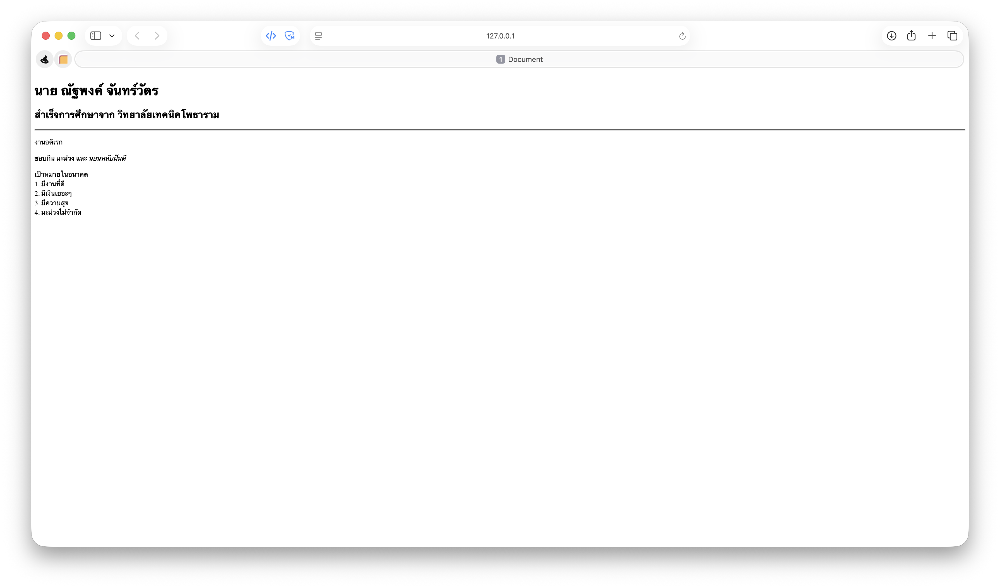

# ใบงานการทดลอง HTML
 
## การทดลองที่ 3: การจัดการข้อความและการจัดรูปแบบ
### ขั้นตอนการทดลอง
1. ทดลองใช้ tag ต่างๆ:
```html
<h1>หัวข้อระดับ 1</h1>
<h2>หัวข้อระดับ 2</h2>
<p>ย่อหน้าปกติ</p>
<p>ข้อความ <strong>ตัวหนา</strong> และ <em>ตัวเอียง</em></p>
<p>ขึ้นบรรทัดใหม่<br>ด้วย br</p>
<hr>
<pre>
    ข้อความที่ต้องการ
    รักษารูปแบบ
    การเว้นวรรค
</pre>
```

### แบบฝึกหัด
1. สร้างหน้าเว็บแนะนำตัวเองที่ประกอบด้วย:
   - ชื่อ-นามสกุล
   - ประวัติการศึกษา
   - งานอดิเรก
   - เป้าหมายในอนาคต
 ข้อกำหนดที่ต้องมี:
   - หัวข้อหลักและหัวข้อย่อย
   - ย่อหน้าที่มีการจัดรูปแบบ
   - การขึ้นบรรทัดใหม่
   - เส้นคั่นระหว่างเนื้อหา
### บันทึกผลการทดลอง
- รหัสเอกสาร HTML ที่เขียน:
```html
<!DOCTYPE html>
<html lang="en">

<head>
    <meta charset="UTF-8">
    <meta name="viewport" content="width=device-width, initial-scale=1.0">
    <title>Document</title>
</head>

<body>
    <h1>นาย ณัฐพงค์ จันทร์วัตร</h1>
    <h2>สำเร็จการศึกษาจาก วิทยาลัยเทคนิคโพธาราม</h2>
    <hr>

    <p>งานอดิเรก</p>
    <p>ชอบกิน <strong>มะม่วง</strong> และ <em>นอนหลับฝันดี</em></p>
    <p>เป้าหมายในอนาคต<br>1. มีงานที่ดี<br>2. มีเงินเยอะๆ<br>3. มีความสุข<br>4. มะม่วงไม่จำกัด</p>

</body>

</html>
```
- ภาพผลลัพธ์:



