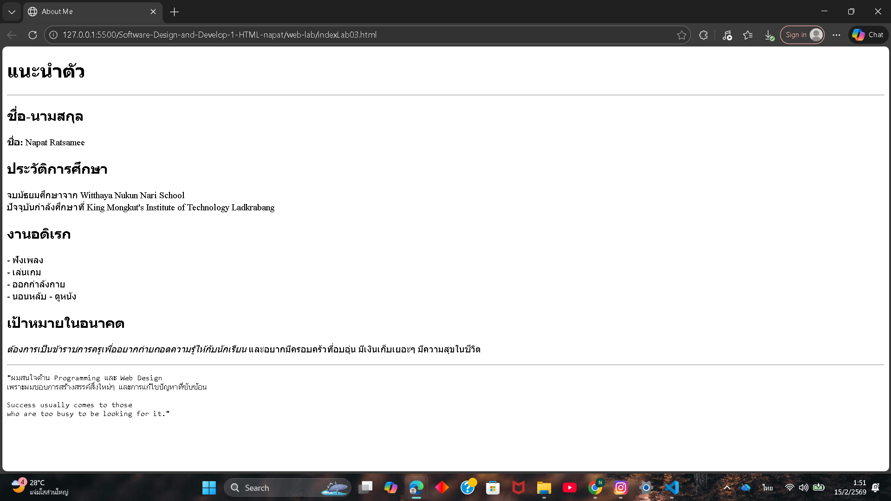

# ใบงานการทดลอง HTML
 
## การทดลองที่ 3: การจัดการข้อความและการจัดรูปแบบ
### ขั้นตอนการทดลอง
1. ทดลองใช้ tag ต่างๆ:
```html
<h1>หัวข้อระดับ 1</h1>
<h2>หัวข้อระดับ 2</h2>
<p>ย่อหน้าปกติ</p>
<p>ข้อความ <strong>ตัวหนา</strong> และ <em>ตัวเอียง</em></p>
<p>ขึ้นบรรทัดใหม่<br>ด้วย br</p>
<hr>
<pre>
    ข้อความที่ต้องการ
    รักษารูปแบบ
    การเว้นวรรค
</pre>
```

### แบบฝึกหัด
1. สร้างหน้าเว็บแนะนำตัวเองที่ประกอบด้วย:
   - ชื่อ-นามสกุล
   - ประวัติการศึกษา
   - งานอดิเรก
   - เป้าหมายในอนาคต
 ข้อกำหนดที่ต้องมี:
   - หัวข้อหลักและหัวข้อย่อย
   - ย่อหน้าที่มีการจัดรูปแบบ
   - การขึ้นบรรทัดใหม่
   - เส้นคั่นระหว่างเนื้อหา
### บันทึกผลการทดลอง
- รหัสเอกสาร HTML ที่เขียน:
```html
[วางโค้ด HTML ที่นี่]
<!DOCTYPE html>
<html>
<head>
    <meta charset="UTF-8">
    <title>About Me</title>
</head>
<body>

    <h1>แนะนำตัว</h1>
    <hr>

    <h2>ชื่อ-นามสกุล</h2>
    <p><strong>ชื่อ:</strong> Napat Ratsamee</p>

    <h2>ประวัติการศึกษา</h2>
    <p>
        จบมัธยมศึกษาจาก Witthaya Nukun Nari School<br>
        ปัจจุบันกำลังศึกษาที่ King Mongkut's Institute of Technology Ladkrabang
    </p>

    <h2>งานอดิเรก</h2>
    <p>
        - ฟังเพลง<br>
        - เล่นเกม<br>
        - ออกกำลังกาย<br>
        - นอนหลับ
        - ดูหนัง
    </p>

    <h2>เป้าหมายในอนาคต</h2>
    <p>
        <em>ต้องการเป็นข้าราชการครูเพื่ออยากถ่ายถอดความรู้ให้กับนักเรียน</em>  
        และอยากมีครอบครัวที่อบอุ่น มีเงินเก็บเยอะๆ มีความสุขในชีวิต
    </p>

    <hr>

    <pre>
"ผมสนใจด้าน Programming และ Web Design
เพราะผมชอบการสร้างสรรค์สิ่งใหม่ๆ และการแก้ไขปัญหาที่ซับซ้อน

Success usually comes to those
who are too busy to be looking for it."
    </pre>

</body>
</html>

```
- ภาพผลลัพธ์:
[วางภาพ screenshot ที่นี่]



