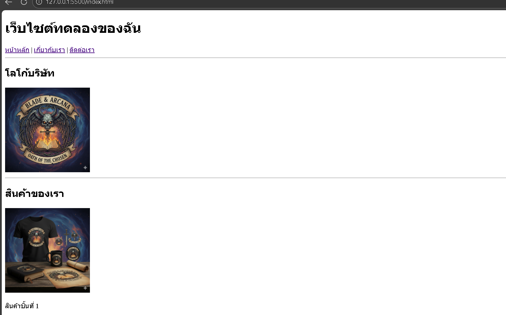
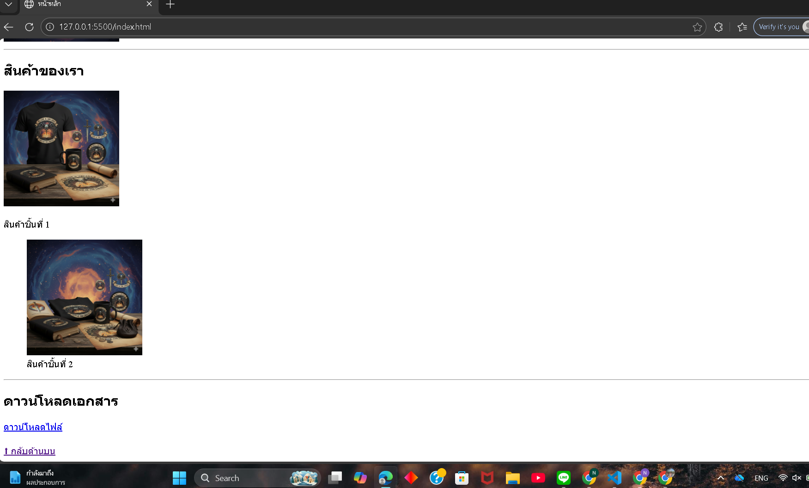
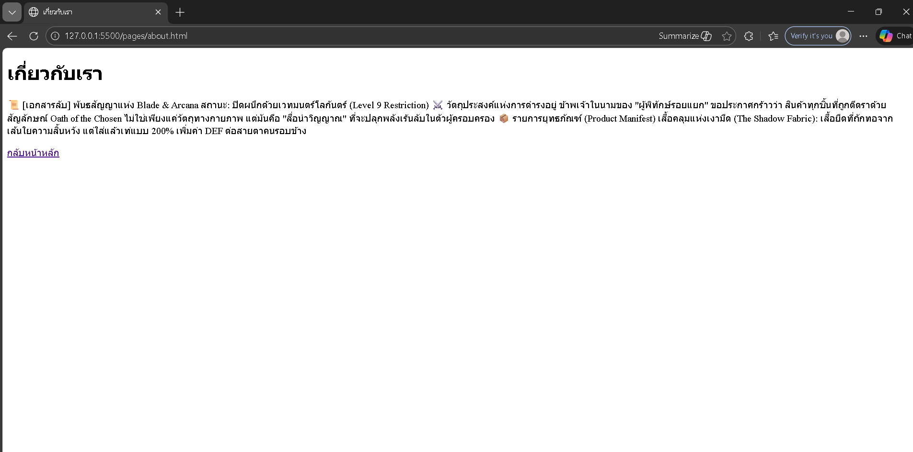
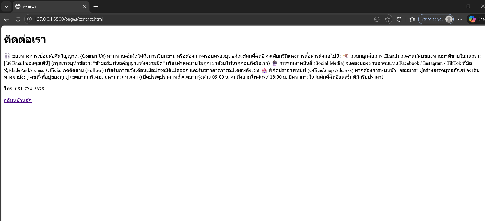

# ใบงานการทดลอง HTML

## การทดลองที่ 4: การสร้างลิงก์และการแทรกรูปภาพ

### การเตรียมโครงสร้างโฟลเดอร์และไฟล์
1. สร้างโครงสร้างโฟลเดอร์:
   ```
   html-workshop/
   ├── index.html
   ├── pages/
   │   ├── about.html
   │   └── contact.html
   ├── images/
   │   ├── logo.jpg
   │   └── products/
   │       ├── product1.jpg
   │       └── product2.jpg
   └── files/
       └── document.pdf
   ```

2. ขั้นตอนการสร้างโครงสร้าง:
   - คลิกขวาในโฟลเดอร์ html-workshop > New Folder > สร้าง "pages"
   - คลิกขวาในโฟลเดอร์ html-workshop > New Folder > สร้าง "images"
   - ในโฟลเดอร์ images > New Folder > สร้าง "products"
   - คลิกขวาในโฟลเดอร์ html-workshop > New Folder > สร้าง "files"

3. สร้างไฟล์ HTML:
   - ในโฟลเดอร์หลัก: สร้าง index.html (ใช้ไฟล์เดิมที่มีได้)
   - ในโฟลเดอร์ pages: สร้าง about.html และ contact.html

4. จัดเตรียมไฟล์:
   - นำรูปภาพที่ต้องการใช้ไปไว้ในโฟลเดอร์ images
   - นำรูปภาพสินค้าไปไว้ในโฟลเดอร์ products
   - นำไฟล์เอกสารไปไว้ในโฟลเดอร์ files

### ขั้นตอนการทดลอง

#### ส่วนที่ 1: การสร้างลิงก์
1. เปิดไฟล์ index.html และใส่โครงสร้างพื้นฐาน:
```html
<!DOCTYPE html>
<html lang="th">
<head>
    <meta charset="UTF-8">
    <title>หน้าหลัก</title>
</head>
<body>
    <!-- ส่วนของเนื้อหา -->
</body>
</html>
```

2. สร้างเมนูนำทางพื้นฐาน:
```html
<nav>
    <!-- ลิงก์ภายใน - ไปยังหน้าในเว็บไซต์เดียวกัน -->
    <a href="index.html">หน้าหลัก</a>
    <a href="pages/about.html">เกี่ยวกับเรา</a>
    <a href="pages/contact.html">ติดต่อเรา</a>
    
    <!-- ลิงก์ภายนอก - เปิดในแท็บใหม่ -->
    <a href="https://www.google.com" target="_blank">
        ไปยัง Google
    </a>
</nav>
```
คำอธิบาย:
- `href="..."` - กำหนดเส้นทางของลิงก์
- `target="_blank"` - เปิดลิงก์ในแท็บใหม่

3. สร้างลิงก์ภายในหน้าเดียวกัน:
```html
<!-- สร้างจุดเชื่อมโยง -->
<section id="top">
    <h1>เนื้อหาส่วนบน</h1>
</section>

<section id="products">
    <h2>สินค้าของเรา</h2>
</section>

<!-- ลิงก์ไปยังจุดเชื่อมโยง -->
<a href="#top">กลับด้านบน</a>
<a href="#products">ไปยังสินค้า</a>
```
คำอธิบาย:
- `id="..."` - กำหนดจุดเชื่อมโยง
- `href="#..."` - ลิงก์ไปยัง id ที่กำหนด

4. สร้างลิงก์พิเศษ:
```html
<!-- ลิงก์อีเมล -->
<a href="mailto:contact@example.com">ส่งอีเมลหาเรา</a>

<!-- ลิงก์โทรศัพท์ -->
<a href="tel:+66812345678">โทร 081-234-5678</a>

<!-- ลิงก์ดาวน์โหลด -->
<a href="files/document.pdf" download>
    ดาวน์โหลดเอกสาร
</a>
```
คำอธิบาย:
- `mailto:` - เปิดโปรแกรมอีเมล
- `tel:` - เปิดโปรแกรมโทรศัพท์
- `download` - ดาวน์โหลดไฟล์แทนการเปิด

#### ส่วนที่ 2: การแทรกรูปภาพ
1. แทรกรูปภาพพื้นฐาน:
```html
<!-- รูปภาพในโฟลเดอร์ images -->


<!-- รูปภาพในโฟลเดอร์ย่อย products -->

```
คำอธิบาย:
- `src="..."` - ระบุตำแหน่งของรูปภาพ
- `alt="..."` - ข้อความทดแทนเมื่อไม่สามารถแสดงรูปได้
- `width="..."` - กำหนดความกว้าง
- `height="..."` - กำหนดความสูง

2. ใช้ figure และ figcaption:
```html
<figure>
    
    <figcaption>
        รายละเอียดสินค้าชิ้นที่ 2
    </figcaption>
</figure>
```
คำอธิบาย:
- `<figure>` - จัดกลุ่มรูปภาพและคำอธิบาย
- `<figcaption>` - คำอธิบายประกอบรูปภาพ

3. สร้างรูปภาพที่คลิกได้:
```html
<a href="images/products/product1.jpg">
    
</a>
```

### หมายเหตุ
- ตรวจสอบการสะกดชื่อไฟล์และโฟลเดอร์ให้ถูกต้อง
- path ของรูปภาพต้องถูกต้องตามโครงสร้างโฟลเดอร์
- ทดสอบการทำงานของลิงก์ทุกจุด

### แบบฝึกหัด
1. สร้างแกลเลอรีสินค้า:
   - สร้างโฟลเดอร์ images/gallery
   - ใส่รูปภาพอย่างน้อย 4 รูป
   - แต่ละรูปต้องคลิกดูขนาดใหญ่ได้
   - มีคำอธิบายใต้รูป
   - มีปุ่มกลับด้านบน

### บันทึกผลการทดลอง
- รหัสเอกสาร HTML ที่เขียน:
```html
[วางโค้ด HTML ที่นี่]
index
<!DOCTYPE html>
<html lang="th">
<head>
    <meta charset="UTF-8">
    <title>หน้าหลัก</title>
</head>
<body>

<h1 id="top">เว็บไซต์ทดลองของฉัน</h1>

<!-- เมนู -->
<nav>
    <a href="index.html">หน้าหลัก</a> |
    <a href="pages/about.html">เกี่ยวกับเรา</a> |
    <a href="pages/contact.html">ติดต่อเรา</a>
</nav>

<hr>

<h2>โลโก้บริษัท</h2>


<hr>

<h2 id="products">สินค้าของเรา</h2>

<a href="images/products/product1.jpg">
    
</a>
<p>สินค้าชิ้นที่ 1</p>

<figure>
    
    <figcaption>สินค้าชิ้นที่ 2</figcaption>
</figure>

<hr>

<h2>ดาวน์โหลดเอกสาร</h2>
<a href="files/document.pdf" download>
ดาวน์โหลดไฟล์
</a>

<br><br>

<a href="#top">⬆ กลับด้านบน</a>

</body>
</html>
----
about
<!DOCTYPE html>
<html lang="th">
<head>
<meta charset="UTF-8">
<title>เกี่ยวกับเรา</title>
</head>

<body>

<h1>เกี่ยวกับเรา</h1>

<p>📜 [เอกสารลับ] พันธสัญญาแห่ง Blade & Arcana สถานะ: ปิดผนึกด้วยเวทมนตร์โลกันตร์ (Level 9 Restriction) ⚔️ วัตถุประสงค์แห่งการดำรงอยู่ ข้าพเจ้าในนามของ "ผู้พิทักษ์รอยแยก" ขอประกาศกร้าวว่า สินค้าทุกชิ้นที่ถูกตีตราด้วยสัญลักษณ์ Oath of the Chosen ไม่ใช่เพียงแค่วัตถุทางกายภาพ แต่มันคือ "สื่อนำวิญญาณ" ที่จะปลุกพลังเร้นลับในตัวผู้ครอบครอง 📦 รายการยุทธภัณฑ์ (Product Manifest) เสื้อคลุมแห่งเงามืด (The Shadow Fabric): เสื้อยืดที่ถักทอจากเส้นใยความสิ้นหวัง แต่ใส่แล้วเท่แบบ 200% เพิ่มค่า DEF ต่อสายตาคนรอบข้าง</p>

<a href="../index.html">กลับหน้าหลัก</a>

</body>
</html>

----
contact

<!DOCTYPE html>
<html lang="th">
<head>
<meta charset="UTF-8">
<title>ติดต่อเรา</title>
</head>

<body>

<h1>ติดต่อเรา</h1>

<p>⛓️ ช่องทางการเชื่อมต่อจิตวิญญาณ (Contact Us) หากท่านสัมผัสได้ถึงการเรียกขาน หรือต้องการครอบครองยุทธภัณฑ์ศักดิ์สิทธิ์ จงเลือกวิถีแห่งการสื่อสารดังต่อไปนี้: 🦅 ส่งนกฮูกสื่อสาร (Email) ส่งสาสน์ลับของท่านมาที่ข่ายใยมนตรา: [ใส่ Email ของคุณที่นี่] (กรุณาระบุหัวข้อว่า: "ข้าขอรับพันธสัญญาแห่งความมืด" เพื่อให้จดหมายไม่ถูกเผาด้วยไฟนรกก่อนถึงมือเรา) 🔮 กระจกเงาหมื่นลี้ (Social Media) จงส่องมองผ่านอาคมแห่ง Facebook / Instagram / TikTok ที่ชื่อ: @BladeAndArcana_Official กดติดตาม (Follow) เพื่อรับการแจ้งเตือนเมื่อประตูมิติเปิดออก และรับข่าวสารการอัปเดตพลังเวท 🏰 พิกัดปราสาททมิฬ (Office/Shop Address) หากต้องการพบหน้า "จอมมาร" ผู้สร้างสรรค์ยุทธภัณฑ์ จงเดินทางมายัง: [เลขที่/ที่อยู่ของคุณ] เขตอาคมพิเศษ, มหานครแห่งเงา (เปิดประตูปราสาทตั้งแต่ยามรุ่งสาง 09:00 น. จนถึงยามโพล้เพล้ 18:00 น. ปิดทำการในวันศักดิ์สิทธิ์และวันที่มีสุริยุปราคา)</p>
<p>โทร: 081-234-5678</p>

<a href="../index.html">กลับหน้าหลัก</a>

</body>
</html>

```
- ภาพผลลัพธ์:
[วางภาพ screenshot ที่นี่]
index


about


contact



