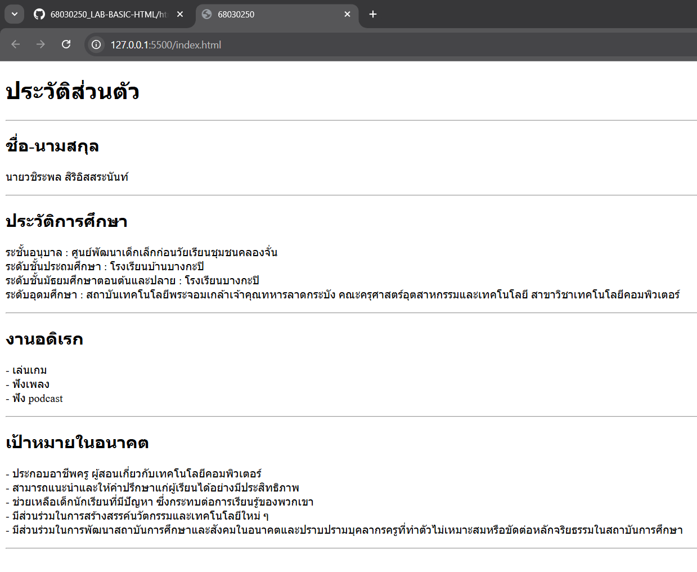

# ใบงานการทดลอง HTML
 
## การทดลองที่ 3: การจัดการข้อความและการจัดรูปแบบ
### ขั้นตอนการทดลอง
1. ทดลองใช้ tag ต่างๆ:
```html
<h1>หัวข้อระดับ 1</h1>
<h2>หัวข้อระดับ 2</h2>
<p>ย่อหน้าปกติ</p>
<p>ข้อความ <strong>ตัวหนา</strong> และ <em>ตัวเอียง</em></p>
<p>ขึ้นบรรทัดใหม่<br>ด้วย br</p>
<hr>
<pre>
    ข้อความที่ต้องการ
    รักษารูปแบบ
    การเว้นวรรค
</pre>
```

### แบบฝึกหัด
1. สร้างหน้าเว็บแนะนำตัวเองที่ประกอบด้วย:
   - ชื่อ-นามสกุล
   - ประวัติการศึกษา
   - งานอดิเรก
   - เป้าหมายในอนาคต
 ข้อกำหนดที่ต้องมี:
   - หัวข้อหลักและหัวข้อย่อย
   - ย่อหน้าที่มีการจัดรูปแบบ
   - การขึ้นบรรทัดใหม่
   - เส้นคั่นระหว่างเนื้อหา
### บันทึกผลการทดลอง
- รหัสเอกสาร HTML ที่เขียน:
```html
<!DOCTYPE html>
<html>
<head>
    <title>68030250</title>
</head>

<body>
    <h1>ประวัติส่วนตัว</h1>
    <hr>
    <h2>ชื่อ-นามสกุล</h2>
    <p>นายวชิระพล สิริอิสสระนันท์</p>

    <hr>
    <h2>ประวัติการศึกษา</h2>
    <p>ระชั้นอนุบาล : ศูนย์พัฒนาเด็กเล็กก่อนวัยเรียนชุมชนคลองจั่น <br>
        ระดับชั้นประถมศึกษา : โรงเรียนบ้านบางกะปิ <br>
        ระดับชั้นมัธยมศึกษาตอนต้นและปลาย : โรงเรียนบางกะปิ <br>
        ระดับอุดมศึกษา : สถาบันเทคโนโลยีพระจอมเกล้าเจ้าคุณทหารลาดกระบัง คณะครุศาสตร์อุตสาหกรรมและเทคโนโลยี สาขาวิชาเทคโนโลยีคอมพิวเตอร์
    </p>

    <hr>
    <h2>งานอดิเรก</h2>
    <p>
        - เล่นเกม <br>
        - ฟังเพลง <br>
        - ฟัง podcast
    </p>

    <hr>
    <h2>เป้าหมายในอนาคต</h2>
    <p>
        - ประกอบอาชีพครู ผู้สอนเกี่ยวกับเทคโนโลยีคอมพิวเตอร์ <br>
        - สามารถแนะนำและให้คำปรึกษาแก่ผู้เรียนได้อย่างมีประสิทธิภาพ <br>
        - ช่วยเหลือเด็กนักเรียนที่มีปัญหา ซึ่งกระทบต่อการเรียนรู้ของพวกเขา <br>
        - มีส่วนร่วมในการสร้างสรรค์นวัตกรรมและเทคโนโลยีใหม่ ๆ <br>
        - มีส่วนร่วมในการพัฒนาสถาบันการศึกษาและสังคมในอนาคตและปราบปรามบุคลากรครูที่ทำตัวไม่เหมาะสมหรือขัดต่อหลักจริยธรรมในสถาบันการศึกษา <br>
    </p>
    <hr>
    
</body>

</html>
```
- ภาพผลลัพธ์:



