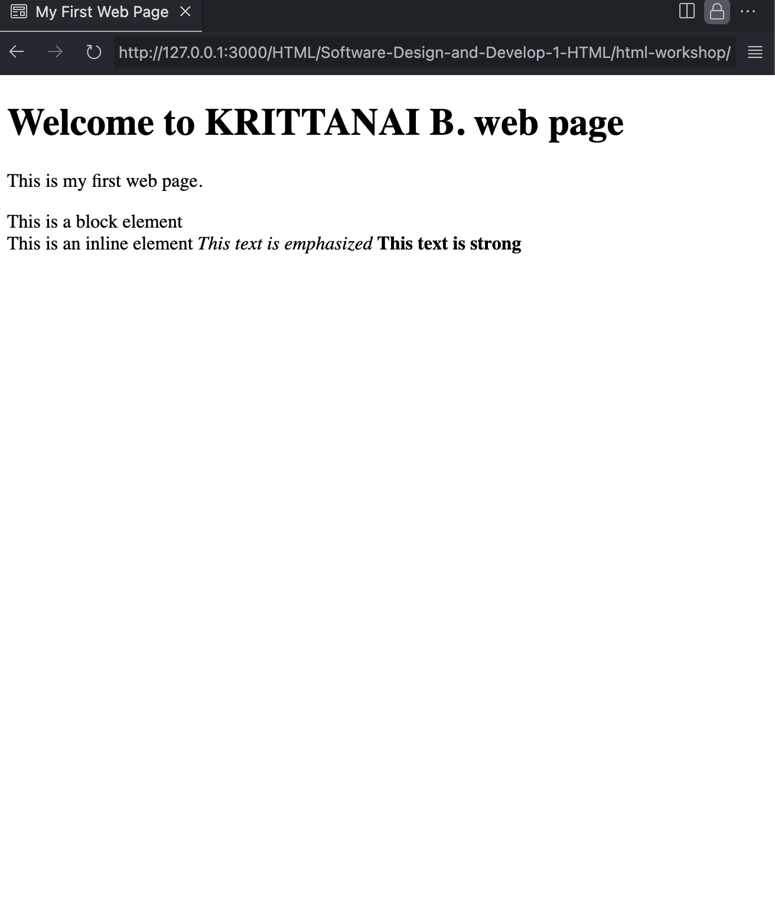

## การทดลองที่ 1: การติดตั้งและเตรียมเครื่องมือ

### ขั้นตอนที่ 1: การติดตั้ง Visual Studio Code
1. เปิดเว็บเบราว์เซอร์และเข้าไปที่ https://code.visualstudio.com
2. คลิกปุ่ม Download โดยเลือกตามระบบปฏิบัติการ
3. เมื่อดาวน์โหลดเสร็จ ให้เปิดไฟล์ที่ดาวน์โหลดมา
4. ทำตามขั้นตอนการติดตั้ง:
    - เลือกตัวเลือกเพิ่มเติม:
     * [✓] Add "Open with Code" action to Windows Explorer file context menu
     * [✓] Add "Open with Code" action to Windows Explorer directory context menu
     * [✓] Register Code as an editor for supported file types
     * [✓] Add to PATH

### ขั้นตอนที่ 2: การติดตั้ง Extension Live Server
1. เปิดโปรแกรม Visual Studio Code
2. คลิกไอคอน Extensions ที่แถบด้านซ้าย (รูปสี่เหลี่ยมจตุรัส 4 ชิ้น) หรือกด Ctrl+Shift+X
3. พิมพ์คำว่า "Live Server" ในช่องค้นหา
4. มองหา "Live Server" ของ Ritwick Dey (มักจะอยู่อันดับแรก)
5. คลิกปุ่ม "Install"
6. รอจนติดตั้งเสร็จ (ปุ่มจะเปลี่ยนเป็น "Uninstall")
7. คลิก "Reload" เพื่อเริ่มการทำงานของ Extension

### ขั้นตอนที่ 3: การสร้างโฟลเดอร์สำหรับเก็บไฟล์งาน
1. เปิด File Explorer (Windows) หรือ Finder (macOS)
2. ไปที่ตำแหน่งที่ต้องการสร้างโฟลเดอร์
3. คลิกขวา > New > Folder
4. ตั้งชื่อโฟลเดอร์เป็น "html-workshop"
5. เปิด VS Code
6. ไปที่ File > Open Folder หรือกด Ctrl+K Ctrl+O
7. เลือกโฟลเดอร์ "html-workshop" ที่สร้างไว้
8. คลิก "Select Folder"

### ขั้นตอนที่ 4: การทดสอบ Live Server
1. สร้างไฟล์ใหม่:
   - คลิกไอคอน New File ในแถบด้านซ้าย หรือกด Ctrl+N
   - ไปที่ File > Save หรือกด Ctrl+S
   - ตั้งชื่อไฟล์เป็น "test.html"
2. พิมพ์โค้ด HTML พื้นฐาน:
   ```html
   <!DOCTYPE html>
   <html>
   <head>
       <title>ทดสอบ Live Server</title>
   </head>
   <body>
       <h1>สวัสดี Live Server</h1>
   </body>
   </html>
   ```
3. บันทึกไฟล์ (Ctrl+S)
4. เริ่มใช้งาน Live Server โดยทำวิธีใดวิธีหนึ่ง:
   - คลิกขวาที่ไฟล์ test.html แล้วเลือก "Open with Live Server"
   - คลิก "Go Live" ที่แถบสถานะด้านล่าง
   - กด Alt+L Alt+O
5. เว็บเบราว์เซอร์จะเปิดขึ้นมาโดยอัตโนมัติที่ http://127.0.0.1:5500
6. ทดสอบการทำงาน:
   - แก้ไขข้อความใน <h1>
   - บันทึกไฟล์
   - สังเกตว่าเบราว์เซอร์รีเฟรชอัตโนมัติ
   - 
#### หมายเหตุ สามารถติดตั้ง Live Preview ของไมโครซอฟต์ แทนการใช้ Live Server เมื่อติดตั้งแล้ว สามารถคลิกเมาส์ด้านขวาที่ไฟล์ HTML เลือกเมนู Show Preview เพื่อดูผลลัพธ์ HTML ได้เช่นกัน
  
### บันทึกผลการทดลอง


## การทดลองที่ 2: โครงสร้างพื้นฐาน HTML
### ขั้นตอนการทดลอง
1. สร้างไฟล์ index.html
2. เขียนโครงสร้างพื้นฐาน HTML:
```html
<!DOCTYPE html>
<html>
<head>
    <title>My First Web Page</title>
</head>
<body>
    <h1>Welcome to ...... (student name) web page</h1>
    <p>This is my first web page.</p>
    <div>This is a block element</div>
    <span>This is an inline element</span>
    <em>This text is emphasized</em>
    <strong>This text is strong</strong>    
</body>
</html>
```
3. บันทึกไฟล์และเปิดด้วย Live Server


### คำอธิบายเพิ่มเติม
- `<!DOCTYPE html>` คือการประกาศประเภทเอกสารเป็น HTML5
- `<html>` เป็น tag หลักที่ครอบคลุมทั้งเอกสาร
- `<head>` ใช้สำหรับข้อมูล metadata และการเชื่อมโยงไฟล์ภายนอก
- `<body>` คือส่วนที่แสดงผลบนหน้าเว็บ
- `<div>` เป็น block element ที่ขึ้นบรรทัดใหม่โดยอัตโนมัติ
- `<span>` เป็น inline element ที่ต่อเนื่องในบรรทัดเดียวกัน
- `<em>` ใช้เน้นข้อความ (แสดงเป็นตัวเอียง)
- `<strong>` ใช้เน้นข้อความ (แสดงเป็นตัวหนา)
  
  ### บันทึกผลการทดลอง
- รหัสเอกสาร HTML ที่เขียนindex.html
```html
<!DOCTYPE html>
<html>
<head>
    <title>My First Web Page</title>
</head>
<body>
    <h1>Welcome to KRITTANAI B. web page</h1>
    <p>This is my first web page.</p>
    <div>This is a block element</div>
    <span>This is an inline element</span>
    <em>This text is emphasized</em>
    <strong>This text is strong</strong>    
</body>
</html>
```
- ภาพผลลัพธ์:


# ใบงานการทดลอง HTML
 
## การทดลองที่ 3: การจัดการข้อความและการจัดรูปแบบ
### ขั้นตอนการทดลอง
1. ทดลองใช้ tag ต่างๆ:
```html
<h1>หัวข้อระดับ 1</h1>
<h2>หัวข้อระดับ 2</h2>
<p>ย่อหน้าปกติ</p>
<p>ข้อความ <strong>ตัวหนา</strong> และ <em>ตัวเอียง</em></p>
<p>ขึ้นบรรทัดใหม่<br>ด้วย br</p>
<hr>
<pre>
    ข้อความที่ต้องการ
    รักษารูปแบบ
    การเว้นวรรค
</pre>
```

### แบบฝึกหัด
1. สร้างหน้าเว็บแนะนำตัวเองที่ประกอบด้วย:
   - ชื่อ-นามสกุล
   - ประวัติการศึกษา
   - งานอดิเรก
   - เป้าหมายในอนาคต
 ข้อกำหนดที่ต้องมี:
   - หัวข้อหลักและหัวข้อย่อย
   - ย่อหน้าที่มีการจัดรูปแบบ
   - การขึ้นบรรทัดใหม่
   - เส้นคั่นระหว่างเนื้อหา
### บันทึกผลการทดลอง
- รหัสเอกสาร HTML ที่เขียน:
```html
<!DOCTYPE html>
<html lang="th">
<head>
    <meta charset="UTF-8">
    <meta name="viewport" content="width=device-width, initial-scale=1.0">
    <title>แนะนำตัวเอง</title>
</head>
<body>
    <h1>แนะนำตัวเอง</h1>
    <h2>ชื่อ-นามสกุล</h2>
    <p>ชื่อ: กฤตนัย บุญน้อย</p>
    <h2>ประวัติการศึกษา</h2>
    <p>จบการศึกษาระดับมัธยมศึกษาจากโรงเรียนหาดใหญ่วิทยาลัย</p>
    <p>กำลังศึกษาระดับปริญญาตรีที่สถาบันเทคโนโลยีพระจอมเกล้าเจ้าคุณทหารลาดกระบัง</p>
    <hr>
    <h2>งานอดิเรก</h2>
    <p>งานอดิเรกที่ชอบ:</p>
    <ul>
        <li>เล่นเกม</li>
        <li>เขียนโค้ด</li>
        <li>อ่านหนังสือ</li>
    </ul>
    <hr>
    <h2>เป้าหมายในอนาคต</h2>
    <p>เป้าหมายของฉันคือ:</p>
    <p><strong>สร้างธุรกิจ</strong> ที่ประสบความสำเร็จในด้านเทคโนโลยี</p>
    <p>และช่วยพัฒนาสังคมด้วย <em>การให้ความรู้</em> ผ่านช่องทางออนไลน์</p>
    <br>
    <p>Have a nice day!</p>
</body>
</html>
```
- ภาพผลลัพธ์:


# ใบงานการทดลอง HTML

## การทดลองที่ 4: การสร้างลิงก์และการแทรกรูปภาพ

### การเตรียมโครงสร้างโฟลเดอร์และไฟล์
1. สร้างโครงสร้างโฟลเดอร์:
   ```
   html-workshop/
   ├── index.html
   ├── pages/
   │   ├── about.html
   │   └── contact.html
   ├── images/
   │   ├── logo.jpg
   │   └── products/
   │       ├── product1.jpg
   │       └── product2.jpg
   └── files/
       └── document.pdf
   ```

2. ขั้นตอนการสร้างโครงสร้าง:
   - คลิกขวาในโฟลเดอร์ html-workshop > New Folder > สร้าง "pages"
   - คลิกขวาในโฟลเดอร์ html-workshop > New Folder > สร้าง "images"
   - ในโฟลเดอร์ images > New Folder > สร้าง "products"
   - คลิกขวาในโฟลเดอร์ html-workshop > New Folder > สร้าง "files"

3. สร้างไฟล์ HTML:
   - ในโฟลเดอร์หลัก: สร้าง index.html (ใช้ไฟล์เดิมที่มีได้)
   - ในโฟลเดอร์ pages: สร้าง about.html และ contact.html

4. จัดเตรียมไฟล์:
   - นำรูปภาพที่ต้องการใช้ไปไว้ในโฟลเดอร์ images
   - นำรูปภาพสินค้าไปไว้ในโฟลเดอร์ products
   - นำไฟล์เอกสารไปไว้ในโฟลเดอร์ files

### ขั้นตอนการทดลอง

#### ส่วนที่ 1: การสร้างลิงก์
1. เปิดไฟล์ index.html และใส่โครงสร้างพื้นฐาน:
```html
<!DOCTYPE html>
<html lang="th">
<head>
    <meta charset="UTF-8">
    <title>หน้าหลัก</title>
</head>
<body>
    <!-- ส่วนของเนื้อหา -->
</body>
</html>
```

2. สร้างเมนูนำทางพื้นฐาน:
```html
<nav>
    <!-- ลิงก์ภายใน - ไปยังหน้าในเว็บไซต์เดียวกัน -->
    <a href="index.html">หน้าหลัก</a>
    <a href="pages/about.html">เกี่ยวกับเรา</a>
    <a href="pages/contact.html">ติดต่อเรา</a>
    
    <!-- ลิงก์ภายนอก - เปิดในแท็บใหม่ -->
    <a href="https://www.google.com" target="_blank">
        ไปยัง Google
    </a>
</nav>
```
คำอธิบาย:
- `href="..."` - กำหนดเส้นทางของลิงก์
- `target="_blank"` - เปิดลิงก์ในแท็บใหม่

3. สร้างลิงก์ภายในหน้าเดียวกัน:
```html
<!-- สร้างจุดเชื่อมโยง -->
<section id="top">
    <h1>เนื้อหาส่วนบน</h1>
</section>

<section id="products">
    <h2>สินค้าของเรา</h2>
</section>

<!-- ลิงก์ไปยังจุดเชื่อมโยง -->
<a href="#top">กลับด้านบน</a>
<a href="#products">ไปยังสินค้า</a>
```
คำอธิบาย:
- `id="..."` - กำหนดจุดเชื่อมโยง
- `href="#..."` - ลิงก์ไปยัง id ที่กำหนด

4. สร้างลิงก์พิเศษ:
```html
<!-- ลิงก์อีเมล -->
<a href="mailto:contact@example.com">ส่งอีเมลหาเรา</a>

<!-- ลิงก์โทรศัพท์ -->
<a href="tel:+66812345678">โทร 081-234-5678</a>

<!-- ลิงก์ดาวน์โหลด -->
<a href="files/document.pdf" download>
    ดาวน์โหลดเอกสาร
</a>
```
คำอธิบาย:
- `mailto:` - เปิดโปรแกรมอีเมล
- `tel:` - เปิดโปรแกรมโทรศัพท์
- `download` - ดาวน์โหลดไฟล์แทนการเปิด

#### ส่วนที่ 2: การแทรกรูปภาพ
1. แทรกรูปภาพพื้นฐาน:
```html
<!-- รูปภาพในโฟลเดอร์ images -->


<!-- รูปภาพในโฟลเดอร์ย่อย products -->

```
คำอธิบาย:
- `src="..."` - ระบุตำแหน่งของรูปภาพ
- `alt="..."` - ข้อความทดแทนเมื่อไม่สามารถแสดงรูปได้
- `width="..."` - กำหนดความกว้าง
- `height="..."` - กำหนดความสูง

2. ใช้ figure และ figcaption:
```html
<figure>
    
    <figcaption>
        รายละเอียดสินค้าชิ้นที่ 2
    </figcaption>
</figure>
```
คำอธิบาย:
- `<figure>` - จัดกลุ่มรูปภาพและคำอธิบาย
- `<figcaption>` - คำอธิบายประกอบรูปภาพ

3. สร้างรูปภาพที่คลิกได้:
```html
<a href="images/products/product1.jpg">
    
</a>
```

### หมายเหตุ
- ตรวจสอบการสะกดชื่อไฟล์และโฟลเดอร์ให้ถูกต้อง
- path ของรูปภาพต้องถูกต้องตามโครงสร้างโฟลเดอร์
- ทดสอบการทำงานของลิงก์ทุกจุด

### แบบฝึกหัด
1. สร้างแกลเลอรีสินค้า:
   - สร้างโฟลเดอร์ images/gallery
   - ใส่รูปภาพอย่างน้อย 4 รูป
   - แต่ละรูปต้องคลิกดูขนาดใหญ่ได้
   - มีคำอธิบายใต้รูป
   - มีปุ่มกลับด้านบน

### บันทึกผลการทดลอง
- รหัสเอกสาร HTML ที่เขียน:
```html
<!DOCTYPE html>
<html lang="th">
<head>
    <meta charset="UTF-8">
    <meta name="viewport" content="width=device-width, initial-scale=1.0">
    <title>แกลเลอรีสินค้า</title>
</head>
<body>
    <header>
        <h1 id="top">แกลเลอรีสินค้า</h1>
        <nav>
            <!-- ลิงก์นำทางพื้นฐาน -->
            <a href="index.html">หน้าหลัก</a>
            <a href="pages/about.html">เกี่ยวกับเรา</a>
            <a href="pages/contact.html">ติดต่อเรา</a>
            <a href="https://github.com/Kritternai/Software-Design-and-Develop-1-HTML.git" target="_blank">ไปยัง GitHub</a>
        </nav>
    </header>

    <main>
        <!-- แกลเลอรีสินค้า -->
        <section id="gallery">
            <h2>แกลเลอรีสินค้า</h2>
            <p>คลิกที่รูปภาพเพื่อดูขนาดใหญ่</p>
            <div>
                <!-- รูปที่ 1 -->
                <figure>
                    <a href="images/products/product1.jpeg">
                        
                    </a>
                    <figcaption>สินค้า 1</figcaption>
                </figure>

                <!-- รูปที่ 2 -->
                <figure>
                    <a href="images/products/product2.jpeg">
                        
                    </a>
                    <figcaption>สินค้า 2</figcaption>
                </figure>
            </div>
        </section>

        <br>
        <!-- ลิงก์ภายในหน้า -->
        <a href="#top">กลับด้านบน</a>
    </main>

    <footer>
        <hr>
        <p>ติดต่อเรา: <a href="mailto:contact@example.com">contact@example.com</a></p>
        <p>โทร: <a href="tel:+66812345678">081-234-5678</a></p>
        <p>
            <a href="files/document.pdf" download>ดาวน์โหลดเอกสาร</a>
        </p>
    </footer>
</body>
</html>
```
- ภาพผลลัพธ์:


# ใบงานการทดลอง HTML

## การทดลองที่ 5: การสร้างตารางและรายการ
### วัตถุประสงค์
- เรียนรู้การสร้างตารางข้อมูล
- เรียนรู้การสร้างรายการแบบต่างๆ

### ขั้นตอนการทดลอง
1. สร้างไฟล์ tablelist.html ดังตัวอย่าง:
```html
<table border="1">
    <thead>
        <tr>
            <th>Header 1</th>
            <th>Header 2</th>
        </tr>
    </thead>
    <tbody>
        <tr>
            <td>Row 1, Cell 1</td>
            <td>Row 1, Cell 2</td>
        </tr>
        <tr>
            <td>Row 2, Cell 1</td>
            <td>Row 2, Cell 2</td>
        </tr>
    </tbody>
</table>
```

### คำอธิบายเพิ่มเติม
- `<table>` กำหนดขอบเขตของตาราง
- `<thead>` สำหรับส่วนหัวตาราง
- `<tbody>` สำหรับเนื้อหาตาราง
- `<tr>` แทนแถว
- `<th>` แทนเซลล์หัวตาราง
- `<td>` แทนเซลล์ข้อมูล

2. การสร้างรายการ โดยเพิ่มเติม Code ในไฟล์ tablelist.html :
```html
<ul>
    <li>Unordered item 1</li>
    <li>Unordered item 2</li>
</ul>

<ol>
    <li>Ordered item 1</li>
    <li>Ordered item 2</li>
</ol>

<dl>
    <dt>Term 1</dt>
    <dd>Definition 1</dd>
    <dt>Term 2</dt>
    <dd>Definition 2</dd>
</dl>
```

### คำอธิบายเพิ่มเติม
- `<ul>` สำหรับรายการแบบไม่เรียงลำดับ
- `<ol>` สำหรับรายการแบบเรียงลำดับ
- `<dl>` สำหรับรายการแบบคำจำกัดความ
- `<li>` แทนรายการแต่ละรายการ

### แบบฝึกหัด
1. สร้างตารางแสดงข้อมูลส่วนตัว
2. สร้างรายการเมนูอาหาร

[วางโค้ด HTML ที่นี่]
```html
<!DOCTYPE html>
<html lang="th">
<head>
    <meta charset="UTF-8">
    <meta name="viewport" content="width=device-width, initial-scale=1.0">
    <title>ตารางข้อมูลส่วนตัวและเมนูอาหาร</title>
</head>
<body>
    <header>
        <h1>ข้อมูลส่วนตัวและเมนูอาหาร</h1>
    </header>

    <main>
        <!-- ตารางข้อมูลส่วนตัว -->
        <section>
            <h2>ตารางข้อมูลส่วนตัว</h2>
            <table border="1">
                <thead>
                    <tr>
                        <th>ชื่อ</th>
                        <th>นามสกุล</th>
                        <th>อายุ</th>
                        <th>อาชีพ</th>
                    </tr>
                </thead>
                <tbody>
                    <tr>
                        <td>กฤตนัย</td>
                        <td>บุญน้อย</td>
                        <td>25</td>
                        <td>นักพัฒนา</td>
                    </tr>
                    <tr>
                        <td>บุญน้อย</td>
                        <td>กฤตนัย</td>
                        <td>30</td>
                        <td>นักออกแบบ</td>
                    </tr>
                </tbody>
            </table>
        </section>

        <!-- รายการเมนูอาหาร -->
        <section>
            <h2>รายการเมนูอาหาร</h2>
            <ul>
                <li>ข้าวผัด</li>
                <li>ก๋วยเตี๋ยว</li>
                <li>ส้มตำ</li>
                <li>ต้มยำกุ้ง</li>
            </ul>
        </section>
    </main>

    <footer>
        <hr>
        <p>จัดทำโดย: กฤตนัย บุญน้อย 67030011</p>
    </footer>
</body>
</html>
```
- ภาพผลลัพธ์:


# ใบงานการทดลอง HTML

## การทดลองที่ 6: การสร้างฟอร์ม
### วัตถุประสงค์
- สร้างฟอร์มรับข้อมูลได้ตามกำหนด
- เลือกใช้ประเภทของ input แบบต่างๆ ได้เหมาะสม
- สามารถใช้งาน form validation ได้

### ขั้นตอนการทดลอง
1. สร้างฟอร์มลงทะเบียนนักศึกษา:
```html
    <!-- กำหนดรูปแบบของฟอร์มบางส่วน -->
  <style>
        .form-group {
            margin-bottom: 15px;
        }
        
        .input-wrapper {
            display: flex;
            align-items: center;
        }
        
        .required-mark {
            color: red;
            margin-left: 5px;
        }
    </style>

    <body>
        <form action="/register" method="post">
            <!-- ส่วนข้อมูลส่วนตัว -->
            <fieldset>
                <legend>ข้อมูลส่วนตัว</legend>
                
                <div class="form-group">
                    <label for="studentId">รหัสนักศึกษา:</label>
                    <input type="text" id="studentId" name="studentId" 
                           pattern="[0-9]{8}" required>
                </div>
        
                <div class="form-group">
                    <label for="prefix">คำนำหน้า:</label>
                     <select id="prefix" name="prefix" required>
                        <option value="">เลือกคำนำหน้า</option>
                        <option value="mr">นาย</option>
                        <option value="ms">นางสาว</option>
                        <option value="mrs">นาง</option>
                    </select>
                </div>
        
                <div class="form-group">
                    <label for="firstName">ชื่อ:</label>
                    <input type="text" id="firstName" name="firstName" required>
                </div>
        
                <div class="form-group">
                    <label for="lastName">นามสกุล:</label>
                    <input type="text" id="lastName" name="lastName" required>
                </div>
        
                <div class="form-group">
                    <label for="birthdate">วันเกิด:</label>
                    <input type="date" id="birthdate" name="birthdate" required>
                </div>
        
                <div class="form-group">
                    <label>เพศ:</label>
                    <input type="radio" id="male" name="gender" value="male" required>
                    <label for="male">ชาย</label>
                    <input type="radio" id="female" name="gender" value="female">
                    <label for="female">หญิง</label>
                </div>
            </fieldset>
        
            <!-- ส่วนข้อมูลการติดต่อ -->
            <fieldset>
                <legend>ข้อมูลการติดต่อ</legend>
        
                <div class="form-group">
                    <label for="email">อีเมล:</label>
                    <input type="email" id="email" name="email" required>
                </div>
        
                <div class="form-group">
                    <label for="phone">เบอร์โทรศัพท์:</label>
                    <input type="tel" id="phone" name="phone" 
                           pattern="[0-9]{10}" required>
                </div>
        
                <div class="form-group">
                    <label for="address">ที่อยู่:</label>
                    <textarea id="address" name="address" 
                              rows="3" required></textarea> <span class="required-mark">*</span>
                </div>
            </fieldset>
        
            <!-- ส่วนข้อมูลการศึกษา -->
            <fieldset>
                <legend>ข้อมูลการศึกษา</legend>
        
                <div class="form-group">
                    <label for="faculty">คณะ:</label>
                    <select id="faculty" name="faculty" required>
                        <option value="">เลือกคณะ</option>
                        <option value="siet">ครุศาสตร์อุตสาหกรรมและเทคโนโลยี</option>
                        <option value="engineering">วิศวกรรมศาสตร์</option>
                        <option value="science">วิทยาศาสตร์</option>
                    </select> <span class="required-mark">*</span>
                </div>
        
                <div class="form-group">
                    <label for="major">สาขาวิชา:</label>
                    <select id="major" name="major" required>
                        <option value="">เลือกสาขาวิชา</option>
                        <!-- ตัวเลือกจะเปลี่ยนตามคณะที่เลือก ส่วนนี้ Code ยังไม่สมบูรณ์-->
                    </select> <span class="required-mark">*</span>
                </div>
        
                <div class="form-group">
                    <label for="gpa">เกรดเฉลี่ยสะสม:</label>
                    <input type="number" id="gpa" name="gpa" 
                           min="0" max="4" step="0.01" required> <span class="required-mark">*</span>
                </div>
            </fieldset>
        
            <!-- ส่วนความสนใจและกิจกรรม -->
            <fieldset>
                <legend>ความสนใจและกิจกรรม</legend>
        
                <div class="form-group">
                    <label>ความสนใจ:</label>
                    <input type="checkbox" id="sport" name="interests" value="sport">
                    <label for="sport">กีฬา</label>
                    <input type="checkbox" id="music" name="interests" value="music">
                    <label for="music">ดนตรี</label>
                    <input type="checkbox" id="art" name="interests" value="art">
                    <label for="art">ศิลปะ</label>
                    <input type="checkbox" id="tech" name="interests" value="tech">
                    <label for="tech">เทคโนโลยี</label>
                </div>
        
                <div class="form-group">
                    <label for="club">ชมรมที่สนใจ:</label>
                    <select id="club" name="club" multiple>
                        <option value="computer">ชมรมคอมพิวเตอร์</option>
                        <option value="robot">ชมรมหุ่นยนต์</option>
                        <option value="sport">ชมรมกีฬา</option>
                        <option value="music">ชมรมดนตรี</option>
                    </select>
                </div>
            </fieldset>
        
            <!-- ส่วนอัพโหลดเอกสาร -->
            <fieldset>
                <legend>เอกสารประกอบ</legend>
                <div class="form-group">
                    <label for="photo">รูปถ่าย:</label>
                    <input type="file" id="photo" name="photo" 
                           accept="image/*" required><span class="required-mark">*</span>
                </div>
        
                <div class="form-group">
                    <label for="transcript">ใบแสดงผลการเรียน:</label>
                    <input type="file" id="transcript" name="transcript" 
                           accept=".pdf,.doc,.docx" required>
                           <span class="required-mark">*</span>
                </div>
            </fieldset>
        
            <!-- ส่วนยืนยันข้อมูล -->
            <fieldset>
                <legend>การยืนยัน</legend>
        
                <div class="form-group">
                    <input type="checkbox" id="agree" name="agree" required>
                    <label for="agree">
                        ข้าพเจ้ายืนยันว่าข้อมูลทั้งหมดเป็นความจริง
                    </label>
                </div>
        
                <div class="form-group">
                    <button type="submit">ลงทะเบียน</button>
                    <button type="reset">ล้างข้อมูล</button>
                </div>
            </fieldset>
        </form>
```

### คำอธิบายเพิ่มเติม
1. Input Types ที่ใช้:
   - text: สำหรับข้อความทั่วไป
   - email: สำหรับอีเมล (มีการตรวจสอบรูปแบบอัตโนมัติ)
   - tel: สำหรับเบอร์โทรศัพท์
   - date: สำหรับวันที่
   - number: สำหรับตัวเลข
   - radio: สำหรับตัวเลือกเดียว
   - checkbox: สำหรับหลายตัวเลือก
   - file: สำหรับอัพโหลดไฟล์
   - select: สำหรับรายการแบบเลือก
   - textarea: สำหรับข้อความหลายบรรทัด

2. Attributes ที่สำคัญ:
   - required: จำเป็นต้องกรอก
   - pattern: กำหนดรูปแบบข้อมูล
   - min/max: กำหนดค่าต่ำสุด/สูงสุด
   - accept: กำหนดประเภทไฟล์ที่ยอมรับ
   - multiple: เลือกได้หลายตัวเลือก

### แบบฝึกหัด
1. สร้างฟอร์มสมัครสมาชิกร้านค้าออนไลน์ที่มี:
   - ข้อมูลส่วนตัว (ชื่อ-นามสกุล, วันเกิด, เพศ)
   - ข้อมูลการติดต่อ (อีเมล, เบอร์โทร, ที่อยู่จัดส่ง)
   - รูปโปรไฟล์
   - การยืนยันรหัสผ่าน
   - ความสนใจในหมวดหมู่สินค้า
   - การยอมรับเงื่อนไขการใช้งาน

2. เพิ่ม validation ที่เหมาะสม:
   - ตรวจสอบรูปแบบอีเมล
   - ตรวจสอบความยาวรหัสผ่าน
   - ตรวจสอบรูปแบบเบอร์โทร
   - ตรวจสอบขนาดไฟล์รูปภาพ

### บันทึกผลการทดลอง
[วางโค้ด HTML ที่นี่]
```html
<!DOCTYPE html>
<html lang="th">
<head>
    <meta charset="UTF-8">
    <meta name="viewport" content="width=device-width, initial-scale=1.0">
    <title>ฟอร์มสมัครสมาชิกร้านค้าออนไลน์</title>
    <style>
        .form-group {
            margin-bottom: 15px;
        }
        .required-mark {
            color: red;
            margin-left: 5px;
        }
    </style>
</head>
<body>
    <form action="/register-shop" method="post" enctype="multipart/form-data">
        <fieldset>
            <legend>ข้อมูลส่วนตัว</legend>
            <div class="form-group">
                <label for="firstName">ชื่อ:</label>
                <input type="text" id="firstName" name="firstName" required>
            </div>
            <div class="form-group">
                <label for="lastName">นามสกุล:</label>
                <input type="text" id="lastName" name="lastName" required>
            </div>
            <div class="form-group">
                <label for="birthdate">วันเกิด:</label>
                <input type="date" id="birthdate" name="birthdate" required>
            </div>
            <div class="form-group">
                <label>เพศ:</label>
                <input type="radio" id="male" name="gender" value="male" required>
                <label for="male">ชาย</label>
                <input type="radio" id="female" name="gender" value="female">
                <label for="female">หญิง</label>
            </div>
        </fieldset>

        <fieldset>
            <legend>ข้อมูลการติดต่อ</legend>
            <div class="form-group">
                <label for="email">อีเมล:</label>
                <input type="email" id="email" name="email" required pattern="[a-z0-9._%+-]+@[a-z0-9.-]+\.[a-z]{2,}$">
            </div>
            <div class="form-group">
                <label for="phone">เบอร์โทรศัพท์:</label>
                <input type="tel" id="phone" name="phone" pattern="[0-9]{10}" required>
            </div>
            <div class="form-group">
                <label for="address">ที่อยู่จัดส่ง:</label>
                <textarea id="address" name="address" rows="3" required></textarea>
            </div>
        </fieldset>

        <fieldset>
            <legend>ข้อมูลบัญชีผู้ใช้</legend>
            <div class="form-group">
                <label for="username">ชื่อผู้ใช้:</label>
                <input type="text" id="username" name="username" required>
            </div>
            <div class="form-group">
                <label for="password">รหัสผ่าน:</label>
                <input type="password" id="password" name="password" minlength="6" required>
            </div>
            <div class="form-group">
                <label for="confirmPassword">ยืนยันรหัสผ่าน:</label>
                <input type="password" id="confirmPassword" name="confirmPassword" required>
            </div>
        </fieldset>

        <fieldset>
            <legend>รูปโปรไฟล์</legend>
            <div class="form-group">
                <label for="profileImage">เลือกรูปโปรไฟล์:</label>
                <input type="file" id="profileImage" name="profileImage" accept="image/*" required onchange="validateImage()">
                <span id="imageError" style="color:red;"></span>
            </div>
        </fieldset>

        <fieldset>
            <legend>ความสนใจในหมวดหมู่สินค้า</legend>
            <div class="form-group">
                <label for="category">หมวดหมู่สินค้า:</label>
                <select id="category" name="category" required>
                    <option value="">เลือกหมวดหมู่สินค้า</option>
                    <option value="electronics">อิเล็กทรอนิกส์</option>
                    <option value="clothing">เสื้อผ้า</option>
                    <option value="home">ของใช้ในบ้าน</option>
                </select>
            </div>
        </fieldset>

        <fieldset>
            <legend>การยอมรับเงื่อนไข</legend>
            <div class="form-group">
                <input type="checkbox" id="agree" name="agree" required>
                <label for="agree">ข้าพเจ้ายอมรับเงื่อนไขและข้อตกลง</label>
            </div>
            <div class="form-group">
                <button type="submit">สมัครสมาชิก</button>
                <button type="reset">ล้างข้อมูล</button>
            </div>
        </fieldset>
    </form>

    <script>
        function validateImage() {
            const fileInput = document.getElementById('profileImage');
            const file = fileInput.files[0];
            const errorMessage = document.getElementById('imageError');
            if (file) {
                const fileSize = file.size / 1024 / 1024;
                if (fileSize > 2) {
                    errorMessage.textContent = "ขนาดไฟล์รูปภาพต้องไม่เกิน 2MB";
                    fileInput.setCustomValidity("ขนาดไฟล์รูปภาพต้องไม่เกิน 2MB");
                } else {
                    errorMessage.textContent = "";
                    fileInput.setCustomValidity("");
                }
            }
        }
    </script>
</body>
</html>
```
- ภาพผลลัพธ์:


# ใบงานการทดลอง HTML

## การทดลองที่ 7: HTML Layout
### วัตถุประสงค์
- จัดวางองค์ประกอบในหน้าเว็บได้
- ใช้ semantic elements
- สร้าง responsive layout ได้

### ขั้นตอนการทดลอง
1. เรียนรู้ semantic elements:
semantic elements คือ elements ใน HTML5 ที่มีความหมายในตัวเอง ช่วยอธิบายโครงสร้างและความหมายของเนื้อหาในหน้าเว็บ
    ตัวอย่าง Semantic Elements หลักๆ:

```html
<header>      <!-- ส่วนหัวของหน้าเว็บหรือส่วน -->
<nav>         <!-- ส่วนเมนูนำทาง -->
<main>        <!-- เนื้อหาหลักของหน้าเว็บ -->
<article>     <!-- เนื้อหาที่เป็นบทความ สามารถแยกออกมาอ่านเดี่ยวๆ ได้ -->
<section>     <!-- ส่วนของเนื้อหาที่เกี่ยวข้องกัน -->
<aside>       <!-- เนื้อหาที่เกี่ยวข้องแต่ไม่ใช่เนื้อหาหลัก -->
<footer>      <!-- ส่วนท้ายของหน้าเว็บหรือส่วน -->
```

### ข้อดีของการใช้ Semantic Elements:


### SEO (Search Engine Optimization):

```html 
<!-- แบบไม่ใช้ Semantic -->
<div class="header">
    <div class="nav">...</div>
</div>

<!-- แบบใช้ Semantic - Search Engine เข้าใจโครงสร้างได้ดีกว่า -->
<header>
    <nav>...</nav>
</header>
```

### Accessibility:

```html
<!-- Screen reader จะอ่านและเข้าใจโครงสร้างได้ดีขึ้น -->
<main>
    <article>
        <h1>หัวข้อบทความ</h1>
        <p>เนื้อหา...</p>
    </article>
</main>
```
### ตัวอย่างการใช้งาน
```html
<body>
    <header>
        <h1>ชื่อเว็บไซต์</h1>
        <nav>
            <ul>
                <li><a href="/">หน้าแรก</a></li>
                <li><a href="/about">เกี่ยวกับเรา</a></li>
            </ul>
        </nav>
    </header>

    <main>
        <article>
            <h2>บทความที่ 1</h2>
            <p>เนื้อหาบทความ...</p>
        </article>

        <aside>
            <h3>บทความที่เกี่ยวข้อง</h3>
            <ul>
                <li><a href="#">บทความอื่น 1</a></li>
                <li><a href="#">บทความอื่น 2</a></li>
            </ul>
        </aside>
    </main>

    <footer>
        <p>ลิขสิทธิ์ © 2024</p>
    </footer>
</body>
```


### บันทึกผลการทดลอง

