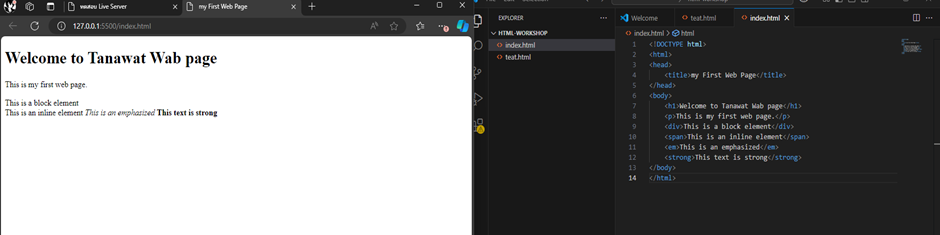
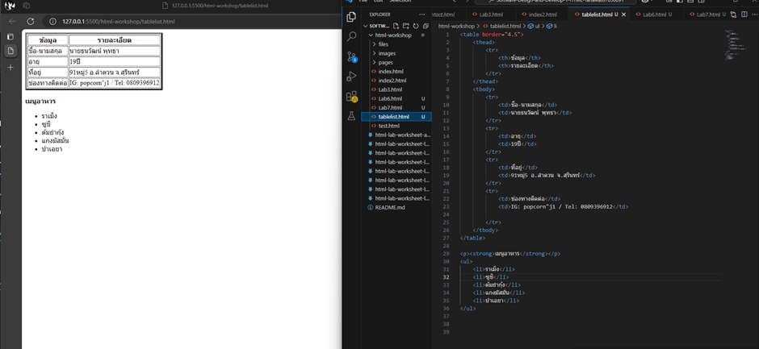
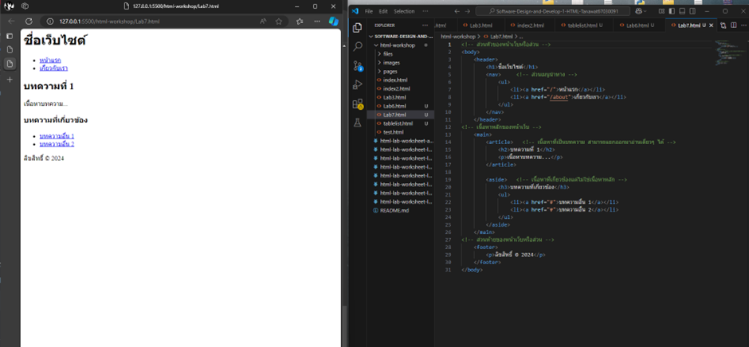

# ใบงานการทดลอง HTML

## จุดประสงค์การเรียนรู้
1. อธิบายโครงสร้างของ HTML ได้
2. สามารถใช้งาน HTML tag พื้นฐานได้
3. สามารถสร้างหน้าเว็บเพจอย่างง่ายได้

## เครื่องมือที่ใช้
1. Visual Studio Code
2. Web Browser 
3. Extension Live Server


## การทดลองที่ 1: การติดตั้งและเตรียมเครื่องมือ

### ขั้นตอนที่ 1: การติดตั้ง Visual Studio Code
1. เปิดเว็บเบราว์เซอร์และเข้าไปที่ https://code.visualstudio.com
2. คลิกปุ่ม Download โดยเลือกตามระบบปฏิบัติการ
3. เมื่อดาวน์โหลดเสร็จ ให้เปิดไฟล์ที่ดาวน์โหลดมา
4. ทำตามขั้นตอนการติดตั้ง:
    - เลือกตัวเลือกเพิ่มเติม:
     * [✓] Add "Open with Code" action to Windows Explorer file context menu
     * [✓] Add "Open with Code" action to Windows Explorer directory context menu
     * [✓] Register Code as an editor for supported file types
     * [✓] Add to PATH

### ขั้นตอนที่ 2: การติดตั้ง Extension Live Server
1. เปิดโปรแกรม Visual Studio Code
2. คลิกไอคอน Extensions ที่แถบด้านซ้าย (รูปสี่เหลี่ยมจตุรัส 4 ชิ้น) หรือกด Ctrl+Shift+X
3. พิมพ์คำว่า "Live Server" ในช่องค้นหา
4. มองหา "Live Server" ของ Ritwick Dey (มักจะอยู่อันดับแรก)
5. คลิกปุ่ม "Install"
6. รอจนติดตั้งเสร็จ (ปุ่มจะเปลี่ยนเป็น "Uninstall")
7. คลิก "Reload" เพื่อเริ่มการทำงานของ Extension

### ขั้นตอนที่ 3: การสร้างโฟลเดอร์สำหรับเก็บไฟล์งาน
1. เปิด File Explorer (Windows) หรือ Finder (macOS)
2. ไปที่ตำแหน่งที่ต้องการสร้างโฟลเดอร์
3. คลิกขวา > New > Folder
4. ตั้งชื่อโฟลเดอร์เป็น "html-workshop"
5. เปิด VS Code
6. ไปที่ File > Open Folder หรือกด Ctrl+K Ctrl+O
7. เลือกโฟลเดอร์ "html-workshop" ที่สร้างไว้
8. คลิก "Select Folder"

### ขั้นตอนที่ 4: การทดสอบ Live Server
1. สร้างไฟล์ใหม่:
   - คลิกไอคอน New File ในแถบด้านซ้าย หรือกด Ctrl+N
   - ไปที่ File > Save หรือกด Ctrl+S
   - ตั้งชื่อไฟล์เป็น "test.html"
2. พิมพ์โค้ด HTML พื้นฐาน:
   ```html
   <!DOCTYPE html>
   <html>
   <head>
       <title>ทดสอบ Live Server</title>
   </head>
   <body>
       <h1>สวัสดี Live Server</h1>
   </body>
   </html>
   ```
3. บันทึกไฟล์ (Ctrl+S)
4. เริ่มใช้งาน Live Server โดยทำวิธีใดวิธีหนึ่ง:
   - คลิกขวาที่ไฟล์ test.html แล้วเลือก "Open with Live Server"
   - คลิก "Go Live" ที่แถบสถานะด้านล่าง
   - กด Alt+L Alt+O
5. เว็บเบราว์เซอร์จะเปิดขึ้นมาโดยอัตโนมัติที่ http://127.0.0.1:5500
6. ทดสอบการทำงาน:
   - แก้ไขข้อความใน <h1>
   - บันทึกไฟล์
   - สังเกตว่าเบราว์เซอร์รีเฟรชอัตโนมัติ
   - 
#### หมายเหตุ สามารถติดตั้ง Live Preview ของไมโครซอฟต์ แทนการใช้ Live Server เมื่อติดตั้งแล้ว สามารถคลิกเมาส์ด้านขวาที่ไฟล์ HTML เลือกเมนู Show Preview เพื่อดูผลลัพธ์ HTML ได้เช่นกัน
  
### บันทึกผลการทดลอง
[บันทึกภาพหน้าจอของผลลัพธ์การทดลอง]


## การทดลองที่ 2: โครงสร้างพื้นฐาน HTML
### ขั้นตอนการทดลอง
1. สร้างไฟล์ index.html
2. เขียนโครงสร้างพื้นฐาน HTML:
```html
<!DOCTYPE html>
<html>
<head>
    <title>My First Web Page</title>
</head>
<body>
    <h1>Welcome to ...... (student name) web page</h1>
    <p>This is my first web page.</p>
    <div>This is a block element</div>
    <span>This is an inline element</span>
    <em>This text is emphasized</em>
    <strong>This text is strong</strong>    
</body>
</html>
```
3. บันทึกไฟล์และเปิดด้วย Live Server


### คำอธิบายเพิ่มเติม
- `<!DOCTYPE html>` คือการประกาศประเภทเอกสารเป็น HTML5
- `<html>` เป็น tag หลักที่ครอบคลุมทั้งเอกสาร
- `<head>` ใช้สำหรับข้อมูล metadata และการเชื่อมโยงไฟล์ภายนอก
- `<body>` คือส่วนที่แสดงผลบนหน้าเว็บ
- `<div>` เป็น block element ที่ขึ้นบรรทัดใหม่โดยอัตโนมัติ
- `<span>` เป็น inline element ที่ต่อเนื่องในบรรทัดเดียวกัน
- `<em>` ใช้เน้นข้อความ (แสดงเป็นตัวเอียง)
- `<strong>` ใช้เน้นข้อความ (แสดงเป็นตัวหนา)
  
  ### บันทึกผลการทดลอง
- รหัสเอกสาร HTML ที่เขียน:
```html
<!DOCTYPE html>
<html>
<head>
    <title>My First Web Page</title>
</head>
<body>
    <h1>Welcome to ...... (student name) web page</h1>
    <p>This is my first web page.</p>
    <div>This is a block element</div>
    <span>This is an inline element</span>
    <em>This text is emphasized</em>
    <strong>This text is strong</strong>    
</body>
</html>
```

- ภาพผลลัพธ์:


## การทดลองที่ 3: การจัดการข้อความและการจัดรูปแบบ
### ขั้นตอนการทดลอง
1. ทดลองใช้ tag ต่างๆ:
```html
<h1>หัวข้อระดับ 1</h1>
<h2>หัวข้อระดับ 2</h2>
<p>ย่อหน้าปกติ</p>
<p>ข้อความ <strong>ตัวหนา</strong> และ <em>ตัวเอียง</em></p>
<p>ขึ้นบรรทัดใหม่<br>ด้วย br</p>
<hr>
<pre>
    ข้อความที่ต้องการ
    รักษารูปแบบ
    การเว้นวรรค
</pre>
```

### แบบฝึกหัด
1. สร้างหน้าเว็บแนะนำตัวเองที่ประกอบด้วย:
   - ชื่อ-นามสกุล
   - ประวัติการศึกษา
   - งานอดิเรก
   - เป้าหมายในอนาคต
 ข้อกำหนดที่ต้องมี:
   - หัวข้อหลักและหัวข้อย่อย
   - ย่อหน้าที่มีการจัดรูปแบบ
   - การขึ้นบรรทัดใหม่
   - เส้นคั่นระหว่างเนื้อหา
### บันทึกผลการทดลอง
- รหัสเอกสาร HTML ที่เขียน:
```html
[[<!DOCTYPE html>
<html lang="th">
<head>
    <meta charset="UTF-8">
    <title>แนะนำตัว - Kanisorn Netsuwan</title>
    <style>
        body {
            font-family: Arial, sans-serif;
            background-color: #f4f6f9;
            margin: 40px;
            line-height: 1.8;
        }
        h1 {
            color: #1e3a8a;
            text-align: center;
        }
        h2 {
            color: #2563eb;
            margin-top: 30px;
        }
        p {
            text-indent: 40px;
        }
        hr {
            border: 1px solid #cbd5e1;
            margin: 25px 0;
        }
        .container {
            background-color: white;
            padding: 30px;
            border-radius: 10px;
            box-shadow: 0 0 10px rgba(0,0,0,0.1);
        }
    </style>
</head>
<body>
<div class="container">
    <h1>ประวัติส่วนตัว</h1>
    <hr>
    <h2>ชื่อ - นามสกุล</h2>
    <p>
        นายคณิศร เนตรสุวรรณ<br>
        ชื่อเล่น: โม<br>
        ปัจจุบันอายุ 18 ปี
    </p>
    <hr>
    <h2>ประวัติการศึกษา</h2>
    <p>
        กำลังศึกษาอยู่ที่<br>
        คณะครุศาสตร์อุตสาหกรรมและเทคโนโลยี<br>
        สาขาเทคโนโลยีคอมพิวเตอร์<br>
        ชั้นปีที่ 1
    </p>
    <hr>
    <h2>งานอดิเรก</h2>
    <p>
        งานอดิเรกของผมคือการศึกษาเทคโนโลยีใหม่ ๆ 
        ทดลองเขียนโปรแกรม และเรียนรู้เกี่ยวกับระบบคอมพิวเตอร์<br>
        นอกจากนี้ยังชอบขับรถจักรยานยนต์ท่องเที่ยวด้วย
    </p>
    <hr>
    <h2>เป้าหมายในอนาคต</h2>
    <p>
        เป้าหมายของผมในอนาคตคือการเป็นครูด้านเทคโนโลยีคอมพิวเตอร์ 
        ที่สามารถถ่ายทอดความรู้ให้กับนักเรียนได้อย่างเข้าใจง่าย<br>
        และต้องการพัฒนาทักษะด้านการเขียนโปรแกรม 
        เพื่อสร้างสื่อการสอนและนวัตกรรมทางการศึกษาในอนาคต
    </p>
</div>
</body>
</html>]]
```
- ภาพผลลัพธ์:
[]

## การทดลองที่ 4: การสร้างลิงก์และการแทรกรูปภาพ

### การเตรียมโครงสร้างโฟลเดอร์และไฟล์
1. สร้างโครงสร้างโฟลเดอร์:
   ```
   html-workshop/
   ├── index.html
   ├── pages/
   │   ├── about.html
   │   └── contact.html
   ├── images/
   │   ├── logo.jpg
   │   └── products/
   │       ├── product1.jpg
   │       └── product2.jpg
   └── files/
       └── document.pdf
   ```

2. ขั้นตอนการสร้างโครงสร้าง:
   - คลิกขวาในโฟลเดอร์ html-workshop > New Folder > สร้าง "pages"
   - คลิกขวาในโฟลเดอร์ html-workshop > New Folder > สร้าง "images"
   - ในโฟลเดอร์ images > New Folder > สร้าง "products"
   - คลิกขวาในโฟลเดอร์ html-workshop > New Folder > สร้าง "files"

3. สร้างไฟล์ HTML:
   - ในโฟลเดอร์หลัก: สร้าง index.html (ใช้ไฟล์เดิมที่มีได้)
   - ในโฟลเดอร์ pages: สร้าง about.html และ contact.html

4. จัดเตรียมไฟล์:
   - นำรูปภาพที่ต้องการใช้ไปไว้ในโฟลเดอร์ images
   - นำรูปภาพสินค้าไปไว้ในโฟลเดอร์ products
   - นำไฟล์เอกสารไปไว้ในโฟลเดอร์ files

### ขั้นตอนการทดลอง

#### ส่วนที่ 1: การสร้างลิงก์
1. เปิดไฟล์ index.html และใส่โครงสร้างพื้นฐาน:
```html
<!DOCTYPE html>
<html lang="th">
<head>
    <meta charset="UTF-8">
    <title>หน้าหลัก</title>
</head>
<body>
    <!-- ส่วนของเนื้อหา -->
</body>
</html>
```

2. สร้างเมนูนำทางพื้นฐาน:
```html
<nav>
    <!-- ลิงก์ภายใน - ไปยังหน้าในเว็บไซต์เดียวกัน -->
    <a href="index.html">หน้าหลัก</a>
    <a href="pages/about.html">เกี่ยวกับเรา</a>
    <a href="pages/contact.html">ติดต่อเรา</a>
    
    <!-- ลิงก์ภายนอก - เปิดในแท็บใหม่ -->
    <a href="https://www.google.com" target="_blank">
        ไปยัง Google
    </a>
</nav>
```
คำอธิบาย:
- `href="..."` - กำหนดเส้นทางของลิงก์
- `target="_blank"` - เปิดลิงก์ในแท็บใหม่

3. สร้างลิงก์ภายในหน้าเดียวกัน:
```html
<!-- สร้างจุดเชื่อมโยง -->
<section id="top">
    <h1>เนื้อหาส่วนบน</h1>
</section>

<section id="products">
    <h2>สินค้าของเรา</h2>
</section>

<!-- ลิงก์ไปยังจุดเชื่อมโยง -->
<a href="#top">กลับด้านบน</a>
<a href="#products">ไปยังสินค้า</a>
```
คำอธิบาย:
- `id="..."` - กำหนดจุดเชื่อมโยง
- `href="#..."` - ลิงก์ไปยัง id ที่กำหนด

4. สร้างลิงก์พิเศษ:
```html
<!-- ลิงก์อีเมล -->
<a href="mailto:contact@example.com">ส่งอีเมลหาเรา</a>

<!-- ลิงก์โทรศัพท์ -->
<a href="tel:+66812345678">โทร 081-234-5678</a>

<!-- ลิงก์ดาวน์โหลด -->
<a href="files/document.pdf" download>
    ดาวน์โหลดเอกสาร
</a>
```
คำอธิบาย:
- `mailto:` - เปิดโปรแกรมอีเมล
- `tel:` - เปิดโปรแกรมโทรศัพท์
- `download` - ดาวน์โหลดไฟล์แทนการเปิด

#### ส่วนที่ 2: การแทรกรูปภาพ
1. แทรกรูปภาพพื้นฐาน:
```html
<!-- รูปภาพในโฟลเดอร์ images -->


<!-- รูปภาพในโฟลเดอร์ย่อย products -->

```
คำอธิบาย:
- `src="..."` - ระบุตำแหน่งของรูปภาพ
- `alt="..."` - ข้อความทดแทนเมื่อไม่สามารถแสดงรูปได้
- `width="..."` - กำหนดความกว้าง
- `height="..."` - กำหนดความสูง

2. ใช้ figure และ figcaption:
```html
<figure>
    
    <figcaption>
        รายละเอียดสินค้าชิ้นที่ 2
    </figcaption>
</figure>
```
คำอธิบาย:
- `<figure>` - จัดกลุ่มรูปภาพและคำอธิบาย
- `<figcaption>` - คำอธิบายประกอบรูปภาพ

3. สร้างรูปภาพที่คลิกได้:
```html
<a href="images/products/product1.jpg">
    
</a>
```

### หมายเหตุ
- ตรวจสอบการสะกดชื่อไฟล์และโฟลเดอร์ให้ถูกต้อง
- path ของรูปภาพต้องถูกต้องตามโครงสร้างโฟลเดอร์
- ทดสอบการทำงานของลิงก์ทุกจุด

### แบบฝึกหัด
1. สร้างแกลเลอรีสินค้า:
   - สร้างโฟลเดอร์ images/gallery
   - ใส่รูปภาพอย่างน้อย 4 รูป
   - แต่ละรูปต้องคลิกดูขนาดใหญ่ได้
   - มีคำอธิบายใต้รูป
   - มีปุ่มกลับด้านบน

### บันทึกผลการทดลอง
- รหัสเอกสาร HTML ที่เขียน:
```html
[<!DOCTYPE html>
<html lang="th">
<head>
    <meta charset="UTF-8">
    <title>แกลเลอรีสินค้า</title>
    <style>
        body {
            font-family: Arial, sans-serif;
            margin: 0;
            padding: 20px;
            background-color: #f2f2f2;
            scroll-behavior: smooth;
        }

        h1 {
            text-align: center;
        }

        .gallery {
            display: grid;
            grid-template-columns: repeat(auto-fit, minmax(220px, 1fr));
            gap: 20px;
            margin-top: 30px;
        }

        figure {
            background: #ffffff;
            padding: 15px;
            border-radius: 10px;
            text-align: center;
            box-shadow: 0 0 8px rgba(0,0,0,0.1);
        }

        figure img {
            width: 100%;
            height: 180px;
            object-fit: cover;
            border-radius: 8px;
            cursor: pointer;
            transition: 0.3s;
        }

        figure img:hover {
            transform: scale(1.05);
        }

        figcaption {
            margin-top: 10px;
        }

        #topBtn {
            position: fixed;
            bottom: 25px;
            right: 25px;
            padding: 10px 15px;
            background-color: #0077cc;
            color: white;
            border: none;
            border-radius: 5px;
            cursor: pointer;
        }

        #topBtn:hover {
            background-color: #005fa3;
        }
    </style>
</head>

<body>

<h1 id="top">แกลเลอรีสินค้า</h1>

<div class="gallery">

    <figure>
        <a href="images/products/Bn-jelly.jpg" target="_self">
            
        </a>
        <figcaption>เยลลี่หมีน้ำตาล</figcaption>
    </figure>

    <figure>
        <a href="images/products/PP-jelly.jpg" target="_self">
            
        </a>
        <figcaption>เยลลี่หมีม่วง</figcaption>
    </figure>

    <figure>
        <a href="images/products/Grn-jelly.jpg" target="_self">
            
        </a>
        <figcaption>เยลลี่หมีเขียว</figcaption>
    </figure>

    <figure>
        <a href="images/products/Pnk-jelly.jpg" target="_self">
            
        </a>
        <figcaption>เยลลี่หมีชมพู</figcaption>
    </figure>

</div>

<button id="topBtn" onclick="goTop()">↑ กลับด้านบน</button>

<script>
function goTop() {
    window.scrollTo({ top: 0, behavior: 'smooth' });
}
</script>

</body>
</html>

```
- ภาพผลลัพธ์:
[]


## การทดลองที่ 5: การสร้างตารางและรายการ
### วัตถุประสงค์
- เรียนรู้การสร้างตารางข้อมูล
- เรียนรู้การสร้างรายการแบบต่างๆ

### ขั้นตอนการทดลอง
1. สร้างไฟล์ tablelist.html ดังตัวอย่าง:
```html
<table border="1">
    <thead>
        <tr>
            <th>Header 1</th>
            <th>Header 2</th>
        </tr>
    </thead>
    <tbody>
        <tr>
            <td>Row 1, Cell 1</td>
            <td>Row 1, Cell 2</td>
        </tr>
        <tr>
            <td>Row 2, Cell 1</td>
            <td>Row 2, Cell 2</td>
        </tr>
    </tbody>
</table>
```

### คำอธิบายเพิ่มเติม
- `<table>` กำหนดขอบเขตของตาราง
- `<thead>` สำหรับส่วนหัวตาราง
- `<tbody>` สำหรับเนื้อหาตาราง
- `<tr>` แทนแถว
- `<th>` แทนเซลล์หัวตาราง
- `<td>` แทนเซลล์ข้อมูล

2. การสร้างรายการ โดยเพิ่มเติม Code ในไฟล์ tablelist.html :
```html
<ul>
    <li>Unordered item 1</li>
    <li>Unordered item 2</li>
</ul>

<ol>
    <li>Ordered item 1</li>
    <li>Ordered item 2</li>
</ol>

<dl>
    <dt>Term 1</dt>
    <dd>Definition 1</dd>
    <dt>Term 2</dt>
    <dd>Definition 2</dd>
</dl>
```

### คำอธิบายเพิ่มเติม
- `<ul>` สำหรับรายการแบบไม่เรียงลำดับ
- `<ol>` สำหรับรายการแบบเรียงลำดับ
- `<dl>` สำหรับรายการแบบคำจำกัดความ
- `<li>` แทนรายการแต่ละรายการ

### แบบฝึกหัด
1. สร้างตารางแสดงข้อมูลส่วนตัว
2. สร้างรายการเมนูอาหาร

[วางโค้ด HTML ที่นี่]
```html
<!DOCTYPE html>
<html lang="th">
<head>
    <meta charset="UTF-8">
    <title>การสร้างตารางและรายการ</title>
    <style>
        body {
            font-family: Arial, sans-serif;
            margin: 40px;
            line-height: 1.8;
        }

        h1, h2 {
            color: #1e3a8a;
        }

        table {
            border-collapse: collapse;
            width: 60%;
            margin-bottom: 30px;
        }

        table, th, td {
            border: 1px solid black;
        }

        th, td {
            padding: 10px;
            text-align: left;
        }

        th {
            background-color: #fdaaf9;
        }
    </style>
</head>
<body>

    <h1>การทดลองที่ 5: การสร้างตารางและรายการ</h1>

    <!-- ตารางข้อมูลส่วนตัว -->
    <h2>ตารางข้อมูลส่วนตัว</h2>

    <table>
        <thead>
            <tr>
                <th>หัวข้อ</th>
                <th>ข้อมูล</th>
            </tr>
        </thead>
        <tbody>
            <tr>
                <td>ชื่อ-นามสกุล</td>
                <td>นายคณิศร เนตรสุวรรณ</td>
            </tr>
            <tr>
                <td>ชื่อเล่น</td>
                <td>โม</td>
            </tr>
            <tr>
                <td>คณะ</td>
                <td>ครุศาสตร์อุตสาหกรรมและเทคโนโลยี</td>
            </tr>
            <tr>
                <td>สาขา</td>
                <td>เทคโนโลยีคอมพิวเตอร์</td>
            </tr>
            <tr>
                <td>ชั้นปี</td>
                <td>ปีที่ 1</td>
            </tr>
        </tbody>
    </table>

    <!-- รายการเมนูอาหาร -->
 <h2>ตารางรายการอาหาร</h2>

<table>
    <thead>
        <tr>
            <th>ลำดับ</th>
            <th>ชื่อเมนู</th>
            <th>ประเภท</th>
            <th>ราคา (บาท)</th>
        </tr>
    </thead>
    <tbody>
        <tr>
            <td>1</td>
            <td>ข้าวผัดกะเพรา</td>
            <td>อาหารจานเดียว</td>
            <td>50</td>
        </tr>
        <tr>
            <td>2</td>
            <td>ผัดไทย</td>
            <td>อาหารจานเดียว</td>
            <td>60</td>
        </tr>
        <tr>
            <td>3</td>
            <td>ต้มยำกุ้ง</td>
            <td>กับข้าว</td>
            <td>120</td>
        </tr>
        <tr>
            <td>4</td>
            <td>ส้มตำ</td>
            <td>อาหารอีสาน</td>
            <td>40</td>
        </tr>
        <tr>
            <td>5</td>
            <td>ข้าวมันไก่</td>
            <td>อาหารจานเดียว</td>
            <td>55</td>
        </tr>
    </tbody>
</table>


</body>
</html>

```
- ภาพผลลัพธ์:
[]


## การทดลองที่ 6: การสร้างฟอร์ม
### วัตถุประสงค์
- สร้างฟอร์มรับข้อมูลได้ตามกำหนด
- เลือกใช้ประเภทของ input แบบต่างๆ ได้เหมาะสม
- สามารถใช้งาน form validation ได้

### ขั้นตอนการทดลอง
1. สร้างฟอร์มลงทะเบียนนักศึกษา:
```html
    <!-- กำหนดรูปแบบของฟอร์มบางส่วน -->
  <style>
        .form-group {
            margin-bottom: 15px;
        }
        
        .input-wrapper {
            display: flex;
            align-items: center;
        }
        
        .required-mark {
            color: red;
            margin-left: 5px;
        }
    </style>

    <body>
        <form action="/register" method="post">
            <!-- ส่วนข้อมูลส่วนตัว -->
            <fieldset>
                <legend>ข้อมูลส่วนตัว</legend>
                
                <div class="form-group">
                    <label for="studentId">รหัสนักศึกษา:</label>
                    <input type="text" id="studentId" name="studentId" 
                           pattern="[0-9]{8}" required>
                </div>
        
                <div class="form-group">
                    <label for="prefix">คำนำหน้า:</label>
                     <select id="prefix" name="prefix" required>
                        <option value="">เลือกคำนำหน้า</option>
                        <option value="mr">นาย</option>
                        <option value="ms">นางสาว</option>
                        <option value="mrs">นาง</option>
                    </select>
                </div>
        
                <div class="form-group">
                    <label for="firstName">ชื่อ:</label>
                    <input type="text" id="firstName" name="firstName" required>
                </div>
        
                <div class="form-group">
                    <label for="lastName">นามสกุล:</label>
                    <input type="text" id="lastName" name="lastName" required>
                </div>
        
                <div class="form-group">
                    <label for="birthdate">วันเกิด:</label>
                    <input type="date" id="birthdate" name="birthdate" required>
                </div>
        
                <div class="form-group">
                    <label>เพศ:</label>
                    <input type="radio" id="male" name="gender" value="male" required>
                    <label for="male">ชาย</label>
                    <input type="radio" id="female" name="gender" value="female">
                    <label for="female">หญิง</label>
                </div>
            </fieldset>
        
            <!-- ส่วนข้อมูลการติดต่อ -->
            <fieldset>
                <legend>ข้อมูลการติดต่อ</legend>
        
                <div class="form-group">
                    <label for="email">อีเมล:</label>
                    <input type="email" id="email" name="email" required>
                </div>
        
                <div class="form-group">
                    <label for="phone">เบอร์โทรศัพท์:</label>
                    <input type="tel" id="phone" name="phone" 
                           pattern="[0-9]{10}" required>
                </div>
        
                <div class="form-group">
                    <label for="address">ที่อยู่:</label>
                    <textarea id="address" name="address" 
                              rows="3" required></textarea> <span class="required-mark">*</span>
                </div>
            </fieldset>
        
            <!-- ส่วนข้อมูลการศึกษา -->
            <fieldset>
                <legend>ข้อมูลการศึกษา</legend>
        
                <div class="form-group">
                    <label for="faculty">คณะ:</label>
                    <select id="faculty" name="faculty" required>
                        <option value="">เลือกคณะ</option>
                        <option value="siet">ครุศาสตร์อุตสาหกรรมและเทคโนโลยี</option>
                        <option value="engineering">วิศวกรรมศาสตร์</option>
                        <option value="science">วิทยาศาสตร์</option>
                    </select> <span class="required-mark">*</span>
                </div>
        
                <div class="form-group">
                    <label for="major">สาขาวิชา:</label>
                    <select id="major" name="major" required>
                        <option value="">เลือกสาขาวิชา</option>
                        <!-- ตัวเลือกจะเปลี่ยนตามคณะที่เลือก ส่วนนี้ Code ยังไม่สมบูรณ์-->
                    </select> <span class="required-mark">*</span>
                </div>
        
                <div class="form-group">
                    <label for="gpa">เกรดเฉลี่ยสะสม:</label>
                    <input type="number" id="gpa" name="gpa" 
                           min="0" max="4" step="0.01" required> <span class="required-mark">*</span>
                </div>
            </fieldset>
        
            <!-- ส่วนความสนใจและกิจกรรม -->
            <fieldset>
                <legend>ความสนใจและกิจกรรม</legend>
        
                <div class="form-group">
                    <label>ความสนใจ:</label>
                    <input type="checkbox" id="sport" name="interests" value="sport">
                    <label for="sport">กีฬา</label>
                    <input type="checkbox" id="music" name="interests" value="music">
                    <label for="music">ดนตรี</label>
                    <input type="checkbox" id="art" name="interests" value="art">
                    <label for="art">ศิลปะ</label>
                    <input type="checkbox" id="tech" name="interests" value="tech">
                    <label for="tech">เทคโนโลยี</label>
                </div>
        
                <div class="form-group">
                    <label for="club">ชมรมที่สนใจ:</label>
                    <select id="club" name="club" multiple>
                        <option value="computer">ชมรมคอมพิวเตอร์</option>
                        <option value="robot">ชมรมหุ่นยนต์</option>
                        <option value="sport">ชมรมกีฬา</option>
                        <option value="music">ชมรมดนตรี</option>
                    </select>
                </div>
            </fieldset>
        
            <!-- ส่วนอัพโหลดเอกสาร -->
            <fieldset>
                <legend>เอกสารประกอบ</legend>
                <div class="form-group">
                    <label for="photo">รูปถ่าย:</label>
                    <input type="file" id="photo" name="photo" 
                           accept="image/*" required><span class="required-mark">*</span>
                </div>
        
                <div class="form-group">
                    <label for="transcript">ใบแสดงผลการเรียน:</label>
                    <input type="file" id="transcript" name="transcript" 
                           accept=".pdf,.doc,.docx" required>
                           <span class="required-mark">*</span>
                </div>
            </fieldset>
        
            <!-- ส่วนยืนยันข้อมูล -->
            <fieldset>
                <legend>การยืนยัน</legend>
        
                <div class="form-group">
                    <input type="checkbox" id="agree" name="agree" required>
                    <label for="agree">
                        ข้าพเจ้ายืนยันว่าข้อมูลทั้งหมดเป็นความจริง
                    </label>
                </div>
        
                <div class="form-group">
                    <button type="submit">ลงทะเบียน</button>
                    <button type="reset">ล้างข้อมูล</button>
                </div>
            </fieldset>
        </form>
```

### คำอธิบายเพิ่มเติม
1. Input Types ที่ใช้:
   - text: สำหรับข้อความทั่วไป
   - email: สำหรับอีเมล (มีการตรวจสอบรูปแบบอัตโนมัติ)
   - tel: สำหรับเบอร์โทรศัพท์
   - date: สำหรับวันที่
   - number: สำหรับตัวเลข
   - radio: สำหรับตัวเลือกเดียว
   - checkbox: สำหรับหลายตัวเลือก
   - file: สำหรับอัพโหลดไฟล์
   - select: สำหรับรายการแบบเลือก
   - textarea: สำหรับข้อความหลายบรรทัด

2. Attributes ที่สำคัญ:
   - required: จำเป็นต้องกรอก
   - pattern: กำหนดรูปแบบข้อมูล
   - min/max: กำหนดค่าต่ำสุด/สูงสุด
   - accept: กำหนดประเภทไฟล์ที่ยอมรับ
   - multiple: เลือกได้หลายตัวเลือก

### แบบฝึกหัด
1. สร้างฟอร์มสมัครสมาชิกร้านค้าออนไลน์ที่มี:
   - ข้อมูลส่วนตัว (ชื่อ-นามสกุล, วันเกิด, เพศ)
   - ข้อมูลการติดต่อ (อีเมล, เบอร์โทร, ที่อยู่จัดส่ง)
   - รูปโปรไฟล์
   - การยืนยันรหัสผ่าน
   - ความสนใจในหมวดหมู่สินค้า
   - การยอมรับเงื่อนไขการใช้งาน

2. เพิ่ม validation ที่เหมาะสม:
   - ตรวจสอบรูปแบบอีเมล
   - ตรวจสอบความยาวรหัสผ่าน
   - ตรวจสอบรูปแบบเบอร์โทร
   - ตรวจสอบขนาดไฟล์รูปภาพ

### บันทึกผลการทดลอง
[<!DOCTYPE html>
<html lang="th">
<head>
<meta charset="UTF-8">
<title>ฟอร์มสมัครสมาชิกร้านค้าออนไลน์</title>

<style>
    body {
        font-family: Arial, sans-serif;
        margin: 40px;
    }

    fieldset {
        margin-bottom: 20px;
        padding: 15px;
    }

    legend {
        font-weight: bold;
    }

    .form-group {
        margin-bottom: 12px;
    }

    label {
        display: inline-block;
        width: 150px;
    }

    .required {
        color: red;
    }
</style>

<script>
function validateFileSize(input) {
    const file = input.files[0];
    if (file && file.size > 2 * 1024 * 1024) { // 2MB
        alert("ไฟล์รูปต้องมีขนาดไม่เกิน 2MB");
        input.value = "";
    }
}

function validatePassword() {
    const pass = document.getElementById("password").value;
    const confirm = document.getElementById("confirmPassword").value;

    if (pass !== confirm) {
        alert("รหัสผ่านไม่ตรงกัน");
        return false;
    }
    return true;
}
</script>

</head>
<body>

<h1>สมัครสมาชิกร้านค้าออนไลน์</h1>

<form onsubmit="return validatePassword()">

<!-- ข้อมูลส่วนตัว -->
<fieldset>
<legend>ข้อมูลส่วนตัว</legend>

<div class="form-group">
<label>ชื่อ-นามสกุล:</label>
<input type="text" name="fullname" required>
<span class="required">*</span>
</div>

<div class="form-group">
<label>วันเกิด:</label>
<input type="date" name="birthdate" required>
<span class="required">*</span>
</div>

<div class="form-group">
<label>เพศ:</label>
<input type="radio" name="gender" value="male" required> ชาย
<input type="radio" name="gender" value="female"> หญิง
</div>

</fieldset>

<!-- ข้อมูลการติดต่อ -->
<fieldset>
<legend>ข้อมูลการติดต่อ</legend>

<div class="form-group">
<label>อีเมล:</label>
<input type="email" name="email" required>
<span class="required">*</span>
</div>

<div class="form-group">
<label>เบอร์โทร:</label>
<input type="tel" name="phone" pattern="[0-9]{10}" required>
<span class="required">*</span>
</div>

<div class="form-group">
<label>ที่อยู่จัดส่ง:</label>
<textarea name="address" rows="3" required></textarea>
<span class="required">*</span>
</div>

</fieldset>

<!-- บัญชีผู้ใช้ -->
<fieldset>
<legend>ข้อมูลบัญชี</legend>

<div class="form-group">
<label>รหัสผ่าน:</label>
<input type="password" id="password" name="password"
       minlength="6" required>
<span class="required">*</span>
</div>

<div class="form-group">
<label>ยืนยันรหัสผ่าน:</label>
<input type="password" id="confirmPassword"
       name="confirmPassword" minlength="6" required>
<span class="required">*</span>
</div>

</fieldset>

<!-- รูปโปรไฟล์ -->
<fieldset>
<legend>รูปโปรไฟล์</legend>

<div class="form-group">
<label>อัปโหลดรูป:</label>
<input type="file" name="profile"
       accept="image/*"
       onchange="validateFileSize(this)"
       required>
<span class="required">*</span>
</div>

</fieldset>

<!-- ความสนใจ -->
<fieldset>
<legend>หมวดหมู่สินค้าที่สนใจ</legend>

<div class="form-group">
<input type="checkbox" name="interest" value="electronics"> อิเล็กทรอนิกส์
<input type="checkbox" name="interest" value="fashion"> แฟชั่น
<input type="checkbox" name="interest" value="sports"> กีฬา
<input type="checkbox" name="interest" value="books"> หนังสือ
</div>

</fieldset>

<!-- การยืนยัน -->
<fieldset>
<legend>ยืนยันเงื่อนไข</legend>

<div class="form-group">
<input type="checkbox" name="agree" required>
ยอมรับเงื่อนไขการใช้งาน
<span class="required">*</span>
</div>

<div class="form-group">
<button type="submit">สมัครสมาชิก</button>
<button type="reset">ล้างข้อมูล</button>
</div>

</fieldset>

</form>

</body>
</html>
]
```
- ภาพผลลัพธ์:
[]


## การทดลองที่ 7: HTML Layout
### วัตถุประสงค์
- จัดวางองค์ประกอบในหน้าเว็บได้
- ใช้ semantic elements
- สร้าง responsive layout ได้

### ขั้นตอนการทดลอง
1. เรียนรู้ semantic elements:
semantic elements คือ elements ใน HTML5 ที่มีความหมายในตัวเอง ช่วยอธิบายโครงสร้างและความหมายของเนื้อหาในหน้าเว็บ
    ตัวอย่าง Semantic Elements หลักๆ:

```html
<header>      <!-- ส่วนหัวของหน้าเว็บหรือส่วน -->
<nav>         <!-- ส่วนเมนูนำทาง -->
<main>        <!-- เนื้อหาหลักของหน้าเว็บ -->
<article>     <!-- เนื้อหาที่เป็นบทความ สามารถแยกออกมาอ่านเดี่ยวๆ ได้ -->
<section>     <!-- ส่วนของเนื้อหาที่เกี่ยวข้องกัน -->
<aside>       <!-- เนื้อหาที่เกี่ยวข้องแต่ไม่ใช่เนื้อหาหลัก -->
<footer>      <!-- ส่วนท้ายของหน้าเว็บหรือส่วน -->
```

### ข้อดีของการใช้ Semantic Elements:


### SEO (Search Engine Optimization):

```html 
<!-- แบบไม่ใช้ Semantic -->
<div class="header">
    <div class="nav">...</div>
</div>

<!-- แบบใช้ Semantic - Search Engine เข้าใจโครงสร้างได้ดีกว่า -->
<header>
    <nav>...</nav>
</header>
```

### Accessibility:

```html
<!-- Screen reader จะอ่านและเข้าใจโครงสร้างได้ดีขึ้น -->
<main>
    <article>
        <h1>หัวข้อบทความ</h1>
        <p>เนื้อหา...</p>
    </article>
</main>
```
### ตัวอย่างการใช้งาน
```html
<body>
    <header>
        <h1>ชื่อเว็บไซต์</h1>
        <nav>
            <ul>
                <li><a href="/">หน้าแรก</a></li>
                <li><a href="/about">เกี่ยวกับเรา</a></li>
            </ul>
        </nav>
    </header>

    <main>
        <article>
            <h2>บทความที่ 1</h2>
            <p>เนื้อหาบทความ...</p>
        </article>

        <aside>
            <h3>บทความที่เกี่ยวข้อง</h3>
            <ul>
                <li><a href="#">บทความอื่น 1</a></li>
                <li><a href="#">บทความอื่น 2</a></li>
            </ul>
        </aside>
    </main>

    <footer>
        <p>ลิขสิทธิ์ © 2024</p>
    </footer>
</body>
```


### บันทึกผลการทดลอง
[

]

