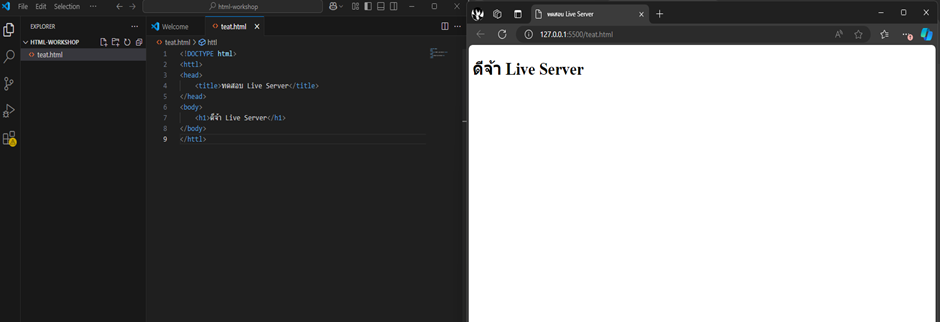

# ใบงานการทดลอง HTML
## การทดลองที่ 2: โครงสร้างพื้นฐาน HTML
### ขั้นตอนการทดลอง
1. สร้างไฟล์ index.html
2. เขียนโครงสร้างพื้นฐาน HTML:
```html
<!DOCTYPE html>
<html>
<head>
    <title>My First Web Page</title>
</head>
<body>
    <h1>Welcome to ...... (student name) web page</h1>
    <p>This is my first web page.</p>
    <div>This is a block element</div>
    <span>This is an inline element</span>
    <em>This text is emphasized</em>
    <strong>This text is strong</strong>    
</body>
</html>
```
3. บันทึกไฟล์และเปิดด้วย Live Server


### คำอธิบายเพิ่มเติม
- `<!DOCTYPE html>` คือการประกาศประเภทเอกสารเป็น HTML5
- `<html>` เป็น tag หลักที่ครอบคลุมทั้งเอกสาร
- `<head>` ใช้สำหรับข้อมูล metadata และการเชื่อมโยงไฟล์ภายนอก
- `<body>` คือส่วนที่แสดงผลบนหน้าเว็บ
- `<div>` เป็น block element ที่ขึ้นบรรทัดใหม่โดยอัตโนมัติ
- `<span>` เป็น inline element ที่ต่อเนื่องในบรรทัดเดียวกัน
- `<em>` ใช้เน้นข้อความ (แสดงเป็นตัวเอียง)
- `<strong>` ใช้เน้นข้อความ (แสดงเป็นตัวหนา)

### บันทึกผลการทดลอง
- รหัสเอกสาร HTML ที่เขียน:
```html
[วางโค้ด HTML ที่นี่]
```

<!DOCTYPE html>
<html lang="en">
<head>
    <meta charset="UTF-8">
    <meta name="viewport" content="width=device-width, initial-scale=1.0">
    <title>My Web Page</title>
    <style>
        *{
            margin: 0;
            padding: 0;
            box-sizing: border-box;
        }
        body{
            font-family: Cambria, Cochin, Georgia, Times, 'Times New Roman', serif;
            text-align: center;
                .park{
                    margin-top: 15%;
                }
                h1{
                    margin-top: 5px;
                }
        }
    </style>
</head>
<body>
    <div class="park">
        
        <h1 >Hello My Name is Anawin Boonchuay</h1>
        <h2 style="margin-top:10px;">Student ID 68030311</h2>
        <h2 style="margin-top:8px;"> Studying at KMILT</h2>
        <h2 style="margin-top:8px;"> Faculty of Industrial Education and Technology</h2>
        <h2 style="margin-top:8px;">Computer Technology branch</h2>
    </div>
</body>
</html>

- ภาพผลลัพธ์:



