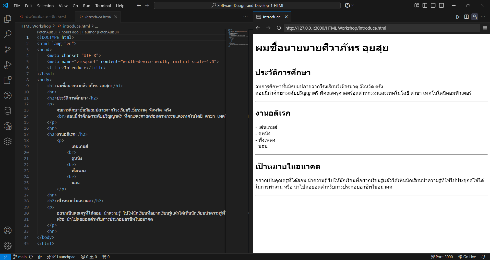

# ใบงานการทดลอง HTML
 
## การทดลองที่ 3: การจัดการข้อความและการจัดรูปแบบ
### ขั้นตอนการทดลอง
1. ทดลองใช้ tag ต่างๆ:
```html
<h1>หัวข้อระดับ 1</h1>
<h2>หัวข้อระดับ 2</h2>
<p>ย่อหน้าปกติ</p>
<p>ข้อความ <strong>ตัวหนา</strong> และ <em>ตัวเอียง</em></p>
<p>ขึ้นบรรทัดใหม่<br>ด้วย br</p>
<hr>
<pre>
    ข้อความที่ต้องการ
    รักษารูปแบบ
    การเว้นวรรค
</pre>
```

### แบบฝึกหัด
1. สร้างหน้าเว็บแนะนำตัวเองที่ประกอบด้วย:
   - ชื่อ-นามสกุล
   - ประวัติการศึกษา
   - งานอดิเรก
   - เป้าหมายในอนาคต
 ข้อกำหนดที่ต้องมี:
   - หัวข้อหลักและหัวข้อย่อย
   - ย่อหน้าที่มีการจัดรูปแบบ
   - การขึ้นบรรทัดใหม่
   - เส้นคั่นระหว่างเนื้อหา
### บันทึกผลการทดลอง
- รหัสเอกสาร HTML ที่เขียน:
```html
<!DOCTYPE html>
<html lang="en">
<head>
    <meta charset="UTF-8">
    <meta name="viewport" content="width=device-width, initial-scale=1.0">
    <title>Introduce</title>
</head>
<body>
    <h1>ผมชื่อนายนายศิวาภัทร อุยสุย</h1>
    <hr>
    <h2>ประวัติการศึกษา</h2>
    <p>
        จบการศึกษาชั้นมัธยมปลายจากโรงเรียนวิเชียรมาตุ จังหวัด ตรัง
        <br>ตอนนี้กำศึกษาระดับปริญญาตรี ที่คณะครุศาสตร์อุตสาหกรรมและเทคโนโลยี สาขา เทคโนโลนีคอมพิวเตอร์
    </p>
    <hr>
    <h2>งานอดิเรก</h2>
        <p>
            - เล่นเกมส์
            <br>
            - ดูหนัง
            <br>
            - ฟังเพลง
            <br>
            - นอน
        </p>
    <hr>
    <h2>เป้าหมายในอนาคต</h2>
    <p>
        อยากเป็นคุณครูที่ได้สอน นำความรู้ ไปให้นักเรียนที่อยากเรียนรู้เเล้วได้เห็นนักเรียนนำความรู้ที่ใช้ไปประยุกต์ใช้ได้ในการทำงาน หรือ นำไปต่อยอดสำหรับการประกอบอาชีพในอนาคต
    </p>
    <hr>
</body>
</html>
```
- ภาพผลลัพธ์:
