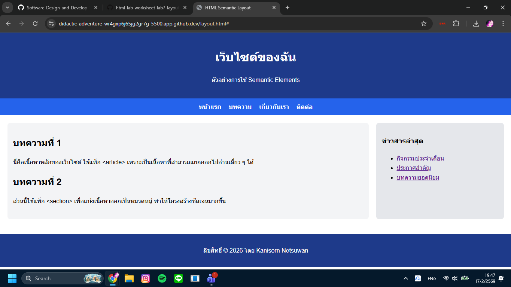

# ใบงานการทดลอง HTML
 
## การทดลองที่ 3: การจัดการข้อความและการจัดรูปแบบ
### ขั้นตอนการทดลอง
1. ทดลองใช้ tag ต่างๆ:
```html
<h1>หัวข้อระดับ 1</h1>
<h2>หัวข้อระดับ 2</h2>
<p>ย่อหน้าปกติ</p>
<p>ข้อความ <strong>ตัวหนา</strong> และ <em>ตัวเอียง</em></p>
<p>ขึ้นบรรทัดใหม่<br>ด้วย br</p>
<hr>
<pre>
    ข้อความที่ต้องการ
    รักษารูปแบบ
    การเว้นวรรค
</pre>
```

### แบบฝึกหัด
1. สร้างหน้าเว็บแนะนำตัวเองที่ประกอบด้วย:
   - ชื่อ-นามสกุล
   - ประวัติการศึกษา
   - งานอดิเรก
   - เป้าหมายในอนาคต
 ข้อกำหนดที่ต้องมี:
   - หัวข้อหลักและหัวข้อย่อย
   - ย่อหน้าที่มีการจัดรูปแบบ
   - การขึ้นบรรทัดใหม่
   - เส้นคั่นระหว่างเนื้อหา
### บันทึกผลการทดลอง
- รหัสเอกสาร HTML ที่เขียน:
```html
[<!DOCTYPE html>
<html lang="th">
<head>
    <meta charset="UTF-8">
    <title>ประวัติส่วนตัว - แนะนำตัวเอง</title>
</head>
<body>

    <h1>ประวัติส่วนตัว (Resume)</h1>
    <p>สวัสดีครับ ผมชื่อ <strong>นาย เสกสรรค์ ผคุโนพาส</strong> ยินดีที่ได้รู้จักครับ</p>
    
    <hr>

    <h2>ประวัติการศึกษา</h2>
    <p>
        กำลังศึกษาอยู่ที่: <em>[ใส่มหาวิทยาลัยของคุณ]</em><br> คณะ: ครุศาสตร์อุตสาหกรรมและเทคโนโลยี<br>
        สาขาวิชา: <em>[ใส่สาขาวิชาของคุณ]</em>
    </p>

    <hr>

    <h2>งานอดิเรกและความสนใจ</h2>
    <p>
        ในเวลาว่าง ผมชอบเล่น <strong>การ์ดเกม (Cardfight!! Vanguard)</strong> <br>
        นอกจากนี้ยังสนใจติดตามข่าวสารด้าน <em>เทคโนโลยี</em> และการพัฒนาเว็บไซต์ครับ
    </p>

    <hr>

    <h2>เป้าหมายในอนาคต</h2>
    <p>
        เป้าหมายของผมคือการพัฒนาทักษะการเขียนโปรแกรมให้เชี่ยวชาญ<br>
        และก้าวขึ้นเป็น <strong>นักพัฒนาเว็บไซต์ (Web Developer)</strong> มืออาชีพที่สามารถสร้างสรรค์ผลงานที่มีประโยชน์ได้ครับ
    </p>

</body>
</html>]
```
- ภาพผลลัพธ์:
[]


