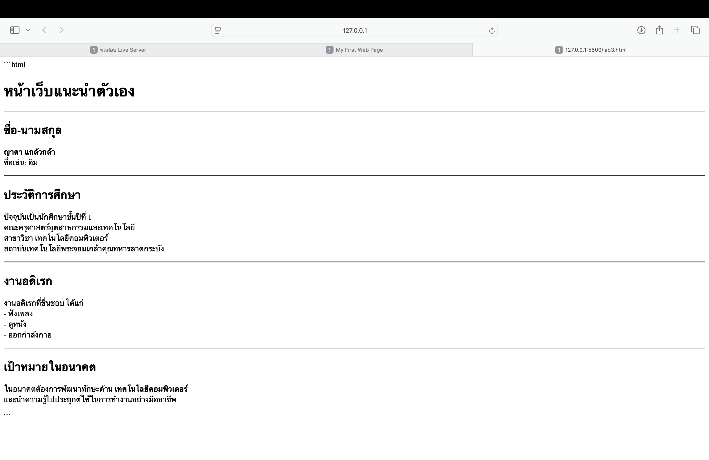

# ใบงานการทดลอง HTML
 
## การทดลองที่ 3: การจัดการข้อความและการจัดรูปแบบ
### ขั้นตอนการทดลอง
1. ทดลองใช้ tag ต่างๆ:
```html
<h1>หัวข้อระดับ 1</h1>
<h2>หัวข้อระดับ 2</h2>
<p>ย่อหน้าปกติ</p>
<p>ข้อความ <strong>ตัวหนา</strong> และ <em>ตัวเอียง</em></p>
<p>ขึ้นบรรทัดใหม่<br>ด้วย br</p>
<hr>
<pre>
    ข้อความที่ต้องการ
    รักษารูปแบบ
    การเว้นวรรค
</pre>
```

### แบบฝึกหัด
1. สร้างหน้าเว็บแนะนำตัวเองที่ประกอบด้วย:
   - ชื่อ-นามสกุล
   - ประวัติการศึกษา
   - งานอดิเรก
   - เป้าหมายในอนาคต
 ข้อกำหนดที่ต้องมี:
   - หัวข้อหลักและหัวข้อย่อย
   - ย่อหน้าที่มีการจัดรูปแบบ
   - การขึ้นบรรทัดใหม่
   - เส้นคั่นระหว่างเนื้อหา
### บันทึกผลการทดลอง
- รหัสเอกสาร HTML ที่เขียน:
```html
<h1>หน้าเว็บแนะนำตัวเอง</h1>
<hr>

<h2>ชื่อ-นามสกุล</h2>
<p>
<strong>ญาดา แกล้วกล้า</strong><br>
ชื่อเล่น: อิม
</p>

<hr>

<h2>ประวัติการศึกษา</h2>
<p>
ปัจจุบันเป็นนักศึกษาชั้นปีที่ 1<br>
คณะครุศาสตร์อุตสาหกรรมและเทคโนโลยี<br>
สาขาวิชา เทคโนโลยีคอมพิวเตอร์<br>
สถาบันเทคโนโลยีพระจอมเกล้าคุณทหารลาดกระบัง
</p>

<hr>

<h2>งานอดิเรก</h2>
<p>
งานอดิเรกที่ชื่นชอบ ได้แก่<br>
- ฟังเพลง<br>
- ดูหนัง<br>
- ออกกำลังกาย
</p>

<hr>

<h2>เป้าหมายในอนาคต</h2>
<p>
ในอนาคตต้องการพัฒนาทักษะด้าน <strong>เทคโนโลยีคอมพิวเตอร์</strong><br>
และนำความรู้ไปประยุกต์ใช้ในการทำงานอย่างมืออาชีพ
</p>
```
- ภาพผลลัพธ์:
[วางภาพ screenshot ที่นี่]


