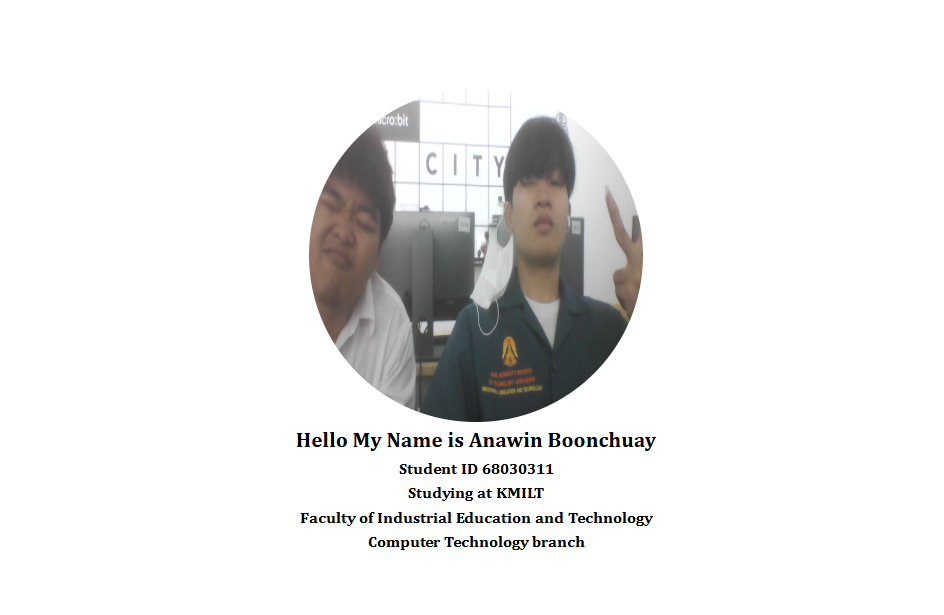

# ใบงานการทดลอง HTML
 
## การทดลองที่ 3: การจัดการข้อความและการจัดรูปแบบ
### ขั้นตอนการทดลอง
1. ทดลองใช้ tag ต่างๆ:
```html
<h1>หัวข้อระดับ 1</h1>
<h2>หัวข้อระดับ 2</h2>
<p>ย่อหน้าปกติ</p>
<p>ข้อความ <strong>ตัวหนา</strong> และ <em>ตัวเอียง</em></p>
<p>ขึ้นบรรทัดใหม่<br>ด้วย br</p>
<hr>
<pre>
    ข้อความที่ต้องการ
    รักษารูปแบบ
    การเว้นวรรค
</pre>
```

### แบบฝึกหัด
1. สร้างหน้าเว็บแนะนำตัวเองที่ประกอบด้วย:
   - ชื่อ-นามสกุล
   - ประวัติการศึกษา
   - งานอดิเรก
   - เป้าหมายในอนาคต
 ข้อกำหนดที่ต้องมี:
   - หัวข้อหลักและหัวข้อย่อย
   - ย่อหน้าที่มีการจัดรูปแบบ
   - การขึ้นบรรทัดใหม่
   - เส้นคั่นระหว่างเนื้อหา
### บันทึกผลการทดลอง
- รหัสเอกสาร HTML ที่เขียน:
```html
[<h1>แนะนำตัวส่วนตัว</h1>

<h2>ข้อมูลเบื้องต้น</h2>
<p><strong>ชื่อ-นามสกุล:</strong> นายวัฒนพงศ์ พรหมภิราม</p>

<hr>

<h2>ประวัติการศึกษา</h2>
<p>
    <strong>ระดับประถมศึกษา:</strong> โรงเรียนอนุบาลสุโขทัย<br>
    <strong>ระดับมัธยมศึกษา:</strong> โรงเรียนศรีสำโรงชนูปถัมภ์<br>
    <strong>ระดับอุดมศึกษา (ปัจจุบัน):</strong> <em>สถาบันเทคโนโลยีพระจอมเกล้าเจ้าคุณทหารลาดกระบัง</em>
</p>

<hr>

<h2>งานอดิเรก และ เป้าหมายในอนาคต</h2>
<p><strong>งานอดิเรก:</strong> ซื้อขายการ์ดเกม (Trading Card Games) ซึ่งช่วยฝึกทักษะการคิดวิเคราะห์ การวางแผน และการเจรจาต่อรอง</p>

<p><strong>เป้าหมายในอนาคต:</strong> ผมมีความใฝ่ฝันที่อยากจะเป็น <strong>"ครู"</strong> ครับ ผมอยากนำความรู้ที่ได้จากรั้วลาดกระบังไปถ่ายทอดและเป็นแรงบันดาลใจให้กับเด็กๆ นอกจากนี้ ผมยังสนใจที่จะนำความสนุกและกลยุทธ์จากการเล่นการ์ดเกม มาประยุกต์ใช้เป็นสื่อการสอนแบบ Active Learning เพื่อให้ห้องเรียนมีชีวิตชีวาและทำให้นักเรียนสนุกกับการเรียนรู้มากยิ่งขึ้นครับ</p>]
```
- ภาพผลลัพธ์:
[]


