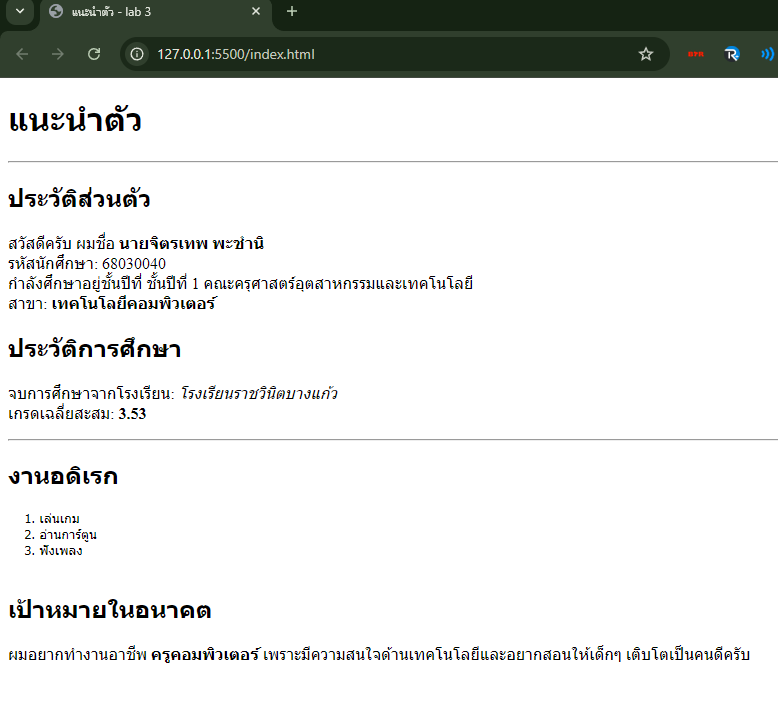

# ใบงานการทดลอง HTML
 
## การทดลองที่ 3: การจัดการข้อความและการจัดรูปแบบ
### ขั้นตอนการทดลอง
1. ทดลองใช้ tag ต่างๆ:
```html
<h1>หัวข้อระดับ 1</h1>
<h2>หัวข้อระดับ 2</h2>
<p>ย่อหน้าปกติ</p>
<p>ข้อความ <strong>ตัวหนา</strong> และ <em>ตัวเอียง</em></p>
<p>ขึ้นบรรทัดใหม่<br>ด้วย br</p>
<hr>
<pre>
    ข้อความที่ต้องการ
    รักษารูปแบบ
    การเว้นวรรค
</pre>
```

### แบบฝึกหัด
1. สร้างหน้าเว็บแนะนำตัวเองที่ประกอบด้วย:
   - ชื่อ-นามสกุล
   - ประวัติการศึกษา
   - งานอดิเรก
   - เป้าหมายในอนาคต
 ข้อกำหนดที่ต้องมี:
   - หัวข้อหลักและหัวข้อย่อย
   - ย่อหน้าที่มีการจัดรูปแบบ
   - การขึ้นบรรทัดใหม่
   - เส้นคั่นระหว่างเนื้อหา
### บันทึกผลการทดลอง
- รหัสเอกสาร HTML ที่เขียน:
```html
<!DOCTYPE html>
<html>
<head>
    <title>แนะนำตัว - lab 3</title>
</head>
<body>

    <h1>แนะนำตัว</h1>
    
    <hr> <h2>ประวัติส่วนตัว</h2>
    <p>
        สวัสดีครับ ผมชื่อ <strong>นายจิตรเทพ พะชำนิ</strong><br>
        รหัสนักศึกษา: 68030040<br>
        กำลังศึกษาอยู่ชั้นปีที่ ชั้นปีที่ 1 คณะครุศาสตร์อุตสาหกรรมและเทคโนโลยี<br>
        สาขา: <strong>เทคโนโลยีคอมพิวเตอร์</strong>
    </p>

    <h2>ประวัติการศึกษา</h2>
    <p>
        จบการศึกษาจากโรงเรียน: <em>โรงเรียนราชวินิตบางแก้ว</em><br>
        เกรดเฉลี่ยสะสม: <strong>3.53</strong>
    </p>

    <hr> <h2>งานอดิเรก</h2>
    <pre>
    1. เล่นเกม 
    2. อ่านการ์ตูน
    3. ฟังเพลง
    </pre>

    <h2>เป้าหมายในอนาคต</h2>
    <p>
        ผมอยากทำงานอาชีพ <strong>ครูคอมพิวเตอร์</strong> 
        เพราะมีความสนใจด้านเทคโนโลยีและอยากสอนให้เด็กๆ เติบโตเป็นคนดีครับ
    </p>

</body>
</html> 
```
- ภาพผลลัพธ์:



