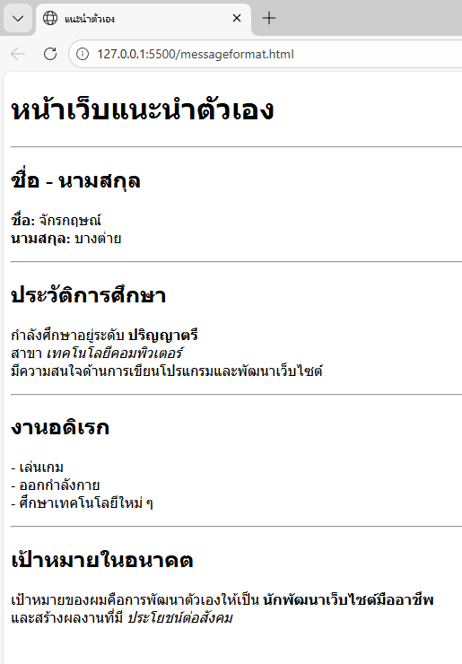

# ใบงานการทดลอง HTML
 
## การทดลองที่ 3: การจัดการข้อความและการจัดรูปแบบ
### ขั้นตอนการทดลอง
1. ทดลองใช้ tag ต่างๆ:
```html
<h1>หัวข้อระดับ 1</h1>
<h2>หัวข้อระดับ 2</h2>
<p>ย่อหน้าปกติ</p>
<p>ข้อความ <strong>ตัวหนา</strong> และ <em>ตัวเอียง</em></p>
<p>ขึ้นบรรทัดใหม่<br>ด้วย br</p>
<hr>
<pre>
    ข้อความที่ต้องการ
    รักษารูปแบบ
    การเว้นวรรค
</pre>
```

### แบบฝึกหัด
1. สร้างหน้าเว็บแนะนำตัวเองที่ประกอบด้วย:
   - ชื่อ-นามสกุล
   - ประวัติการศึกษา
   - งานอดิเรก
   - เป้าหมายในอนาคต
 ข้อกำหนดที่ต้องมี:
   - หัวข้อหลักและหัวข้อย่อย
   - ย่อหน้าที่มีการจัดรูปแบบ
   - การขึ้นบรรทัดใหม่
   - เส้นคั่นระหว่างเนื้อหา
### บันทึกผลการทดลอง
- รหัสเอกสาร HTML ที่เขียน:
```html
[วางโค้ด HTML ที่นี่]
<!DOCTYPE html>
<html lang="th">
<head>
    <meta charset="UTF-8">
    <title>แนะนำตัวเอง</title>
</head>
<body>

    <!-- หัวข้อหลัก -->
    <h1>หน้าเว็บแนะนำตัวเอง</h1>
    <hr>

    <!-- ชื่อ-นามสกุล -->
    <h2>ชื่อ - นามสกุล</h2>
    <p>
        <strong>ชื่อ:</strong> จักรกฤษณ์ <br>
        <strong>นามสกุล:</strong> บางต่าย
    </p>
    <hr>

    <!-- ประวัติการศึกษา -->
    <h2>ประวัติการศึกษา</h2>
    <p>
        กำลังศึกษาอยู่ระดับ <strong>ปริญญาตรี</strong><br>
        สาขา <em>เทคโนโลยีคอมพิวเตอร์</em><br>
        มีความสนใจด้านการเขียนโปรแกรมและพัฒนาเว็บไซต์
    </p>
    <hr>

    <!-- งานอดิเรก -->
    <h2>งานอดิเรก</h2>
    <p>
        - เล่นเกม <br>
        - ออกกำลังกาย <br>
        - ศึกษาเทคโนโลยีใหม่ ๆ 
    </p>
    <hr>

    <!-- เป้าหมายในอนาคต -->
    <h2>เป้าหมายในอนาคต</h2>
    <p>
        เป้าหมายของผมคือการพัฒนาตัวเองให้เป็น 
        <strong>นักพัฒนาเว็บไซต์มืออาชีพ</strong><br>
        และสร้างผลงานที่มี <em>ประโยชน์ต่อสังคม</em>
    </p>

</body>
</html>

```
- ภาพผลลัพธ์:
[วางภาพ screenshot ที่นี่]




