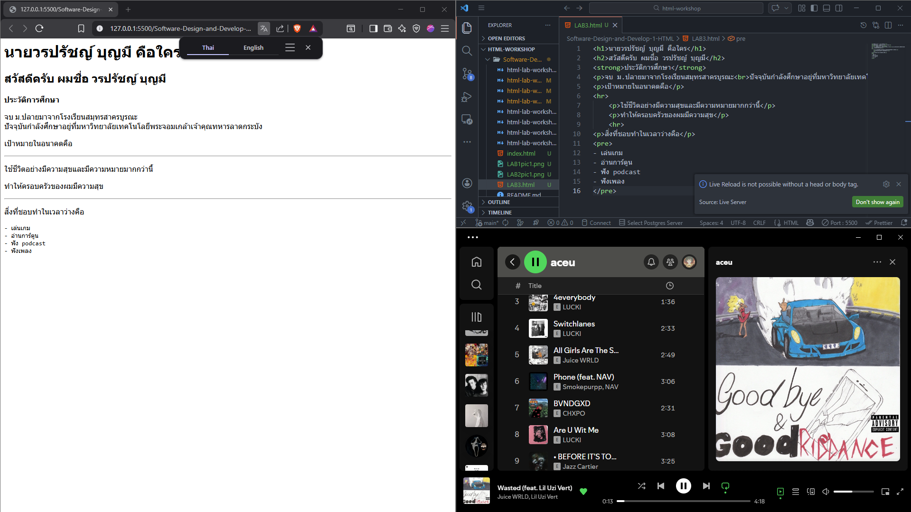

# ใบงานการทดลอง HTML
 
## การทดลองที่ 3: การจัดการข้อความและการจัดรูปแบบ
### ขั้นตอนการทดลอง
1. ทดลองใช้ tag ต่างๆ:
```html
<h1>หัวข้อระดับ 1</h1>
<h2>หัวข้อระดับ 2</h2>
<p>ย่อหน้าปกติ</p>
<p>ข้อความ <strong>ตัวหนา</strong> และ <em>ตัวเอียง</em></p>
<p>ขึ้นบรรทัดใหม่<br>ด้วย br</p>
<hr>
<pre>
    ข้อความที่ต้องการ
    รักษารูปแบบ
    การเว้นวรรค
</pre>
```

### แบบฝึกหัด
1. สร้างหน้าเว็บแนะนำตัวเองที่ประกอบด้วย:
   - ชื่อ-นามสกุล
   - ประวัติการศึกษา
   - งานอดิเรก
   - เป้าหมายในอนาคต
 ข้อกำหนดที่ต้องมี:
   - หัวข้อหลักและหัวข้อย่อย
   - ย่อหน้าที่มีการจัดรูปแบบ
   - การขึ้นบรรทัดใหม่
   - เส้นคั่นระหว่างเนื้อหา
### บันทึกผลการทดลอง
- รหัสเอกสาร HTML ที่เขียน:
```html
<h1>นายวรปรัชญ์ บุญมี คือใคร</h1>
<h2>สวัสดีครับ ผมชื่อ วรปรัชญ์ บุญมี</h2>
<strong>ประวัติการศึกษา</strong>
<p>จบ ม.ปลายมาจากโรงเรียนสมุทรสาครบูรณะ<br>ปัจจุบันกำลังศึกษาอยู่ที่มหาวิทยาลัยเทคโนโลยีพระจอมเกล้าเจ้าคุณทหารลาดกระบัง</p>
<p>เป้าหมายในอนาคตคือ</p>
<hr>
    <p>ใช้ชีวิตอย่างมีความสุขและมีความหมายมากกว่านี้</p>
    <p>ทำให้ครอบครัวของผมมีความสุข</p>
    <hr>
<p>สิ่งที่ชอบทำในเวลาว่างคือ</p>
<pre>
- เล่นเกม
- อ่านการ์ตูน
- ฟัง podcast
- ฟังเพลง
</pre>
```
- ภาพผลลัพธ์:

