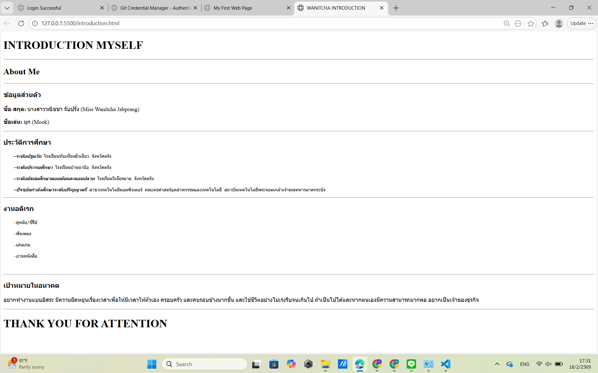

# ใบงานการทดลอง HTML
 
## การทดลองที่ 3: การจัดการข้อความและการจัดรูปแบบ
### ขั้นตอนการทดลอง
1. ทดลองใช้ tag ต่างๆ:
```html
<h1>หัวข้อระดับ 1</h1>
<h2>หัวข้อระดับ 2</h2>
<p>ย่อหน้าปกติ</p>
<p>ข้อความ <strong>ตัวหนา</strong> และ <em>ตัวเอียง</em></p>
<p>ขึ้นบรรทัดใหม่<br>ด้วย br</p>
<hr>
<pre>
    ข้อความที่ต้องการ
    รักษารูปแบบ
    การเว้นวรรค
</pre>
```

### แบบฝึกหัด
1. สร้างหน้าเว็บแนะนำตัวเองที่ประกอบด้วย:
   - ชื่อ-นามสกุล
   - ประวัติการศึกษา
   - งานอดิเรก
   - เป้าหมายในอนาคต
 ข้อกำหนดที่ต้องมี:
   - หัวข้อหลักและหัวข้อย่อย
   - ย่อหน้าที่มีการจัดรูปแบบ
   - การขึ้นบรรทัดใหม่
   - เส้นคั่นระหว่างเนื้อหา
### บันทึกผลการทดลอง
- รหัสเอกสาร HTML ที่เขียน:
```html
<!DOCTYPE html>
<html>
<head>
    <title>WANITCHA INTRODUCTION</title>
</head>
<body>
    <h1>INTRODUCTION MYSELF</h1>
    <hr>
    <h2>About Me</h2><hr>
    <h3>ข้อมูลส่วนตัว</h3>
    <p><strong>ชื่อ-สกุล:</strong> นางสาววณิชชา จับปรั่ง (Miss Wanitcha Jabprang)</p>
    <p><strong>ชื่อเล่น:</strong> มุก (Mook)</p><hr>
    <h3>ประวัติการศึกษา</h3>
    <pre>
    <em><strong>-ระดับปฐมวัย</strong></em> โรงเรียนทับเที่ยงฮั่วเฉียว จังหวัดตรัง

    <em><strong>-ระดับประถมศึกษา</strong></em> โรงเรียนบ้านนาป้อ จังหวัดตรัง

    <em><strong>-ระดับมัธยมศึกษาตอนต้นและตอนปลาย</strong></em> โรงเรียนวิเชียรมาตุ จังหวัดตรัง

    <em><strong>-ปัจจุบันกำลังศึกษาระดับปริญญาตรี</strong></em> สาขาเทคโนโลยีคอมพิวเตอร์ คณะครุศาสตร์อุตสาหกรรมและเทคโนโลยี สถาบันเทคโนโลยีพระจอมเกล้าเจ้าคุณทหารลาดกระบัง</pre>
    <hr>
    <h3>งานอดิเรก</h3>
    <pre>
    -ดูหนัง/ซีรี่ย์<br>
    -ฟังเพลง<br>
    -เล่นเกม<br>
    -อ่านหนังสือ<br>
    </pre><hr>
    <h3>เป้าหมายในอนาคต</h3>
    <p>อยากทำงานแบบอิสระ มีความยืดหยุ่นเรื่องเวลาเพื่อให้มีเวลาให้ตัวเอง ครอบครัว และคนรอบข้างมากขึ้น
    และใช้ชีวิตอย่างไม่เร่งรีบจนเกินไป ถ้าเป็นไปได้และหากตนเองมีความสามารถมากพอ อยากเป็นเจ้าของธุรกิจ</p>
    <hr>
    <h1>THANK YOU FOR ATTENTION</h1>
</body>
</html>
```
- ภาพผลลัพธ์:



