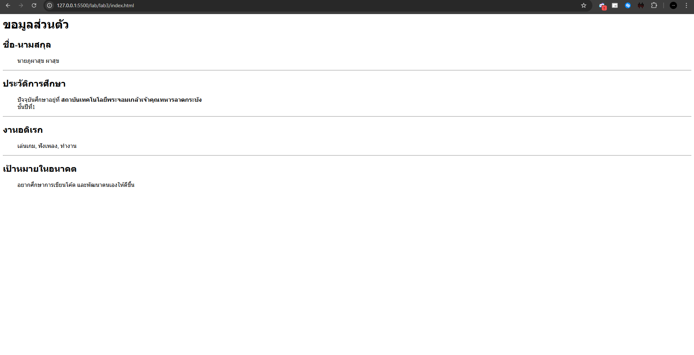

# ใบงานการทดลอง HTML
 
## การทดลองที่ 3: การจัดการข้อความและการจัดรูปแบบ
### ขั้นตอนการทดลอง
1. ทดลองใช้ tag ต่างๆ:
```html
<h1>หัวข้อระดับ 1</h1>
<h2>หัวข้อระดับ 2</h2>
<p>ย่อหน้าปกติ</p>
<p>ข้อความ <strong>ตัวหนา</strong> และ <em>ตัวเอียง</em></p>
<p>ขึ้นบรรทัดใหม่<br>ด้วย br</p>
<hr>
<pre>
    ข้อความที่ต้องการ
    รักษารูปแบบ
    การเว้นวรรค
</pre>
```

### แบบฝึกหัด
1. สร้างหน้าเว็บแนะนำตัวเองที่ประกอบด้วย:
   - ชื่อ-นามสกุล
   - ประวัติการศึกษา
   - งานอดิเรก
   - เป้าหมายในอนาคต
 ข้อกำหนดที่ต้องมี:
   - หัวข้อหลักและหัวข้อย่อย
   - ย่อหน้าที่มีการจัดรูปแบบ
   - การขึ้นบรรทัดใหม่
   - เส้นคั่นระหว่างเนื้อหา
### บันทึกผลการทดลอง
- รหัสเอกสาร HTML ที่เขียน:
```html
<h1>ขอมูลส่วนตัว</h1>

<h2>ชื่อ-นามสกุล</h2>
<ol>
    <p>นายภูผาสุข ผาสุข</p>
</ol>
<hr>

<h2>ประวัติการศึกษา</h2>
<ol>
    <p>ปัจจุบันศึกษาอยู่ที่ <strong>สถาบันเทคโนโลยีพระจอมเกล้าเจ้าคุณทหารลาดกระบัง</strong> <br>ชั้นปีที่1</p>
</ol>
<hr>

<h2>งานอดิเรก</h2>
<ol>
    <p>เล่นเกม, ฟังเพลง, ทำงาน</p>
</ol>
<hr>

<h2>เป้าหมายในอนาคต</h2>
<ol>
    <p>อยากศึกษาการเขียนโค้ด และพัฒนาตนเองให้ดีขี้น</p>
</ol>
```
- ภาพผลลัพธ์:



