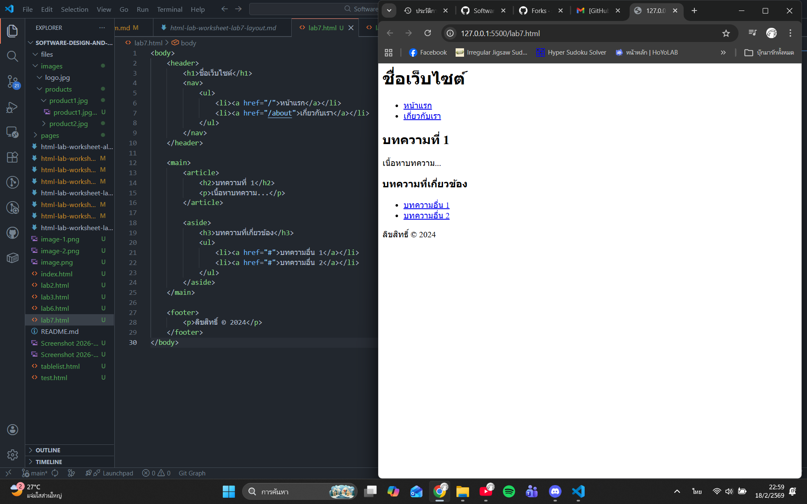

# ใบงานการทดลอง HTML
 
## การทดลองที่ 3: การจัดการข้อความและการจัดรูปแบบ
### ขั้นตอนการทดลอง
1. ทดลองใช้ tag ต่างๆ:
```html
<h1>หัวข้อระดับ 1</h1>
<h2>หัวข้อระดับ 2</h2>
<p>ย่อหน้าปกติ</p>
<p>ข้อความ <strong>ตัวหนา</strong> และ <em>ตัวเอียง</em></p>
<p>ขึ้นบรรทัดใหม่<br>ด้วย br</p>
<hr>
<pre>
    ข้อความที่ต้องการ
    รักษารูปแบบ
    การเว้นวรรค
</pre>
```

### แบบฝึกหัด
1. สร้างหน้าเว็บแนะนำตัวเองที่ประกอบด้วย:
   - ชื่อ-นามสกุล
   - ประวัติการศึกษา
   - งานอดิเรก
   - เป้าหมายในอนาคต
 ข้อกำหนดที่ต้องมี:
   - หัวข้อหลักและหัวข้อย่อย
   - ย่อหน้าที่มีการจัดรูปแบบ
   - การขึ้นบรรทัดใหม่
   - เส้นคั่นระหว่างเนื้อหา
### บันทึกผลการทดลอง
- รหัสเอกสาร HTML ที่เขียน:
```html
[<!DOCTYPE html>
<html lang="en">
<head>
    <title>Document</title>
</head>

<body>
    <h1>miss.chutiporn chaochai</h1>
    <h2>ประวัติการศึกษา</h2>
    <pre>
        จบจากวิทยาลัยเทคนิคสมุทรสาคร ระดับปวช
        กำลังศึกษาอยู่ที่สถาบันเทคโนโลยีพระจอมเกล้าเจ้าคุณทหารลาดกะบัง 
        คณะครุศาตร์อุตสาหกรรมและเทคโนโลยี
    </pre>
    <hr>

    <h4>งานอดิเรก</h4>
    <pre>
        อ่านนิยาย เล่นเกม ดูหนัง ฟังเพลง
    </pre>
    <hr>

    <h4>เป้าหมายในอนาคต</h4>
    <pre>
        อยาก<em>สอบบรรจุเข้าราชการ</em> ทำหน้าที่เป็นครูอย่างเต็มรูปแบบดูแลและช่วยเหลือนักเรียนมี<br>เงินเลี้ยงดูพ่อแม่</br>
    </pre>
    <hr>


</body>
</html>]
```
- ภาพผลลัพธ์:
[]


