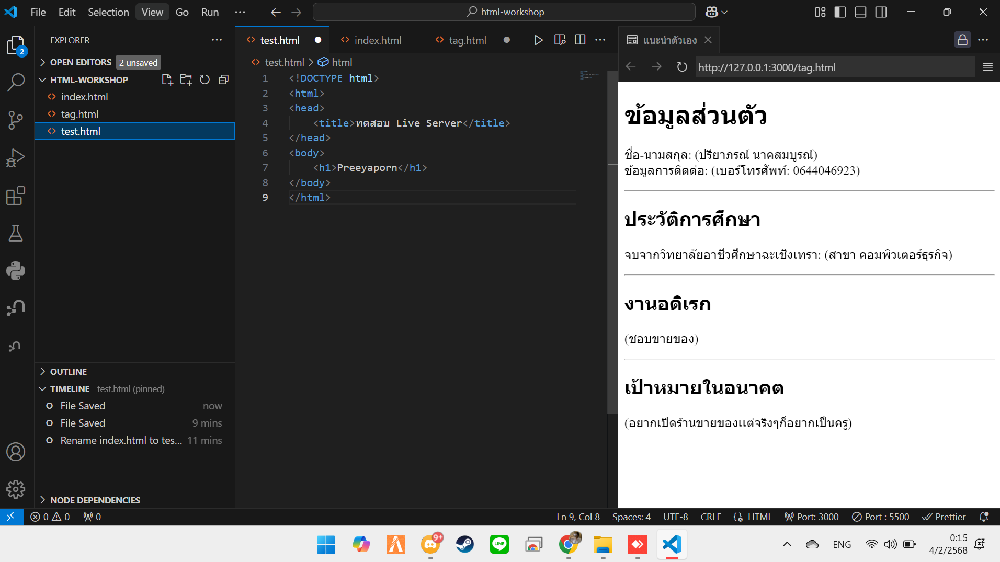

# ใบงานการทดลอง HTML
 
## การทดลองที่ 3: การจัดการข้อความและการจัดรูปแบบ
### ขั้นตอนการทดลอง
1. ทดลองใช้ tag ต่างๆ:
```html
<h1>หัวข้อระดับ 1</h1>
<h2>หัวข้อระดับ 2</h2>
<p>ย่อหน้าปกติ</p>
<p>ข้อความ <strong>ตัวหนา</strong> และ <em>ตัวเอียง</em></p>
<p>ขึ้นบรรทัดใหม่<br>ด้วย br</p>
<hr>
<pre>
    ข้อความที่ต้องการ
    รักษารูปแบบ
    การเว้นวรรค
</pre>
```

### แบบฝึกหัด
1. สร้างหน้าเว็บแนะนำตัวเองที่ประกอบด้วย:
   - ชื่อ-นามสกุล
   - ประวัติการศึกษา
   - งานอดิเรก
   - เป้าหมายในอนาคต
 ข้อกำหนดที่ต้องมี:
   - หัวข้อหลักและหัวข้อย่อย
   - ย่อหน้าที่มีการจัดรูปแบบ
   - การขึ้นบรรทัดใหม่
   - เส้นคั่นระหว่างเนื้อหา
### บันทึกผลการทดลอง
- รหัสเอกสาร HTML ที่เขียน:
```html
<!DOCTYPE html>
<html>
<head>
<title>แนะนำตัวเอง</title>
</head>
<body>

<h1>ข้อมูลส่วนตัว</h1>
<p>ชื่อ-นามสกุล: (ปรียาภรณ์ นาคสมบูรณ์)<br>
ข้อมูลการติดต่อ: (เบอร์โทรศัพท์: 0644046923)</p>

<hr>

<h2>ประวัติการศึกษา</h2>
<p>จบจากวิทยาลัยอาชีวศึกษาฉะเชิงเทรา: (สาขา คอมพิวเตอร์ธุรกิจ)</p>

<hr>

<h2>งานอดิเรก</h2>
<p>(ชอบขายของ)</p>

<hr>

<h2>เป้าหมายในอนาคต</h2>
<p>(อยากเปิดร้านขายของเเต่จริงๆก็อยากเป็นครู)</p>

</body>
</html>
```
- ภาพผลลัพธ์:



