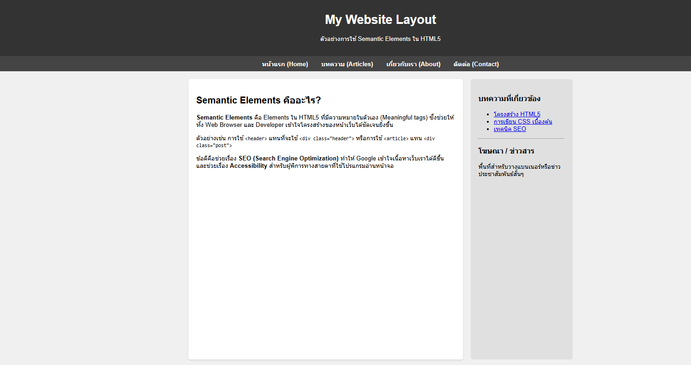

# ใบงานการทดลอง HTML
 
## การทดลองที่ 3: การจัดการข้อความและการจัดรูปแบบ
### ขั้นตอนการทดลอง
1. ทดลองใช้ tag ต่างๆ:
```html
<h1>หัวข้อระดับ 1</h1>
<h2>หัวข้อระดับ 2</h2>
<p>ย่อหน้าปกติ</p>
<p>ข้อความ <strong>ตัวหนา</strong> และ <em>ตัวเอียง</em></p>
<p>ขึ้นบรรทัดใหม่<br>ด้วย br</p>
<hr>
<pre>
    ข้อความที่ต้องการ
    รักษารูปแบบ
    การเว้นวรรค
</pre>
```

### แบบฝึกหัด
1. สร้างหน้าเว็บแนะนำตัวเองที่ประกอบด้วย:
   - ชื่อ-นามสกุล
   - ประวัติการศึกษา
   - งานอดิเรก
   - เป้าหมายในอนาคต
 ข้อกำหนดที่ต้องมี:
   - หัวข้อหลักและหัวข้อย่อย
   - ย่อหน้าที่มีการจัดรูปแบบ
   - การขึ้นบรรทัดใหม่
   - เส้นคั่นระหว่างเนื้อหา
### บันทึกผลการทดลอง
- รหัสเอกสาร HTML ที่เขียน:
```html
[วางโค้ด HTML ที่นี่]
```<!DOCTYPE html>
<html>
<head>
    <title>แนะนำตัวเอง</title>
</head>
<body>

    <!-- หัวข้อหลัก -->
    <h1>แนะนำตัวเอง</h1>

    <hr>

    <!-- ชื่อ-นามสกุล -->
    <h2>ชื่อ - นามสกุล</h2>
    <p>
        ชื่อ: <strong>ณภัทร สิงห์ตุ้ย</strong><br>
        ชื่อเล่น: <em>บัค</em>
    </p>

    <hr>

    <!-- ประวัติการศึกษา -->
    <h2>ประวัติการศึกษา</h2>
    <p>
        กำลังศึกษาอยู่ใน <strong>สถาบัคเทคโนโลยีพระจอมเกล้าเจ้าคุณทหารลาดกระบัง</strong><br>
    
    </p>

    <hr>

 
    <h2>งานอดิเรก</h2>
    <p>
        งานอดิเรกของฉันคือ<br>
        เล่นเกม <br>
        ฟังเพลง <br>
       
    </p>

    <hr>

  
    <h2>เป้าหมายในอนาคต</h2>
    <p>
        เป้าหมายในอนาคตคือ<br>
         <strong>มีความสุขกับงานในอนาคต
</p>

</body>
</html>
- ภาพผลลัพธ์:



