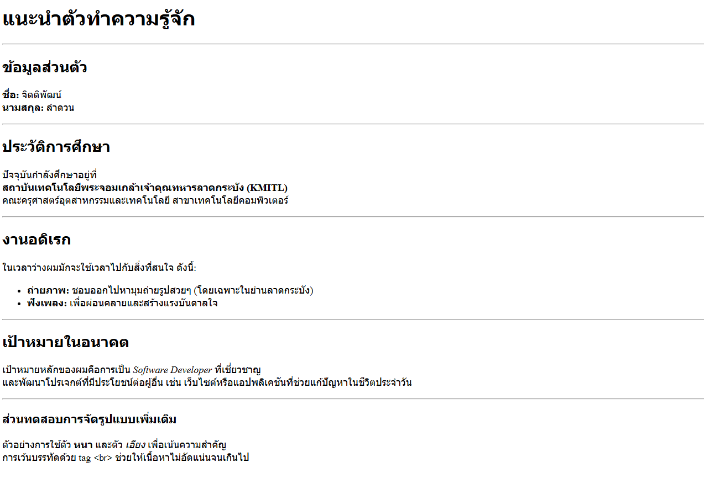

# ใบงานการทดลอง HTML
 
## การทดลองที่ 3: การจัดการข้อความและการจัดรูปแบบ
### ขั้นตอนการทดลอง
1. ทดลองใช้ tag ต่างๆ:
```html
<h1>หัวข้อระดับ 1</h1>
<h2>หัวข้อระดับ 2</h2>
<p>ย่อหน้าปกติ</p>
<p>ข้อความ <strong>ตัวหนา</strong> และ <em>ตัวเอียง</em></p>
<p>ขึ้นบรรทัดใหม่<br>ด้วย br</p>
<hr>
<pre>
    ข้อความที่ต้องการ
    รักษารูปแบบ
    การเว้นวรรค
</pre>
```

### แบบฝึกหัด
1. สร้างหน้าเว็บแนะนำตัวเองที่ประกอบด้วย:
   - ชื่อ-นามสกุล
   - ประวัติการศึกษา
   - งานอดิเรก
   - เป้าหมายในอนาคต
 ข้อกำหนดที่ต้องมี:
   - หัวข้อหลักและหัวข้อย่อย
   - ย่อหน้าที่มีการจัดรูปแบบ
   - การขึ้นบรรทัดใหม่
   - เส้นคั่นระหว่างเนื้อหา
### บันทึกผลการทดลอง
- รหัสเอกสาร HTML ที่เขียน:
```html
<!DOCTYPE html>
<html lang="th">
<head>
    <meta charset="UTF-8">
    <title>หน้าแนะนำตัวของ จิตติพัฒน์</title>
</head>
<body>

    <h1>แนะนำตัวทำความรู้จัก</h1>
    
    <hr> <h2>ข้อมูลส่วนตัว</h2>
    <p>
        <strong>ชื่อ:</strong> จิตติพัฒน์ <br>
        <strong>นามสกุล:</strong> ลำดวน
    </p>

    <hr>

    <h2>ประวัติการศึกษา</h2>
    <p>
        ปัจจุบันกำลังศึกษาอยู่ที่ <br>
        <strong>สถาบันเทคโนโลยีพระจอมเกล้าเจ้าคุณทหารลาดกระบัง (KMITL)</strong><br>
        คณะครุศาสตร์อุตสาหกรรมและเทคโนโลยี สาขาเทคโนโลยีคอมพิวเตอร์
    </p>

    <hr>

    <h2>งานอดิเรก</h2>
    <p>
        ในเวลาว่างผมมักจะใช้เวลาไปกับสิ่งที่สนใจ ดังนี้:
    </p>
    <ul>
        <li><strong>ถ่ายภาพ:</strong> ชอบออกไปหามุมถ่ายรูปสวยๆ (โดยเฉพาะในย่านลาดกระบัง)</li>
        <li><strong>ฟังเพลง:</strong> เพื่อผ่อนคลายและสร้างแรงบันดาลใจ</li>
    </ul>

    <hr>

    <h2>เป้าหมายในอนาคต</h2>
    <p>
        เป้าหมายหลักของผมคือการเป็น <em>Software Developer</em> ที่เชี่ยวชาญ <br>
        และพัฒนาโปรเจกต์ที่มีประโยชน์ต่อผู้อื่น เช่น เว็บไซต์หรือแอปพลิเคชันที่ช่วยแก้ปัญหาในชีวิตประจำวัน
    </p>

    <hr>

    <h3>ส่วนทดสอบการจัดรูปแบบเพิ่มเติม</h3>
    <p>
        ตัวอย่างการใช้ตัว <strong>หนา</strong> และตัว <em>เอียง</em> เพื่อเน้นความสำคัญ <br>
        การเว้นบรรทัดด้วย tag <code>&lt;br&gt;</code> ช่วยให้เนื้อหาไม่อัดแน่นจนเกินไป
    </p>

</body>
</html>
```
- ภาพผลลัพธ์:



