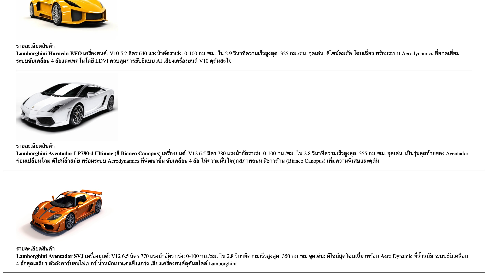

# ใบงานการทดลอง HTML

## การทดลองที่ 4: การสร้างลิงก์และการแทรกรูปภาพ

### การเตรียมโครงสร้างโฟลเดอร์และไฟล์
1. สร้างโครงสร้างโฟลเดอร์:
   ```
   html-workshop/
   ├── index.html
   ├── pages/
   │   ├── about.html
   │   └── contact.html
   ├── images/
   │   ├── logo.jpg
   │   └── products/
   │       ├── product1.jpg
   │       └── product2.jpg
   └── files/
       └── document.pdf
   ```

2. ขั้นตอนการสร้างโครงสร้าง:
   - คลิกขวาในโฟลเดอร์ html-workshop > New Folder > สร้าง "pages"
   - คลิกขวาในโฟลเดอร์ html-workshop > New Folder > สร้าง "images"
   - ในโฟลเดอร์ images > New Folder > สร้าง "products"
   - คลิกขวาในโฟลเดอร์ html-workshop > New Folder > สร้าง "files"

3. สร้างไฟล์ HTML:
   - ในโฟลเดอร์หลัก: สร้าง index.html (ใช้ไฟล์เดิมที่มีได้)
   - ในโฟลเดอร์ pages: สร้าง about.html และ contact.html

4. จัดเตรียมไฟล์:
   - นำรูปภาพที่ต้องการใช้ไปไว้ในโฟลเดอร์ images
   - นำรูปภาพสินค้าไปไว้ในโฟลเดอร์ products
   - นำไฟล์เอกสารไปไว้ในโฟลเดอร์ files

### ขั้นตอนการทดลอง

#### ส่วนที่ 1: การสร้างลิงก์
1. เปิดไฟล์ index.html และใส่โครงสร้างพื้นฐาน:
```html
<!DOCTYPE html>
<html lang="th">
<head>
    <meta charset="UTF-8">
    <title>หน้าหลัก</title>
</head>
<body>
    <!-- ส่วนของเนื้อหา -->
</body>
</html>
```

2. สร้างเมนูนำทางพื้นฐาน:
```html
<nav>
    <!-- ลิงก์ภายใน - ไปยังหน้าในเว็บไซต์เดียวกัน -->
    <a href="index.html">หน้าหลัก</a>
    <a href="pages/about.html">เกี่ยวกับเรา</a>
    <a href="pages/contact.html">ติดต่อเรา</a>
    
    <!-- ลิงก์ภายนอก - เปิดในแท็บใหม่ -->
    <a href="https://www.google.com" target="_blank">
        ไปยัง Google
    </a>
</nav>
```
คำอธิบาย:
- `href="..."` - กำหนดเส้นทางของลิงก์
- `target="_blank"` - เปิดลิงก์ในแท็บใหม่

3. สร้างลิงก์ภายในหน้าเดียวกัน:
```html
<!-- สร้างจุดเชื่อมโยง -->
<section id="top">
    <h1>เนื้อหาส่วนบน</h1>
</section>

<section id="products">
    <h2>สินค้าของเรา</h2>
</section>

<!-- ลิงก์ไปยังจุดเชื่อมโยง -->
<a href="#top">กลับด้านบน</a>
<a href="#products">ไปยังสินค้า</a>
```
คำอธิบาย:
- `id="..."` - กำหนดจุดเชื่อมโยง
- `href="#..."` - ลิงก์ไปยัง id ที่กำหนด

4. สร้างลิงก์พิเศษ:
```html
<!-- ลิงก์อีเมล -->
<a href="mailto:contact@example.com">ส่งอีเมลหาเรา</a>

<!-- ลิงก์โทรศัพท์ -->
<a href="tel:+66812345678">โทร 081-234-5678</a>

<!-- ลิงก์ดาวน์โหลด -->
<a href="files/document.pdf" download>
    ดาวน์โหลดเอกสาร
</a>
```
คำอธิบาย:
- `mailto:` - เปิดโปรแกรมอีเมล
- `tel:` - เปิดโปรแกรมโทรศัพท์
- `download` - ดาวน์โหลดไฟล์แทนการเปิด

#### ส่วนที่ 2: การแทรกรูปภาพ
1. แทรกรูปภาพพื้นฐาน:
```html
<!-- รูปภาพในโฟลเดอร์ images -->


<!-- รูปภาพในโฟลเดอร์ย่อย products -->

```
คำอธิบาย:
- `src="..."` - ระบุตำแหน่งของรูปภาพ
- `alt="..."` - ข้อความทดแทนเมื่อไม่สามารถแสดงรูปได้
- `width="..."` - กำหนดความกว้าง
- `height="..."` - กำหนดความสูง

2. ใช้ figure และ figcaption:
```html
<figure>
    
    <figcaption>
        รายละเอียดสินค้าชิ้นที่ 2
    </figcaption>
</figure>
```
คำอธิบาย:
- `<figure>` - จัดกลุ่มรูปภาพและคำอธิบาย
- `<figcaption>` - คำอธิบายประกอบรูปภาพ

3. สร้างรูปภาพที่คลิกได้:
```html
<a href="images/products/product1.jpg">
    
</a>
```

### หมายเหตุ
- ตรวจสอบการสะกดชื่อไฟล์และโฟลเดอร์ให้ถูกต้อง
- path ของรูปภาพต้องถูกต้องตามโครงสร้างโฟลเดอร์
- ทดสอบการทำงานของลิงก์ทุกจุด

### แบบฝึกหัด
1. สร้างแกลเลอรีสินค้า:
   - สร้างโฟลเดอร์ images/gallery
   - ใส่รูปภาพอย่างน้อย 4 รูป
   - แต่ละรูปต้องคลิกดูขนาดใหญ่ได้
   - มีคำอธิบายใต้รูป
   - มีปุ่มกลับด้านบน

### บันทึกผลการทดลอง
- รหัสเอกสาร HTML ที่เขียน:
```html
[<html>
<head>
    <meta charset="UTF-8">
    <title>หน้าหลัก</title>
</head>
<body>
    <section id="top">
        <h1>รูป</h1>
    </section>

    <hr>

    <section>
        <figure>
            <a href="image/a110s.webp" target="blank">
                
            </a>
            <figcaption>Alpine A110</figcaption>
        </figure>

        <figure>
            <a href="image/f430.jpg" target="_blank">
                
            </a>
            <figcaption>Ferrari F430</figcaption>
        </figure>
        <a href="image/f-18-hornet-2657080_640.jpg" target="_blank">
            
        </a>
        <figcaption>F18 Hornet</figcaption>

        <figure>
            <a href="image/718f2bc0-db45-11f0-bd60-5332627fd119.jpg" target="_blank">
                
            </a>
        </figure>
        <figcaption>F1 2026 Conpect</figcaption>

    </section>

    <hr>

    <a href="#top">กลับไป</a>
    
</body>
</html>]
```
- ภาพผลลัพธ์:



