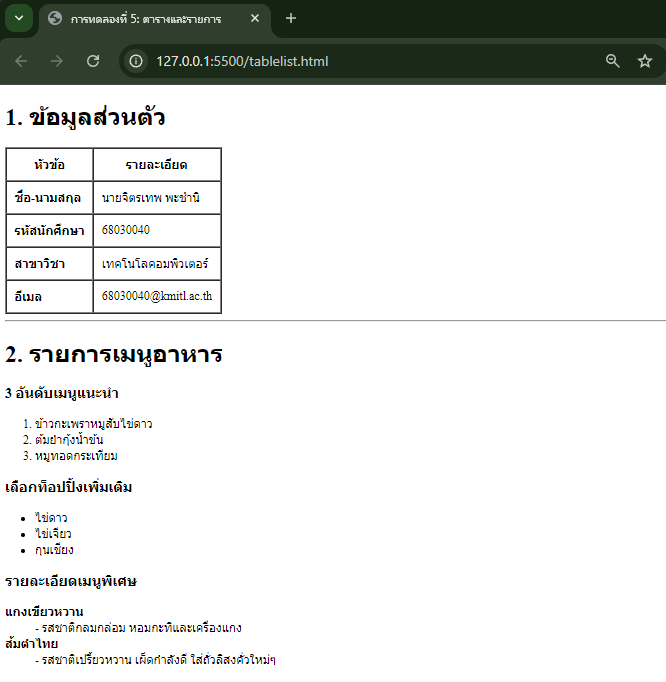

# ใบงานการทดลอง HTML

## การทดลองที่ 5: การสร้างตารางและรายการ
### วัตถุประสงค์
- เรียนรู้การสร้างตารางข้อมูล
- เรียนรู้การสร้างรายการแบบต่างๆ

### ขั้นตอนการทดลอง
1. สร้างไฟล์ tablelist.html ดังตัวอย่าง:
```html
<table border="1">
    <thead>
        <tr>
            <th>Header 1</th>
            <th>Header 2</th>
        </tr>
    </thead>
    <tbody>
        <tr>
            <td>Row 1, Cell 1</td>
            <td>Row 1, Cell 2</td>
        </tr>
        <tr>
            <td>Row 2, Cell 1</td>
            <td>Row 2, Cell 2</td>
        </tr>
    </tbody>
</table>
```

### คำอธิบายเพิ่มเติม
- `<table>` กำหนดขอบเขตของตาราง
- `<thead>` สำหรับส่วนหัวตาราง
- `<tbody>` สำหรับเนื้อหาตาราง
- `<tr>` แทนแถว
- `<th>` แทนเซลล์หัวตาราง
- `<td>` แทนเซลล์ข้อมูล

2. การสร้างรายการ โดยเพิ่มเติม Code ในไฟล์ tablelist.html :
```html
<ul>
    <li>Unordered item 1</li>
    <li>Unordered item 2</li>
</ul>

<ol>
    <li>Ordered item 1</li>
    <li>Ordered item 2</li>
</ol>

<dl>
    <dt>Term 1</dt>
    <dd>Definition 1</dd>
    <dt>Term 2</dt>
    <dd>Definition 2</dd>
</dl>
```

### คำอธิบายเพิ่มเติม
- `<ul>` สำหรับรายการแบบไม่เรียงลำดับ
- `<ol>` สำหรับรายการแบบเรียงลำดับ
- `<dl>` สำหรับรายการแบบคำจำกัดความ
- `<li>` แทนรายการแต่ละรายการ

### แบบฝึกหัด
1. สร้างตารางแสดงข้อมูลส่วนตัว
2. สร้างรายการเมนูอาหาร

[วางโค้ด HTML ที่นี่]
```html
<!DOCTYPE html>
<html lang="th">
<head>
    <meta charset="UTF-8">
    <title>การทดลองที่ 5: ตารางและรายการ</title>
</head>
<body>

    <h1>1. ข้อมูลส่วนตัว</h1>
    
    <table border="1" cellpadding="10" cellspacing="0">
        <thead>
            <tr>
                <th>หัวข้อ</th>
                <th>รายละเอียด</th>
            </tr>
        </thead>
        <tbody>
            <tr>
                <td><strong>ชื่อ-นามสกุล</strong></td>
                <td>นายจิตรเทพ พะชำนิ</td>
            </tr>
            <tr>
                <td><strong>รหัสนักศึกษา</strong></td>
                <td>68030040</td>
            </tr>
            <tr>
                <td><strong>สาขาวิชา</strong></td>
                <td>เทคโนโลคอมพิวเตอร์</td>
            </tr>
            <tr>
                <td><strong>อีเมล</strong></td>
                <td>68030040@kmitl.ac.th</td>
            </tr>
        </tbody>
    </table>

    <hr>

    <h1>2. รายการเมนูอาหาร</h1>

    <h3> 3 อันดับเมนูแนะนำ </h3>
    <ol>
        <li>ข้าวกะเพราหมูสับไข่ดาว</li>
        <li>ต้มยำกุ้งน้ำข้น</li>
        <li>หมูทอดกระเทียม</li>
    </ol>

    <h3>เลือกท็อปปิ้งเพิ่มเติม</h3>
    <ul>
        <li>ไข่ดาว</li>
        <li>ไข่เจียว</li>
        <li>กุนเชียง</li>
    </ul>

    <h3>รายละเอียดเมนูพิเศษ</h3>
    <dl>
        <dt><strong>แกงเขียวหวาน</strong></dt> <dd>- รสชาติกลมกล่อม หอมกะทิและเครื่องแกง</dd> <dt><strong>ส้มตำไทย</strong></dt>
        <dd>- รสชาติเปรี้ยวหวาน เผ็ดกำลังดี ใส่ถั่วลิสงคั่วใหม่ๆ</dd>
    </dl>

</body>
</html>
```
- ภาพผลลัพธ์:


