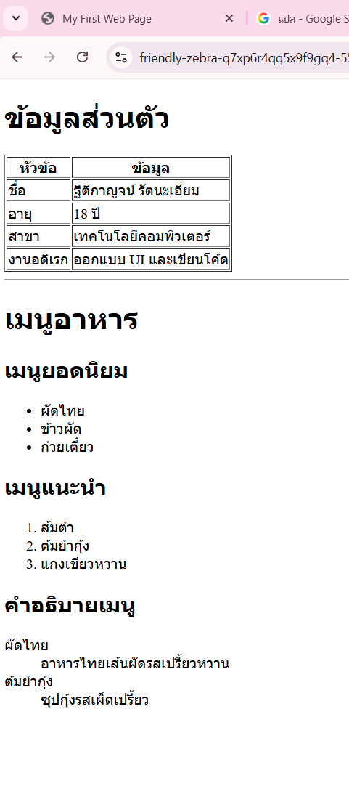

# ใบงานการทดลอง HTML

## การทดลองที่ 5: การสร้างตารางและรายการ
### วัตถุประสงค์
- เรียนรู้การสร้างตารางข้อมูล
- เรียนรู้การสร้างรายการแบบต่างๆ

### ขั้นตอนการทดลอง
1. สร้างไฟล์ tablelist.html ดังตัวอย่าง:
```html
<table border="1">
    <thead>
        <tr>
            <th>Header 1</th>
            <th>Header 2</th>
        </tr>
    </thead>
    <tbody>
        <tr>
            <td>Row 1, Cell 1</td>
            <td>Row 1, Cell 2</td>
        </tr>
        <tr>
            <td>Row 2, Cell 1</td>
            <td>Row 2, Cell 2</td>
        </tr>
    </tbody>
</table>
```

### คำอธิบายเพิ่มเติม
- `<table>` กำหนดขอบเขตของตาราง
- `<thead>` สำหรับส่วนหัวตาราง
- `<tbody>` สำหรับเนื้อหาตาราง
- `<tr>` แทนแถว
- `<th>` แทนเซลล์หัวตาราง
- `<td>` แทนเซลล์ข้อมูล

2. การสร้างรายการ โดยเพิ่มเติม Code ในไฟล์ tablelist.html :
```html
<ul>
    <li>Unordered item 1</li>
    <li>Unordered item 2</li>
</ul>

<ol>
    <li>Ordered item 1</li>
    <li>Ordered item 2</li>
</ol>

<dl>
    <dt>Term 1</dt>
    <dd>Definition 1</dd>
    <dt>Term 2</dt>
    <dd>Definition 2</dd>
</dl>
```

### คำอธิบายเพิ่มเติม
- `<ul>` สำหรับรายการแบบไม่เรียงลำดับ
- `<ol>` สำหรับรายการแบบเรียงลำดับ
- `<dl>` สำหรับรายการแบบคำจำกัดความ
- `<li>` แทนรายการแต่ละรายการ

### แบบฝึกหัด
1. สร้างตารางแสดงข้อมูลส่วนตัว
2. สร้างรายการเมนูอาหาร

[<!DOCTYPE html>
<html lang="th">
<head>
<meta charset="UTF-8">
<title>ตารางและรายการ</title>
</head>
<body>

<h1>ข้อมูลส่วนตัว</h1>

<table border="1">
    <thead>
        <tr>
            <th>หัวข้อ</th>
            <th>ข้อมูล</th>
        </tr>
    </thead>
    <tbody>
        <tr>
            <td>ชื่อ</td>
            <td>ฐิติกาญจน์ รัตนะเอี่ยม</td>
        </tr>
        <tr>
            <td>อายุ</td>
            <td>18 ปี</td>
        </tr>
        <tr>
            <td>สาขา</td>
            <td>เทคโนโลยีคอมพิวเตอร์</td>
        </tr>
        <tr>
            <td>งานอดิเรก</td>
            <td>ออกแบบ UI และเขียนโค้ด</td>
        </tr>
    </tbody>
</table>

<hr>

<h1>เมนูอาหาร</h1>

<h2>เมนูยอดนิยม</h2>
<ul>
    <li>ผัดไทย</li>
    <li>ข้าวผัด</li>
    <li>ก๋วยเตี๋ยว</li>
</ul>

<h2>เมนูแนะนำ</h2>
<ol>
    <li>ส้มตำ</li>
    <li>ต้มยำกุ้ง</li>
    <li>แกงเขียวหวาน</li>
</ol>

<h2>คำอธิบายเมนู</h2>
<dl>
    <dt>ผัดไทย</dt>
    <dd>อาหารไทยเส้นผัดรสเปรี้ยวหวาน</dd>

    <dt>ต้มยำกุ้ง</dt>
    <dd>ซุปกุ้งรสเผ็ดเปรี้ยว</dd>
</dl>

</body>
</html>
]
```html

```
- ภาพผลลัพธ์:
[]

