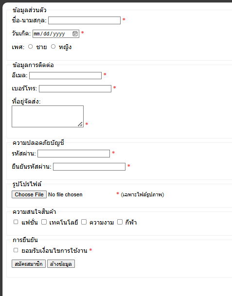

# ใบงานการทดลอง HTML

## การทดลองที่ 5: การสร้างตารางและรายการ
### วัตถุประสงค์
- เรียนรู้การสร้างตารางข้อมูล
- เรียนรู้การสร้างรายการแบบต่างๆ

### ขั้นตอนการทดลอง
1. สร้างไฟล์ tablelist.html ดังตัวอย่าง:
```html
<table border="1">
    <thead>
        <tr>
            <th>Header 1</th>
            <th>Header 2</th>
        </tr>
    </thead>
    <tbody>
        <tr>
            <td>Row 1, Cell 1</td>
            <td>Row 1, Cell 2</td>
        </tr>
        <tr>
            <td>Row 2, Cell 1</td>
            <td>Row 2, Cell 2</td>
        </tr>
    </tbody>
</table>
```

### คำอธิบายเพิ่มเติม
- `<table>` กำหนดขอบเขตของตาราง
- `<thead>` สำหรับส่วนหัวตาราง
- `<tbody>` สำหรับเนื้อหาตาราง
- `<tr>` แทนแถว
- `<th>` แทนเซลล์หัวตาราง
- `<td>` แทนเซลล์ข้อมูล

2. การสร้างรายการ โดยเพิ่มเติม Code ในไฟล์ tablelist.html :
```html
<ul>
    <li>Unordered item 1</li>
    <li>Unordered item 2</li>
</ul>

<ol>
    <li>Ordered item 1</li>
    <li>Ordered item 2</li>
</ol>

<dl>
    <dt>Term 1</dt>
    <dd>Definition 1</dd>
    <dt>Term 2</dt>
    <dd>Definition 2</dd>
</dl>
```

### คำอธิบายเพิ่มเติม
- `<ul>` สำหรับรายการแบบไม่เรียงลำดับ
- `<ol>` สำหรับรายการแบบเรียงลำดับ
- `<dl>` สำหรับรายการแบบคำจำกัดความ
- `<li>` แทนรายการแต่ละรายการ

### แบบฝึกหัด
1. สร้างตารางแสดงข้อมูลส่วนตัว
2. สร้างรายการเมนูอาหาร

[<html>
    <head>
        <title>ตารางแสดงข้อมูลส่วนตัว</title>

    </head>
    <body>
        <h1>ข้อมูลส่วนตัว</h1>
        <hr>
        <table border="1" cellpadding="8">
            <tr>
                <th>หัวข้อ</th>
                <th>รายละเอียด</th>
            </tr>
            <tr>
                <td>ชื่อ-นามสกุล</td>
                <td>นายธนาเทพ ธีรปกรณ์</td>
            </tr>
            <tr>
                <td>ชื่อเล่น</td>
                <td>ไอซ์</td>
            </tr>
            <tr>
                <td>อายุ</td>
                <td>19 ปี</td>
            </tr>
            <tr>
                <td>สาขาเรียน</td>
                <td>สาขาเทคโนโลยีคอมะพิวเตอร์</td>
            </tr>
        </table>
         <hr>

    <h1>รายการเมนูอาหาร</h1>

    <!-- รายการแบบไม่มีลำดับ -->
    <h2>เมนูแนะนำ</h2>
    <ul>
        <li>ข้าวผัดอเมริกัน</li>
        <li>ต้มยำกุ้ง</li>
        <li>แกงเขียว</li>
        <li>ไก่ย่าง</li>
    </ul>

    <!-- รายการแบบมีลำดับ -->
    <h2>เมนูขายดี (อันดับ)</h2>
    <ol>
        <li>ข้าวมันไก่</li>
        <li>กระเพราหมูกรอบ</li>
        <li>ก๋วยเตี๋ยวเรือ</li>
    </ol>
    </body>
</html>]
```html

```
- ภาพผลลัพธ์:


