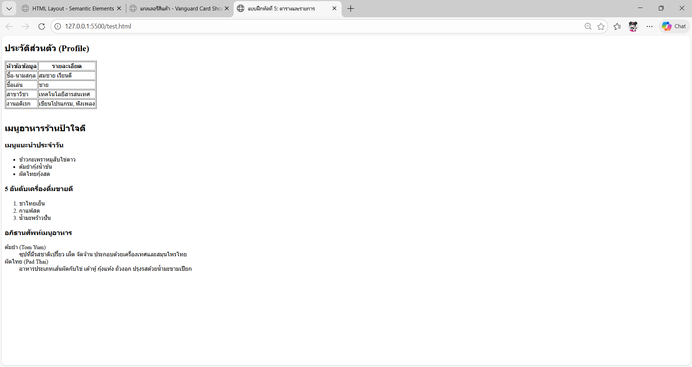

# ใบงานการทดลอง HTML

## การทดลองที่ 5: การสร้างตารางและรายการ
### วัตถุประสงค์
- เรียนรู้การสร้างตารางข้อมูล
- เรียนรู้การสร้างรายการแบบต่างๆ

### ขั้นตอนการทดลอง
1. สร้างไฟล์ tablelist.html ดังตัวอย่าง:
```html
<table border="1">
    <thead>
        <tr>
            <th>Header 1</th>
            <th>Header 2</th>
        </tr>
    </thead>
    <tbody>
        <tr>
            <td>Row 1, Cell 1</td>
            <td>Row 1, Cell 2</td>
        </tr>
        <tr>
            <td>Row 2, Cell 1</td>
            <td>Row 2, Cell 2</td>
        </tr>
    </tbody>
</table>
```

### คำอธิบายเพิ่มเติม
- `<table>` กำหนดขอบเขตของตาราง
- `<thead>` สำหรับส่วนหัวตาราง
- `<tbody>` สำหรับเนื้อหาตาราง
- `<tr>` แทนแถว
- `<th>` แทนเซลล์หัวตาราง
- `<td>` แทนเซลล์ข้อมูล

2. การสร้างรายการ โดยเพิ่มเติม Code ในไฟล์ tablelist.html :
```html
<ul>
    <li>Unordered item 1</li>
    <li>Unordered item 2</li>
</ul>

<ol>
    <li>Ordered item 1</li>
    <li>Ordered item 2</li>
</ol>

<dl>
    <dt>Term 1</dt>
    <dd>Definition 1</dd>
    <dt>Term 2</dt>
    <dd>Definition 2</dd>
</dl>
```

### คำอธิบายเพิ่มเติม
- `<ul>` สำหรับรายการแบบไม่เรียงลำดับ
- `<ol>` สำหรับรายการแบบเรียงลำดับ
- `<dl>` สำหรับรายการแบบคำจำกัดความ
- `<li>` แทนรายการแต่ละรายการ

### แบบฝึกหัด
1. สร้างตารางแสดงข้อมูลส่วนตัว
2. สร้างรายการเมนูอาหาร

[<!DOCTYPE html>
<html lang="th">
<head>
    <meta charset="UTF-8">
    <title>แบบฝึกหัดที่ 5: ตารางและรายการ</title>
</head>
<body>

    <h2>ประวัติส่วนตัว (Profile)</h2>
    <table border="1">
        <thead>
            <tr>
                <th>หัวข้อข้อมูล</th>
                <th>รายละเอียด</th>
            </tr>
        </thead>
        <tbody>
            <tr>
                <td>ชื่อ-นามสกุล</td>
                <td>สมชาย เรียนดี</td>
            </tr>
            <tr>
                <td>ชื่อเล่น</td>
                <td>ชาย</td>
            </tr>
            <tr>
                <td>สาขาวิชา</td>
                <td>เทคโนโลยีสารสนเทศ</td>
            </tr>
            <tr>
                <td>งานอดิเรก</td>
                <td>เขียนโปรแกรม, ฟังเพลง</td>
            </tr>
        </tbody>
    </table>

    <br>

    <h2>เมนูอาหารร้านป้าใจดี</h2>

    <h3>เมนูแนะนำประจำวัน</h3>
    <ul>
        <li>ข้าวกะเพราหมูสับไข่ดาว</li>
        <li>ต้มยำกุ้งน้ำข้น</li>
        <li>ผัดไทยกุ้งสด</li>
    </ul>

    <h3>5 อันดับเครื่องดื่มขายดี</h3>
    <ol>
        <li>ชาไทยเย็น</li>
        <li>กาแฟสด</li>
        <li>น้ำมะพร้าวปั่น</li>
    </ol>

    <h3>อภิธานศัพท์เมนูอาหาร</h3>
    <dl>
        <dt>ต้มยำ (Tom Yum)</dt>
        <dd>ซุปที่มีรสชาติเปรี้ยว เผ็ด จัดจ้าน ประกอบด้วยเครื่องเทศและสมุนไพรไทย</dd>
        
        <dt>ผัดไทย (Pad Thai)</dt>
        <dd>อาหารประเภทเส้นผัดกับไข่ เต้าหู้ กุ้งแห้ง ถั่วงอก ปรุงรสด้วยน้ำมะขามเปียก</dd>
    </dl>

</body>
</html>]
```html

```
- ภาพผลลัพธ์:
[]

