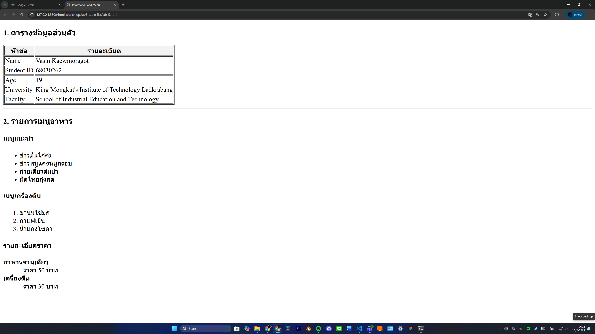

# ใบงานการทดลอง HTML

## การทดลองที่ 5: การสร้างตารางและรายการ
### วัตถุประสงค์
- เรียนรู้การสร้างตารางข้อมูล
- เรียนรู้การสร้างรายการแบบต่างๆ

### ขั้นตอนการทดลอง
1. สร้างไฟล์ tablelist.html ดังตัวอย่าง:
```html
<table border="1">
    <thead>
        <tr>
            <th>Header 1</th>
            <th>Header 2</th>
        </tr>
    </thead>
    <tbody>
        <tr>
            <td>Row 1, Cell 1</td>
            <td>Row 1, Cell 2</td>
        </tr>
        <tr>
            <td>Row 2, Cell 1</td>
            <td>Row 2, Cell 2</td>
        </tr>
    </tbody>
</table>
```

### คำอธิบายเพิ่มเติม
- `<table>` กำหนดขอบเขตของตาราง
- `<thead>` สำหรับส่วนหัวตาราง
- `<tbody>` สำหรับเนื้อหาตาราง
- `<tr>` แทนแถว
- `<th>` แทนเซลล์หัวตาราง
- `<td>` แทนเซลล์ข้อมูล

2. การสร้างรายการ โดยเพิ่มเติม Code ในไฟล์ tablelist.html :
```html
<ul>
    <li>Unordered item 1</li>
    <li>Unordered item 2</li>
</ul>

<ol>
    <li>Ordered item 1</li>
    <li>Ordered item 2</li>
</ol>

<dl>
    <dt>Term 1</dt>
    <dd>Definition 1</dd>
    <dt>Term 2</dt>
    <dd>Definition 2</dd>
</dl>
```

### คำอธิบายเพิ่มเติม
- `<ul>` สำหรับรายการแบบไม่เรียงลำดับ
- `<ol>` สำหรับรายการแบบเรียงลำดับ
- `<dl>` สำหรับรายการแบบคำจำกัดความ
- `<li>` แทนรายการแต่ละรายการ

### แบบฝึกหัด
1. สร้างตารางแสดงข้อมูลส่วนตัว
2. สร้างรายการเมนูอาหาร

[วางโค้ด HTML ที่นี่]
```html
<!DOCTYPE html>
<html>
    <head>
        <meta charset="UTF-8">
        <title>Information and Menu</title>
    </head>
    <body>
        
        <h3>1. ตารางข้อมูลส่วนตัว</h3>
        <table border="1">
            <thead>
                <tr bgcolor="#f2f2f2">
                    <th>หัวข้อ</th>
                    <th>รายละเอียด</th>
                </tr>
            </thead>
            <tbody>
                <tr>
                    <td>Name</td>
                    <td>Vasin Kaewmoragot</td>
                </tr>
                <tr>
                    <td>Student ID</td>
                    <td>68030262</td>
                </tr>
                <tr>
                    <td>Age</td>
                    <td>19</td>
                </tr>
                <tr>
                    <td>University</td>
                    <td>King Mongkut's Institute of Technology Ladkrabang</td>
                </tr>
                <tr>
                    <td>Faculty</td>
                    <td>School of Industrial Education and Technology</td>
                </tr>
            </tbody>
        </table>

        <hr>
        
        <h3>2. รายการเมนูอาหาร</h3>
        
        <h4>เมนูแนะนำ</h4>
        <ul>
            <li>ข้าวมันไก่ต้ม</li>
            <li>ข้าวหมูแดงหมูกรอบ</li>
            <li>ก๋วยเตี๋ยวต้มยำ</li>
            <li>ผัดไทยกุ้งสด</li>
        </ul>

        <h4>เมนูเครื่องดื่ม</h4>
        <ol>
            <li>ชานมไข่มุก</li>
            <li>กาแฟเย็น</li>
            <li>น้ำแดงโซดา</li>
        </ol>

        <h4>รายละเอียดราคา</h4>
        <dl>
            <dt><strong>อาหารจานเดียว</strong></dt>
            <dd>- ราคา 50 บาท</dd>
            
            <dt><strong>เครื่องดื่ม</strong></dt>
            <dd>- ราคา 30 บาท</dd>
        </dl>

    </body>
</html>
```
- ภาพผลลัพธ์:


