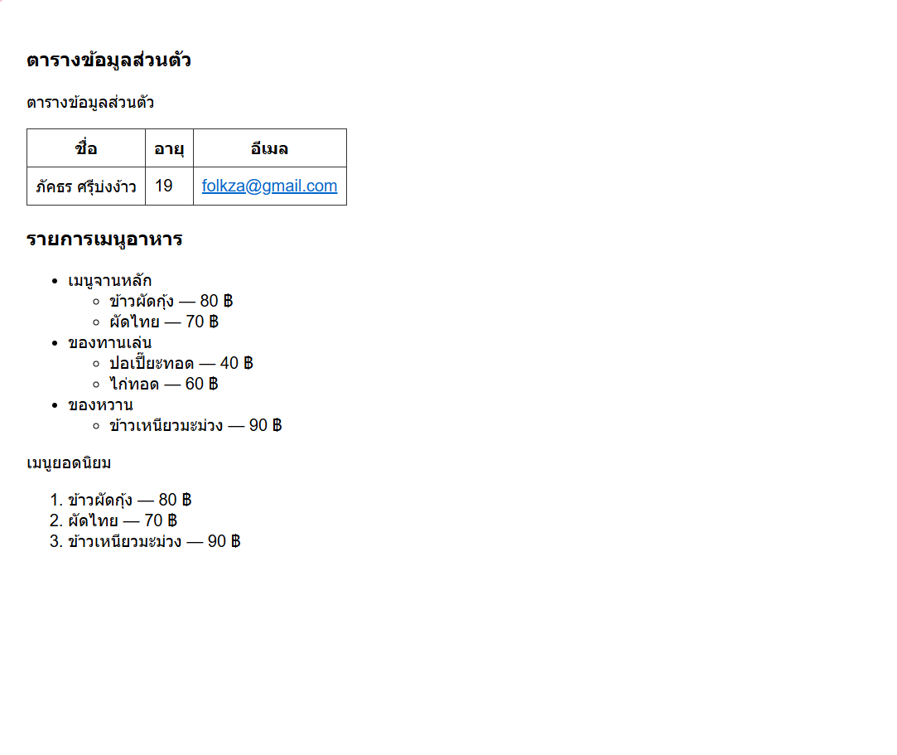

# ใบงานการทดลอง HTML

## การทดลองที่ 5: การสร้างตารางและรายการ
### วัตถุประสงค์
- เรียนรู้การสร้างตารางข้อมูล
- เรียนรู้การสร้างรายการแบบต่างๆ

### ขั้นตอนการทดลอง
1. สร้างไฟล์ tablelist.html ดังตัวอย่าง:
```html
<table border="1">
    <thead>
        <tr>
            <th>Header 1</th>
            <th>Header 2</th>
        </tr>
    </thead>
    <tbody>
        <tr>
            <td>Row 1, Cell 1</td>
            <td>Row 1, Cell 2</td>
        </tr>
        <tr>
            <td>Row 2, Cell 1</td>
            <td>Row 2, Cell 2</td>
        </tr>
    </tbody>
</table>
```

### คำอธิบายเพิ่มเติม
- `<table>` กำหนดขอบเขตของตาราง
- `<thead>` สำหรับส่วนหัวตาราง
- `<tbody>` สำหรับเนื้อหาตาราง
- `<tr>` แทนแถว
- `<th>` แทนเซลล์หัวตาราง
- `<td>` แทนเซลล์ข้อมูล

2. การสร้างรายการ โดยเพิ่มเติม Code ในไฟล์ tablelist.html :
```html
<ul>
    <li>Unordered item 1</li>
    <li>Unordered item 2</li>
</ul>

<ol>
    <li>Ordered item 1</li>
    <li>Ordered item 2</li>
</ol>

<dl>
    <dt>Term 1</dt>
    <dd>Definition 1</dd>
    <dt>Term 2</dt>
    <dd>Definition 2</dd>
</dl>
```

### คำอธิบายเพิ่มเติม
- `<ul>` สำหรับรายการแบบไม่เรียงลำดับ
- `<ol>` สำหรับรายการแบบเรียงลำดับ
- `<dl>` สำหรับรายการแบบคำจำกัดความ
- `<li>` แทนรายการแต่ละรายการ

### แบบฝึกหัด
1. สร้างตารางแสดงข้อมูลส่วนตัว
2. สร้างรายการเมนูอาหาร

[วางโค้ด HTML ที่นี่]
```html
<!DOCTYPE html>
<html lang="th">
<head>
    <meta charset="UTF-8">
    <title>ตาราง</title>
    <style>
        body{font-family:Arial, sans-serif; padding:20px}
        table{border-collapse:collapse; margin-bottom:20px}
        table, th, td{border:1px solid #333; padding:8px}
        a { color:#0066cc }
    </style>
</head>
<body>
    <h3>ตารางข้อมูลส่วนตัว</h3>
    <p>ตารางข้อมูลส่วนตัว</p>
    <table>
        <thead>
            <tr>
                <th>ชื่อ</th>
                <th>อายุ</th>
                <th>อีเมล</th>
            </tr>
        </thead>
        <tbody>
            <tr>
                <td>ภัคธร ศรีุบ่งง้าว</td>
                <td>19</td>
                <td><a href="mailto:folkza@gmail.com">folkza@gmail.com</a></td>
            </tr>
        </tbody>
    </table>

    <h3>รายการเมนูอาหาร</h3>
    <p></p>
    <ul>
        <li>เมนูจานหลัก
            <ul>
                <li>ข้าวผัดกุ้ง — 80 ฿</li>
                <li>ผัดไทย — 70 ฿</li>
            </ul>
        </li>
        <li>ของทานเล่น
            <ul>
                <li>ปอเปี๊ยะทอด — 40 ฿</li>
                <li>ไก่ทอด — 60 ฿</li>
            </ul>
        </li>
        <li>ของหวาน
            <ul>
                <li>ข้าวเหนียวมะม่วง — 90 ฿</li>
            </ul>
        </li>
    </ul>

    <p>เมนูยอดนิยม</p>
    <ol>
        <li>ข้าวผัดกุ้ง — 80 ฿</li>
        <li>ผัดไทย — 70 ฿</li>
        <li>ข้าวเหนียวมะม่วง — 90 ฿</li>
    </ol>
</body>
</html>

```
- ภาพผลลัพธ์:


