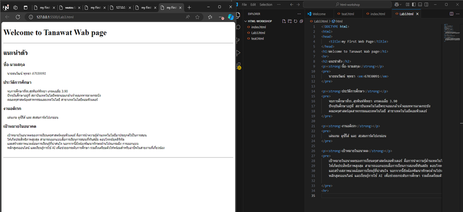

# ใบงานการทดลอง HTML

## การทดลองที่ 5: การสร้างตารางและรายการ
### วัตถุประสงค์
- เรียนรู้การสร้างตารางข้อมูล
- เรียนรู้การสร้างรายการแบบต่างๆ

### ขั้นตอนการทดลอง
1. สร้างไฟล์ tablelist.html ดังตัวอย่าง:
```html
<table border="1">
    <thead>
        <tr>
            <th>Header 1</th>
            <th>Header 2</th>
        </tr>
    </thead>
    <tbody>
        <tr>
            <td>Row 1, Cell 1</td>
            <td>Row 1, Cell 2</td>
        </tr>
        <tr>
            <td>Row 2, Cell 1</td>
            <td>Row 2, Cell 2</td>
        </tr>
    </tbody>
</table>
```

### คำอธิบายเพิ่มเติม
- `<table>` กำหนดขอบเขตของตาราง
- `<thead>` สำหรับส่วนหัวตาราง
- `<tbody>` สำหรับเนื้อหาตาราง
- `<tr>` แทนแถว
- `<th>` แทนเซลล์หัวตาราง
- `<td>` แทนเซลล์ข้อมูล

2. การสร้างรายการ โดยเพิ่มเติม Code ในไฟล์ tablelist.html :
```html
<ul>
    <li>Unordered item 1</li>
    <li>Unordered item 2</li>
</ul>

<ol>
    <li>Ordered item 1</li>
    <li>Ordered item 2</li>
</ol>

<dl>
    <dt>Term 1</dt>
    <dd>Definition 1</dd>
    <dt>Term 2</dt>
    <dd>Definition 2</dd>
</dl>
```

### คำอธิบายเพิ่มเติม
- `<ul>` สำหรับรายการแบบไม่เรียงลำดับ
- `<ol>` สำหรับรายการแบบเรียงลำดับ
- `<dl>` สำหรับรายการแบบคำจำกัดความ
- `<li>` แทนรายการแต่ละรายการ

### แบบฝึกหัด
1. สร้างตารางแสดงข้อมูลส่วนตัว
2. สร้างรายการเมนูอาหาร

[วางโค้ด HTML ที่นี่]
```<table border="1">
    <thead>
        <tr>
            <th>ข้อมูล</th>
            <th>รายละเอียด</th>
        </tr>
    </thead>
    <tbody>
        <tr>
            <td>ชื่อ</td>
            <td>ณัฐพงศ์ เนียมประดิษฐ</td>
        </tr>
        <tr>
            <td>อายุ</td>
            <td>19 ปี</td>
        </tr>
        <tr>
            <td>อาชีพ</td>
            <td>นักศึกษาชั้นปีที่ 1 สจล.</td>
        </tr>
        <tr>
            <td>ที่อยู่</td>
            <td>บ้านเลขที่ 20/2 หมู่ 9 ตำบลหัวสะพาน อำเภอเมือง จังหวัดเพชรบุรี 76000</td>
        </tr>
    </tbody>
</table>
<h1>อาหารที่ชอบรับประทาน</h1>
<ul>
    <li>หมี่คลุกไก่ฉีก</li>
    <li>หมูทอดกระเทียม</li>
    <li>ต้มยำน้ำข้น</li>
    <li>ข้าวผัดปู</li>
    <li>สเต็กหมู</li>
</ul>
```
- ภาพผลลัพธ์:
[วางภาพ screenshot ที่นี่]

