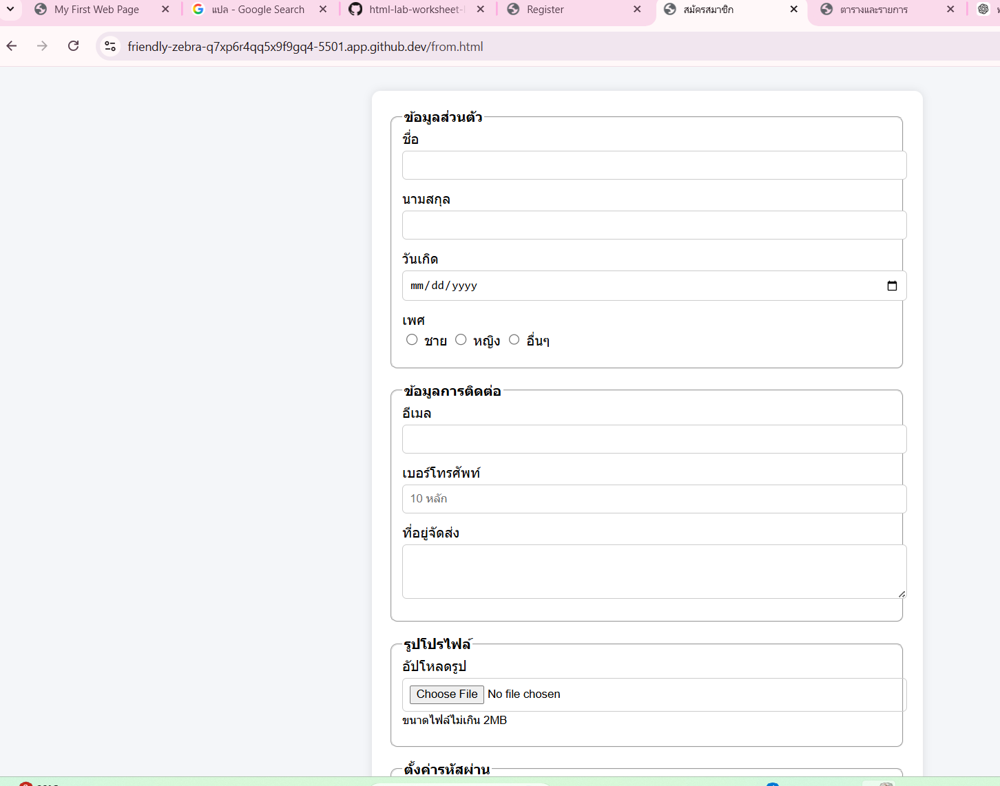
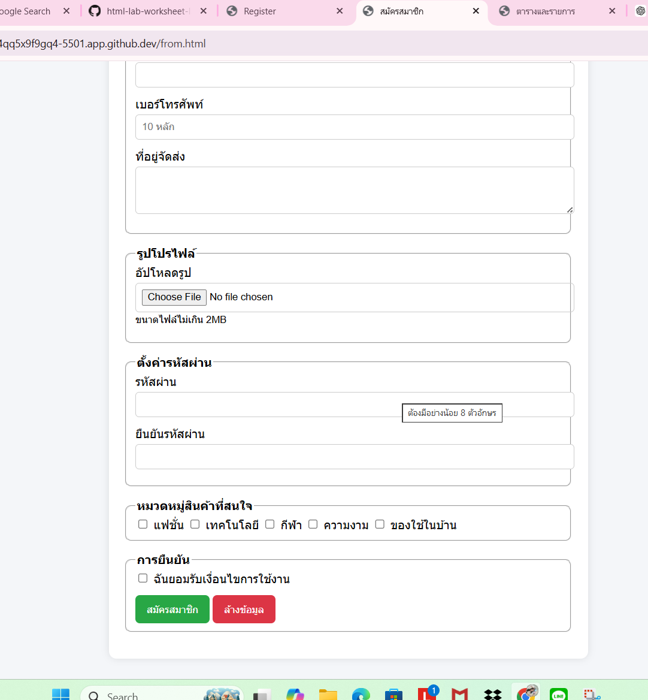

# ใบงานการทดลอง HTML

## การทดลองที่ 6: การสร้างฟอร์ม
### วัตถุประสงค์
- สร้างฟอร์มรับข้อมูลได้ตามกำหนด
- เลือกใช้ประเภทของ input แบบต่างๆ ได้เหมาะสม
- สามารถใช้งาน form validation ได้

### ขั้นตอนการทดลอง
1. สร้างฟอร์มลงทะเบียนนักศึกษา:
```html
    <!-- กำหนดรูปแบบของฟอร์มบางส่วน -->
  <style>
        .form-group {
            margin-bottom: 15px;
        }
        
        .input-wrapper {
            display: flex;
            align-items: center;
        }
        
        .required-mark {
            color: red;
            margin-left: 5px;
        }
    </style>

    <body>
        <form action="/register" method="post">
            <!-- ส่วนข้อมูลส่วนตัว -->
            <fieldset>
                <legend>ข้อมูลส่วนตัว</legend>
                
                <div class="form-group">
                    <label for="studentId">รหัสนักศึกษา:</label>
                    <input type="text" id="studentId" name="studentId" 
                           pattern="[0-9]{8}" required>
                </div>
        
                <div class="form-group">
                    <label for="prefix">คำนำหน้า:</label>
                     <select id="prefix" name="prefix" required>
                        <option value="">เลือกคำนำหน้า</option>
                        <option value="mr">นาย</option>
                        <option value="ms">นางสาว</option>
                        <option value="mrs">นาง</option>
                    </select>
                </div>
        
                <div class="form-group">
                    <label for="firstName">ชื่อ:</label>
                    <input type="text" id="firstName" name="firstName" required>
                </div>
        
                <div class="form-group">
                    <label for="lastName">นามสกุล:</label>
                    <input type="text" id="lastName" name="lastName" required>
                </div>
        
                <div class="form-group">
                    <label for="birthdate">วันเกิด:</label>
                    <input type="date" id="birthdate" name="birthdate" required>
                </div>
        
                <div class="form-group">
                    <label>เพศ:</label>
                    <input type="radio" id="male" name="gender" value="male" required>
                    <label for="male">ชาย</label>
                    <input type="radio" id="female" name="gender" value="female">
                    <label for="female">หญิง</label>
                </div>
            </fieldset>
        
            <!-- ส่วนข้อมูลการติดต่อ -->
            <fieldset>
                <legend>ข้อมูลการติดต่อ</legend>
        
                <div class="form-group">
                    <label for="email">อีเมล:</label>
                    <input type="email" id="email" name="email" required>
                </div>
        
                <div class="form-group">
                    <label for="phone">เบอร์โทรศัพท์:</label>
                    <input type="tel" id="phone" name="phone" 
                           pattern="[0-9]{10}" required>
                </div>
        
                <div class="form-group">
                    <label for="address">ที่อยู่:</label>
                    <textarea id="address" name="address" 
                              rows="3" required></textarea> <span class="required-mark">*</span>
                </div>
            </fieldset>
        
            <!-- ส่วนข้อมูลการศึกษา -->
            <fieldset>
                <legend>ข้อมูลการศึกษา</legend>
        
                <div class="form-group">
                    <label for="faculty">คณะ:</label>
                    <select id="faculty" name="faculty" required>
                        <option value="">เลือกคณะ</option>
                        <option value="siet">ครุศาสตร์อุตสาหกรรมและเทคโนโลยี</option>
                        <option value="engineering">วิศวกรรมศาสตร์</option>
                        <option value="science">วิทยาศาสตร์</option>
                    </select> <span class="required-mark">*</span>
                </div>
        
                <div class="form-group">
                    <label for="major">สาขาวิชา:</label>
                    <select id="major" name="major" required>
                        <option value="">เลือกสาขาวิชา</option>
                        <!-- ตัวเลือกจะเปลี่ยนตามคณะที่เลือก ส่วนนี้ Code ยังไม่สมบูรณ์-->
                    </select> <span class="required-mark">*</span>
                </div>
        
                <div class="form-group">
                    <label for="gpa">เกรดเฉลี่ยสะสม:</label>
                    <input type="number" id="gpa" name="gpa" 
                           min="0" max="4" step="0.01" required> <span class="required-mark">*</span>
                </div>
            </fieldset>
        
            <!-- ส่วนความสนใจและกิจกรรม -->
            <fieldset>
                <legend>ความสนใจและกิจกรรม</legend>
        
                <div class="form-group">
                    <label>ความสนใจ:</label>
                    <input type="checkbox" id="sport" name="interests" value="sport">
                    <label for="sport">กีฬา</label>
                    <input type="checkbox" id="music" name="interests" value="music">
                    <label for="music">ดนตรี</label>
                    <input type="checkbox" id="art" name="interests" value="art">
                    <label for="art">ศิลปะ</label>
                    <input type="checkbox" id="tech" name="interests" value="tech">
                    <label for="tech">เทคโนโลยี</label>
                </div>
        
                <div class="form-group">
                    <label for="club">ชมรมที่สนใจ:</label>
                    <select id="club" name="club" multiple>
                        <option value="computer">ชมรมคอมพิวเตอร์</option>
                        <option value="robot">ชมรมหุ่นยนต์</option>
                        <option value="sport">ชมรมกีฬา</option>
                        <option value="music">ชมรมดนตรี</option>
                    </select>
                </div>
            </fieldset>
        
            <!-- ส่วนอัพโหลดเอกสาร -->
            <fieldset>
                <legend>เอกสารประกอบ</legend>
                <div class="form-group">
                    <label for="photo">รูปถ่าย:</label>
                    <input type="file" id="photo" name="photo" 
                           accept="image/*" required><span class="required-mark">*</span>
                </div>
        
                <div class="form-group">
                    <label for="transcript">ใบแสดงผลการเรียน:</label>
                    <input type="file" id="transcript" name="transcript" 
                           accept=".pdf,.doc,.docx" required>
                           <span class="required-mark">*</span>
                </div>
            </fieldset>
        
            <!-- ส่วนยืนยันข้อมูล -->
            <fieldset>
                <legend>การยืนยัน</legend>
        
                <div class="form-group">
                    <input type="checkbox" id="agree" name="agree" required>
                    <label for="agree">
                        ข้าพเจ้ายืนยันว่าข้อมูลทั้งหมดเป็นความจริง
                    </label>
                </div>
        
                <div class="form-group">
                    <button type="submit">ลงทะเบียน</button>
                    <button type="reset">ล้างข้อมูล</button>
                </div>
            </fieldset>
        </form>
```

### คำอธิบายเพิ่มเติม
1. Input Types ที่ใช้:
   - text: สำหรับข้อความทั่วไป
   - email: สำหรับอีเมล (มีการตรวจสอบรูปแบบอัตโนมัติ)
   - tel: สำหรับเบอร์โทรศัพท์
   - date: สำหรับวันที่
   - number: สำหรับตัวเลข
   - radio: สำหรับตัวเลือกเดียว
   - checkbox: สำหรับหลายตัวเลือก
   - file: สำหรับอัพโหลดไฟล์
   - select: สำหรับรายการแบบเลือก
   - textarea: สำหรับข้อความหลายบรรทัด

2. Attributes ที่สำคัญ:
   - required: จำเป็นต้องกรอก
   - pattern: กำหนดรูปแบบข้อมูล
   - min/max: กำหนดค่าต่ำสุด/สูงสุด
   - accept: กำหนดประเภทไฟล์ที่ยอมรับ
   - multiple: เลือกได้หลายตัวเลือก

### แบบฝึกหัด
1. สร้างฟอร์มสมัครสมาชิกร้านค้าออนไลน์ที่มี:
   - ข้อมูลส่วนตัว (ชื่อ-นามสกุล, วันเกิด, เพศ)
   - ข้อมูลการติดต่อ (อีเมล, เบอร์โทร, ที่อยู่จัดส่ง)
   - รูปโปรไฟล์
   - การยืนยันรหัสผ่าน
   - ความสนใจในหมวดหมู่สินค้า
   - การยอมรับเงื่อนไขการใช้งาน

2. เพิ่ม validation ที่เหมาะสม:
   - ตรวจสอบรูปแบบอีเมล
   - ตรวจสอบความยาวรหัสผ่าน
   - ตรวจสอบรูปแบบเบอร์โทร
   - ตรวจสอบขนาดไฟล์รูปภาพ

### บันทึกผลการทดลอง
[<!DOCTYPE html>
<html lang="th">
<head>
<meta charset="UTF-8">
<title>Register</title>

<style>
.form-group {
    margin-bottom: 15px;
}
.input-wrapper {
    display: flex;
    align-items: center;
}
.required-mark {
    color: red;
    margin-left: 5px;
}
</style>

<script>
function validateForm(){
    const pass = document.getElementById("password").value;
    const confirm = document.getElementById("confirmPassword").value;
    const file = document.getElementById("photo").files[0];

    // ตรวจรหัสผ่านตรงกัน
    if(pass !== confirm){
        alert("รหัสผ่านไม่ตรงกัน");
        return false;
    }

    // ตรวจขนาดไฟล์รูป
    if(file && file.size > 2097152){
        alert("ไฟล์รูปต้องไม่เกิน 2MB");
        return false;
    }

    return true;
}
</script>
</head>

<body>

<form action="/register" method="post" onsubmit="return validateForm()">

<!-- ข้อมูลส่วนตัว -->
<fieldset>
<legend>ข้อมูลส่วนตัว</legend>

<div class="form-group">
<label>ชื่อ:</label>
<input type="text" name="firstName" required>
</div>

<div class="form-group">
<label>นามสกุล:</label>
<input type="text" name="lastName" required>
</div>

<div class="form-group">
<label>วันเกิด:</label>
<input type="date" name="birthdate" required>
</div>

<div class="form-group">
<label>เพศ:</label>
<input type="radio" name="gender" value="male" required> ชาย
<input type="radio" name="gender" value="female"> หญิง
</div>

</fieldset>


<!-- ข้อมูลการติดต่อ -->
<fieldset>
<legend>ข้อมูลการติดต่อ</legend>

<div class="form-group">
<label>อีเมล:</label>
<input type="email" name="email" required>
</div>

<div class="form-group">
<label>เบอร์โทรศัพท์:</label>
<input type="tel" name="phone" pattern="[0-9]{10}" required>
</div>

<div class="form-group">
<label>ที่อยู่:</label>
<textarea name="address" rows="3" required></textarea>
</div>

</fieldset>


<!-- รูปโปรไฟล์ -->
<fieldset>
<legend>รูปโปรไฟล์</legend>

<div class="form-group">
<label>อัปโหลดรูป:</label>
<input type="file" id="photo" name="photo" accept="image/*" required>
<span class="required-mark">*</span>
</div>

</fieldset>


<!-- รหัสผ่าน -->
<fieldset>
<legend>ตั้งค่ารหัสผ่าน</legend>

<div class="form-group">
<label>รหัสผ่าน:</label>
<input type="password" id="password" name="password"
       pattern=".{8,}" title="อย่างน้อย 8 ตัวอักษร" required>
</div>

<div class="form-group">
<label>ยืนยันรหัสผ่าน:</label>
<input type="password" id="confirmPassword" required>
</div>

</fieldset>


<!-- ความสนใจสินค้า -->
<fieldset>
<legend>หมวดหมู่สินค้าที่สนใจ</legend>

<div class="form-group">
<input type="checkbox" name="interest" value="fashion"> แฟชั่น
<input type="checkbox" name="interest" value="tech"> เทคโนโลยี
<input type="checkbox" name="interest" value="sport"> กีฬา
<input type="checkbox" name="interest" value="beauty"> ความงาม
<input type="checkbox" name="interest" value="home"> ของใช้ในบ้าน
</div>

</fieldset>


<!-- การยืนยัน -->
<fieldset>
<legend>การยืนยัน</legend>

<div class="form-group">
<input type="checkbox" required>
ข้าพเจ้ายอมรับเงื่อนไขการใช้งาน
</div>

<div class="form-group">
<button type="submit">สมัครสมาชิก</button>
<button type="reset">ล้างข้อมูล</button>
</div>

</fieldset>

</form>

</body>
</html>
]
```html

```
- ภาพผลลัพธ์:
[  ]


