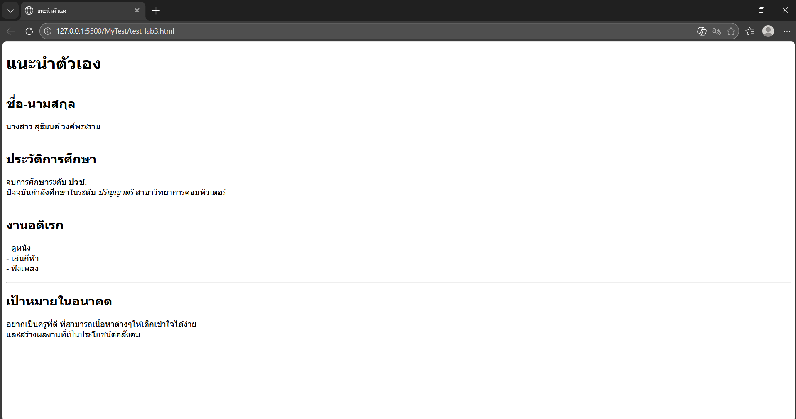

# ใบงานการทดลอง HTML
 
## การทดลองที่ 3: การจัดการข้อความและการจัดรูปแบบ
### ขั้นตอนการทดลอง
1. ทดลองใช้ tag ต่างๆ:
```html
<h1>หัวข้อระดับ 1</h1>
<h2>หัวข้อระดับ 2</h2>
<p>ย่อหน้าปกติ</p>
<p>ข้อความ <strong>ตัวหนา</strong> และ <em>ตัวเอียง</em></p>
<p>ขึ้นบรรทัดใหม่<br>ด้วย br</p>
<hr>
<pre>
    ข้อความที่ต้องการ
    รักษารูปแบบ
    การเว้นวรรค
</pre>
```

### แบบฝึกหัด
1. สร้างหน้าเว็บแนะนำตัวเองที่ประกอบด้วย:
   - ชื่อ-นามสกุล
   - ประวัติการศึกษา
   - งานอดิเรก
   - เป้าหมายในอนาคต
 ข้อกำหนดที่ต้องมี:
   - หัวข้อหลักและหัวข้อย่อย
   - ย่อหน้าที่มีการจัดรูปแบบ
   - การขึ้นบรรทัดใหม่
   - เส้นคั่นระหว่างเนื้อหา
### บันทึกผลการทดลอง
- รหัสเอกสาร HTML ที่เขียน:
```html
[วางโค้ด HTML ที่นี่]
<!DOCTYPE html>
<html lang="th">
<head>
    <meta charset="UTF-8">
    <title>แนะนำตัวเอง</title>
</head>
<body>
    <h1>แนะนำตัวเอง</h1>
    <hr>
    <h2>ชื่อ-นามสกุล</h2>
    <p>นางสาว สุธีมนต์ วงศ์พระราม</p>
    <hr>
    <h2>ประวัติการศึกษา</h2>
    <p>
        จบการศึกษาระดับ <strong>ปวช.</strong><br>
        ปัจจุบันกำลังศึกษาในระดับ <em>ปริญญาตรี</em> สาขาวิทยาการคอมพิวเตอร์
    </p>
    <hr>
    <h2>งานอดิเรก</h2>
    <p>
        - ดูหนัง<br>
        - เล่นกีฬา<br>
        - ฟังเพลง
    </p>
    <hr>
    <h2>เป้าหมายในอนาคต</h2>
    <p>
        อยากเป็นครูที่ดี ที่สามารถเนื้อหาต่างๆให้เด็กเข้าใจได้ง่าย<br>
        และสร้างผลงานที่เป็นประโยชน์ต่อสังคม
```
- ภาพผลลัพธ์:
[วางภาพ screenshot ที่นี่] 


